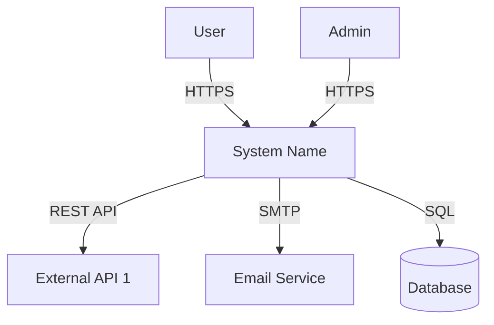
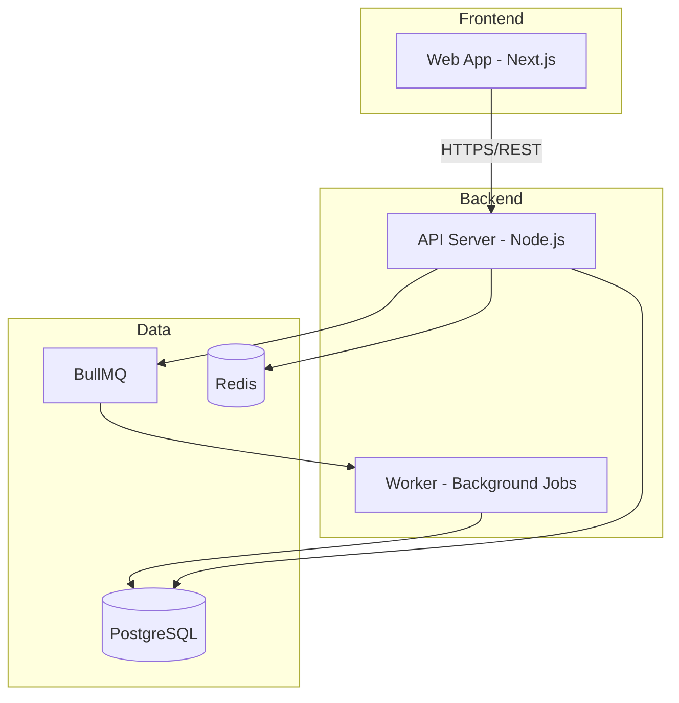
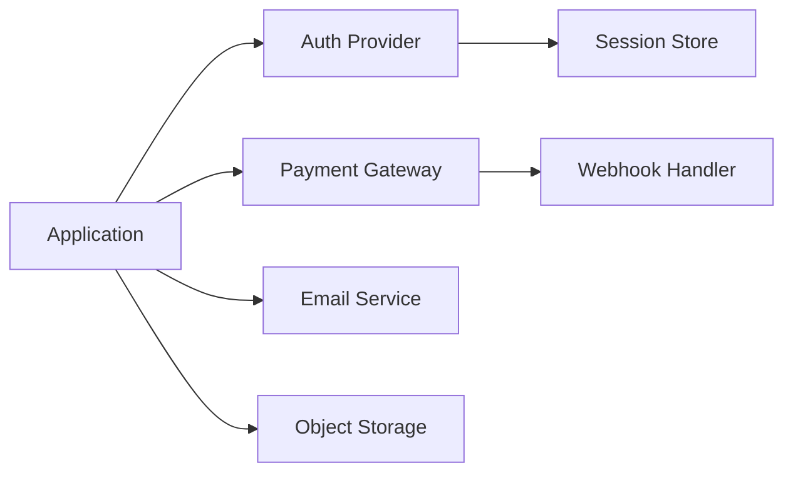
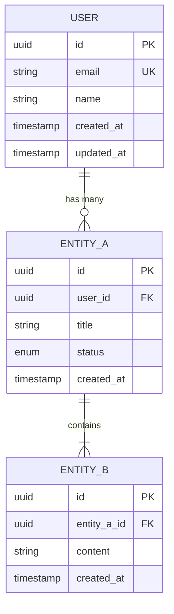

# System Design

> "Architecture is the decisions that are hard to change later."

## Purpose

Provide structured methods for designing system architecture, documenting decisions, and planning infrastructure that scales with the project.

---

## 1. C4 Model (Context, Containers, Components, Code)

### Level 1: System Context

Shows the system as a whole and its interactions with users and external systems.

```markdown
### System Context Diagram

**System:** [System Name]
**Description:** [What it does in one sentence]

#### Actors
| Actor | Type | Description | Interaction |
|-------|------|-------------|-------------|
| [Actor] | Person/System | [Who/What] | [How they interact] |

#### External Systems
| System | Type | Protocol | Data Exchanged |
|--------|------|----------|---------------|
| [System] | API/Database/Service | REST/gRPC/Webhook | [What data flows] |
```



### Level 2: Container Diagram

Shows the major deployable units within the system.

```markdown
### Container Diagram

| Container | Technology | Purpose | Port | Communicates With |
|-----------|------------|---------|------|-------------------|
| Web App | Next.js | User interface | 3000 | API Server |
| API Server | Node.js/Express | Business logic | 8080 | Database, Cache |
| Database | PostgreSQL | Persistent storage | 5432 | API Server |
| Cache | Redis | Session/Cache | 6379 | API Server |
| Queue | BullMQ | Async jobs | - | API Server, Workers |
| Worker | Node.js | Background processing | - | Database, Queue |
```



### Level 3: Component Diagram

Shows the internal structure of a specific container.

```markdown
### Component Diagram: [Container Name]

| Component | Responsibility | Dependencies | Interface |
|-----------|---------------|-------------|-----------|
| Auth Controller | Handle auth routes | Auth Service, JWT | REST endpoints |
| Auth Service | Business logic for auth | User Repository, Hasher | Internal API |
| User Repository | Data access for users | Database | Data layer |
| JWT Service | Token generation/validation | crypto | Internal API |
```

---

## 2. Architecture Patterns

### Pattern Selection Guide

| Scenario | Recommended Pattern | Trade-off |
|----------|--------------------|---------  |
| MVP / Small team | **Modular Monolith** | Simple but harder to scale independently |
| High traffic, independent scaling | **Microservices** | Scalable but complex operations |
| Event-heavy, audit trail needed | **Event-Driven (CQRS)** | Traceable but eventual consistency |
| Real-time features | **Event-Driven + WebSockets** | Responsive but complex state |
| Content-heavy, SEO critical | **Static Generation + ISR** | Fast but stale data risk |
| API-first, multiple clients | **API Gateway + BFF** | Flexible but extra layer |

### Pattern Decision Tree

```
Is this an MVP or small team project?
├── YES → Modular Monolith
│   └── Does it need independent scaling per module?
│       ├── YES → Plan migration path to Microservices
│       └── NO → Stay Monolith
└── NO → What's the primary challenge?
    ├── High Traffic → Microservices + Load Balancer
    ├── Real-time → Event-Driven + WebSockets
    ├── Data-heavy → CQRS + Event Sourcing
    └── Content-heavy → SSG + ISR + CDN
```

---

## 3. Architecture Decision Records (ADRs)

### ADR Template

```markdown
# ADR-{NNN}: [Decision Title]

## Status
Proposed | Accepted | Deprecated | Superseded by ADR-{NNN}

## Context
[What is the issue or situation that motivates this decision?]
[What constraints exist?]

## Decision
[What is the decision and the rationale behind it?]

## Alternatives Considered
| Alternative | Pros | Cons | Reason Rejected |
|------------|------|------|-----------------|
| [Option A] | [Pros] | [Cons] | [Why not chosen] |
| [Option B] | [Pros] | [Cons] | [Why not chosen] |

## Consequences
### Positive
- [Good outcome 1]
- [Good outcome 2]

### Negative
- [Trade-off 1]
- [Trade-off 2]

### Risks
- [Risk and mitigation]

## References
- [Link to relevant documentation]
```

### When to Write an ADR

| Decision | ADR Required? |
|----------|--------------|
| Choice of framework/language | Yes |
| Database selection | Yes |
| Auth strategy | Yes |
| API style (REST vs GraphQL) | Yes |
| State management approach | Yes |
| Hosting/deployment platform | Yes |
| CSS approach | Only if non-standard |
| Library choice (e.g., date lib) | No (unless significant) |

---

## 4. Infrastructure Design

### Environment Strategy

```markdown
### Environments

| Environment | Purpose | URL Pattern | Database | Deploy Trigger |
|-------------|---------|-------------|----------|---------------|
| Development | Local dev | localhost:3000 | Local/Docker | Manual |
| Staging | Pre-production testing | staging.example.com | Isolated copy | PR merge to staging |
| Production | Live users | example.com | Production DB | Tag/Release |
```

### Deployment Architecture

```markdown
### Deployment Topology

| Component | Platform | Region | Scaling | Cost Tier |
|-----------|----------|--------|---------|-----------|
| Frontend | Vercel/Cloudflare | Edge (global) | Auto | Free/Pro |
| API | Railway/Fly.io | [Region] | Horizontal | [Tier] |
| Database | Supabase/Neon | [Region] | Vertical | [Tier] |
| Cache | Upstash Redis | [Region] | Auto | [Tier] |
| Storage | S3/R2 | [Region] | Unlimited | Pay-per-use |
| CDN | Cloudflare | Edge (global) | Auto | Free |
```

### Scaling Strategy

```markdown
### Scaling Plan

| Load Level | Users | Strategy | Infrastructure Changes |
|------------|-------|----------|----------------------|
| Launch | 0-100 | Single instance | Default deployment |
| Growth | 100-1K | Horizontal scaling | Add replicas, CDN |
| Scale | 1K-10K | Distributed | DB read replicas, queue |
| Enterprise | 10K+ | Multi-region | Region replication, sharding |
```

---

## 5. Integration Mapping

### Integration Inventory

```markdown
### External Integrations

| Integration | Purpose | Protocol | Auth | Rate Limit | Fallback | Priority |
|-------------|---------|----------|------|------------|----------|----------|
| [Service] | [Why] | REST/GraphQL/SDK | API Key/OAuth | [Limit] | [What if down] | MVP/Post-MVP |
```

### Integration Dependency Graph



### Data Flow Diagram

```markdown
### Data Flows

| Flow | Source | Destination | Data | Protocol | Frequency | Volume |
|------|--------|-------------|------|----------|-----------|--------|
| User Registration | Client | API → DB | User profile | HTTPS/POST | On demand | Low |
| Order Processing | API | Payment Gateway | Order data | HTTPS/POST | On demand | Medium |
| Email Notification | Queue | Email Service | Template + data | SMTP/API | Async | Medium |
| Analytics | Client | Analytics Service | Events | HTTPS/POST | Real-time | High |
```

---

## 6. Database Architecture (Sub-section of Architecture)

### Database Selection Matrix

| Criteria | PostgreSQL | MongoDB | Firebase/Firestore | SQLite |
|----------|-----------|---------|-------------------|--------|
| Relationships | Strong | Weak | Weak | Strong |
| Scalability | Vertical + Read replicas | Horizontal | Auto | Single file |
| Real-time | Via LISTEN/NOTIFY | Change Streams | Built-in | None |
| Serverless-friendly | Neon/Supabase | Atlas | Native | Turso |
| Cost at scale | Moderate | Moderate | Expensive | Free |
| Best for | Relational data, ACID | Documents, flexible schema | Real-time mobile | Embedded, edge |

### Schema Design Principles

1. **Normalize first** — Denormalize only when performance demands it
2. **Index strategically** — Every query pattern needs a supporting index
3. **Plan for soft delete** — `deleted_at` column on entities that need recovery
4. **Audit timestamps** — `created_at`, `updated_at` on every table
5. **UUID over auto-increment** — Better for distributed systems
6. **RLS from day one** — Row-Level Security is easier to add early

### ERD Template



### Migration Strategy

| Phase | Action | Reversible | Dependencies |
|-------|--------|-----------|-------------|
| 001 | Create base tables | Yes (DROP) | None |
| 002 | Add indexes | Yes (DROP INDEX) | 001 |
| 003 | Add RLS policies | Yes (DROP POLICY) | 001 |
| 004 | Seed initial data | Yes (TRUNCATE) | 001-003 |

---

## 7. Security Architecture

### Authentication Strategy

| Method | Best For | Complexity | Provider Options |
|--------|----------|-----------|-----------------|
| **Session-based** | Traditional web apps | Low | Express-session, Iron-session |
| **JWT** | API-first, mobile clients | Medium | jose, jsonwebtoken |
| **OAuth 2.0 / OIDC** | Social login, enterprise SSO | High | NextAuth, Clerk, Auth0 |
| **Passkeys / WebAuthn** | Passwordless, high security | High | SimpleWebAuthn |

### Authorization Model

| Model | Best For | Complexity |
|-------|----------|-----------|
| **RBAC** (Role-Based) | Most applications | Low-Medium |
| **ABAC** (Attribute-Based) | Complex policies | High |
| **ReBAC** (Relationship-Based) | Social graphs, shared resources | High |

### Security Checklist

- [ ] Auth strategy documented (ADR)
- [ ] RBAC/ABAC model defined
- [ ] API rate limiting planned
- [ ] Input validation strategy
- [ ] CORS configuration planned
- [ ] Secrets management strategy (env vars, vault)
- [ ] HTTPS enforced in all environments
- [ ] OWASP Top 10 review planned

---

## 8. Observability

### Monitoring Strategy

| Layer | What to Monitor | Tool Options | Priority |
|-------|----------------|--------------|----------|
| **Application** | Errors, latency, throughput | Sentry, Datadog | P0 |
| **Infrastructure** | CPU, memory, disk | Platform metrics | P1 |
| **Business** | Signups, conversions, revenue | PostHog, Mixpanel | P1 |
| **Uptime** | Availability, response time | BetterStack, Checkly | P0 |

### Logging Strategy

| Level | When | Example |
|-------|------|---------|
| `error` | System failure, data loss risk | Database connection failed |
| `warn` | Degraded service, approaching limits | Rate limit at 80% |
| `info` | Significant business events | User registered, order placed |
| `debug` | Development troubleshooting | Request payload, query params |

---

## Rules

1. **Start with Level 1** — Don't over-architect; begin with System Context
2. **ADR for every significant decision** — If you debated it, document it
3. **Diagrams are documentation** — Mermaid diagrams are code, keep them updated
4. **Scale later, design for it now** — Simple implementation, extensible architecture
5. **Security is architecture** — Not an afterthought, not a layer on top
6. **Database is part of architecture** — Not a separate concern
7. **Observability from day one** — If you can't monitor it, you can't maintain it
