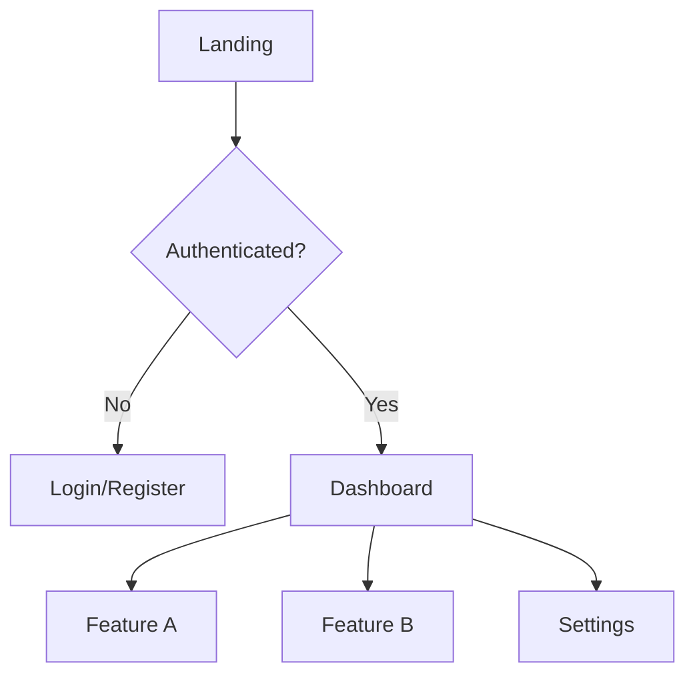
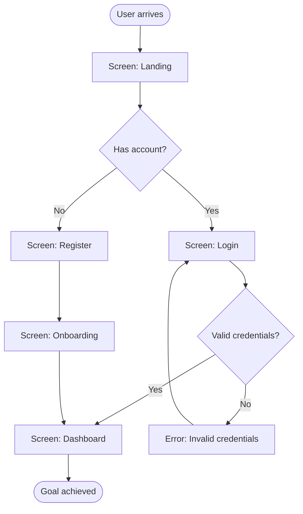

# UX Research Methodology

> "Design is not what it looks like. Design is how it works." — Steve Jobs

## Purpose

Provide structured methods for understanding users, designing experiences, and evaluating usability before visual design or implementation begins.

---

## 1. Information Architecture (IA)

### Content Inventory

Before designing navigation or flows, map all content:

```markdown
### Content Inventory

| Content Type | Source | Volume | Priority | Notes |
|-------------|--------|--------|----------|-------|
| [Type] | [Where it comes from] | [Estimated amount] | Core/Supporting/Optional | [Notes] |
```

### Site Map / App Map

```markdown
### Application Map

- **Level 0:** Entry point (Landing / Login)
  - **Level 1:** Primary sections (Dashboard, Profile, Settings)
    - **Level 2:** Sub-sections (Dashboard > Analytics, Dashboard > Reports)
      - **Level 3:** Detail views (Reports > Report Detail > Export)
```

Use Mermaid for visual mapping:



### Navigation Patterns

| Pattern | Best For | Avoid When |
|---------|----------|------------|
| **Top Navigation** | 3-7 primary sections, desktop-first | Deep hierarchies, mobile-first |
| **Side Navigation** | Complex apps, many sections | Simple apps, content-focused |
| **Bottom Tabs** | Mobile apps, 3-5 sections | More than 5 items |
| **Hamburger Menu** | Secondary navigation, mobile overflow | Primary navigation (reduces discoverability) |
| **Breadcrumbs** | Deep hierarchies, e-commerce | Flat structures |
| **Tab Bar** | Related content sections | Unrelated sections |

### Card Sorting (Mental Model)

When organizing content, think from the user's perspective:

```markdown
### Card Sort Results

| User Mental Model | System Category | Match? | Action |
|-------------------|----------------|--------|--------|
| [How users think of it] | [How system organizes it] | Yes/No | [Adjust if no] |
```

---

## 2. User Flows

### Flow Types

| Type | Purpose | Detail Level |
|------|---------|-------------|
| **Task Flow** | Single task, no decisions | Step-by-step linear |
| **User Flow** | Task with decisions/branches | Flowchart with conditions |
| **Wire Flow** | Flow + interface sketches | Flowchart with wireframes |

### Task Flow Template

```markdown
### Task Flow: [Task Name]

**Goal:** [What the user wants to achieve]
**Persona:** [Which user]
**Entry Point:** [Where they start]
**Success State:** [What "done" looks like]

| Step | User Action | System Response | Screen |
|------|-------------|-----------------|--------|
| 1 | [Action] | [Response] | [Screen name] |
| 2 | [Action] | [Response] | [Screen name] |
| 3 | [Action] | [Response] | [Screen name] |
```

### User Flow Template (with decisions)



### Flow Metrics

| Metric | Target | Measurement |
|--------|--------|-------------|
| **Steps to complete** | Minimum viable steps | Count from entry to success |
| **Decision points** | Minimize choices | Count branches in flow |
| **Error recovery paths** | Always available | Count error → recovery routes |
| **Time on task** | Under [N] seconds | Benchmark against competitors |

---

## 3. Wireframing (Textual)

### Screen Description Template

```markdown
### Screen: [Screen Name]

**Purpose:** [Why this screen exists]
**Entry Points:** [How user arrives here]
**Exit Points:** [Where user can go from here]

#### Layout Structure
```
+--------------------------------------------------+
| [Header: Logo | Navigation | User Menu]          |
+--------------------------------------------------+
| [Sidebar]  | [Main Content Area]                 |
|            |                                      |
| - Nav 1    | [Section Title]                      |
| - Nav 2    | [Content Block 1]                    |
| - Nav 3    | [Content Block 2]                    |
|            |                                      |
|            | [Action Bar: Primary CTA | Secondary]|
+--------------------------------------------------+
| [Footer: Links | Legal | Contact]                |
+--------------------------------------------------+
```

#### Elements
| Element | Type | Behavior | Priority |
|---------|------|----------|----------|
| [Element name] | [Button/Input/List/etc] | [What happens on interaction] | Primary/Secondary/Tertiary |

#### States
| State | Trigger | Visual Change |
|-------|---------|---------------|
| Empty | No data | [Empty state message + CTA] |
| Loading | Fetching data | [Skeleton/Spinner] |
| Error | API failure | [Error message + retry] |
| Success | Action complete | [Confirmation feedback] |
```

---

## 4. Heuristic Evaluation (Nielsen's 10)

### Evaluation Template

```markdown
### Heuristic Evaluation: [Feature/Screen Name]

| # | Heuristic | Status | Issues Found | Severity | Recommendation |
|---|-----------|--------|-------------|----------|----------------|
| 1 | **Visibility of System Status** | Pass/Fail | [Issue] | 0-4 | [Fix] |
| 2 | **Match Between System and Real World** | Pass/Fail | [Issue] | 0-4 | [Fix] |
| 3 | **User Control and Freedom** | Pass/Fail | [Issue] | 0-4 | [Fix] |
| 4 | **Consistency and Standards** | Pass/Fail | [Issue] | 0-4 | [Fix] |
| 5 | **Error Prevention** | Pass/Fail | [Issue] | 0-4 | [Fix] |
| 6 | **Recognition Rather Than Recall** | Pass/Fail | [Issue] | 0-4 | [Fix] |
| 7 | **Flexibility and Efficiency of Use** | Pass/Fail | [Issue] | 0-4 | [Fix] |
| 8 | **Aesthetic and Minimalist Design** | Pass/Fail | [Issue] | 0-4 | [Fix] |
| 9 | **Help Users Recognize, Diagnose, and Recover from Errors** | Pass/Fail | [Issue] | 0-4 | [Fix] |
| 10 | **Help and Documentation** | Pass/Fail | [Issue] | 0-4 | [Fix] |
```

### Severity Scale

| Score | Severity | Definition |
|-------|----------|-----------|
| 0 | Not a problem | Heuristic satisfied |
| 1 | Cosmetic | Fix if time allows |
| 2 | Minor | Low priority fix |
| 3 | Major | High priority fix |
| 4 | Catastrophe | Must fix before launch |

---

## 5. UX Laws & Principles

Apply these when designing flows and layouts:

| Law | Principle | Application |
|-----|-----------|-------------|
| **Fitts's Law** | Larger targets are easier to hit | Make CTAs large and reachable |
| **Hick's Law** | More choices = more decision time | Limit options per screen (5-7) |
| **Jakob's Law** | Users prefer familiar patterns | Use conventions from established products |
| **Miller's Law** | Working memory holds 7 +/- 2 items | Chunk information into groups |
| **Tesler's Law** | Complexity cannot be eliminated, only moved | Move complexity to backend, simplify frontend |
| **Von Restorff Effect** | Distinct items are more memorable | Highlight primary actions visually |
| **Doherty Threshold** | Interactions < 400ms feel instant | Optimize perceived performance |
| **Postel's Law** | Be liberal in what you accept | Accept varied input formats |
| **Peak-End Rule** | Users remember peaks and endings | Make key moments and final interactions delightful |
| **Aesthetic-Usability Effect** | Beautiful things are perceived as easier to use | Invest in visual polish for trust |

---

## 6. Friction Mapping

### Friction Audit Template

```markdown
### Friction Audit: [Flow Name]

| Step | Expected Action | Friction Type | Severity (1-5) | Root Cause | Fix |
|------|----------------|---------------|-----------------|------------|-----|
| [N] | [What user should do] | [Type] | [1-5] | [Why it's hard] | [Solution] |
```

### Friction Types

| Type | Description | Example |
|------|-------------|---------|
| **Cognitive** | Mental effort required | Complex form with unclear labels |
| **Interaction** | Physical effort / clicks | Too many steps to complete task |
| **Emotional** | Anxiety, confusion, frustration | Unclear pricing, hidden fees |
| **Visual** | Hard to see or read | Low contrast, small text |
| **Temporal** | Takes too long | Slow loading, long processes |
| **Access** | Barriers to entry | Required sign-up before browsing |

---

## 7. Accessibility Assessment

### WCAG 2.1 Quick Audit

| Category | Criteria | Level | Status | Notes |
|----------|---------|-------|--------|-------|
| **Perceivable** | Text alternatives for images | A | Pass/Fail | |
| **Perceivable** | Captions for video/audio | A | Pass/Fail | |
| **Perceivable** | Color contrast 4.5:1 (text) | AA | Pass/Fail | |
| **Perceivable** | Color contrast 3:1 (UI elements) | AA | Pass/Fail | |
| **Perceivable** | Content reflows at 320px | AA | Pass/Fail | |
| **Operable** | Keyboard navigable | A | Pass/Fail | |
| **Operable** | No keyboard traps | A | Pass/Fail | |
| **Operable** | Skip navigation links | A | Pass/Fail | |
| **Operable** | Focus order logical | A | Pass/Fail | |
| **Operable** | Focus indicator visible | AA | Pass/Fail | |
| **Understandable** | Language declared | A | Pass/Fail | |
| **Understandable** | Error identification clear | A | Pass/Fail | |
| **Understandable** | Labels for inputs | A | Pass/Fail | |
| **Robust** | Valid HTML | A | Pass/Fail | |
| **Robust** | Name, Role, Value for custom widgets | A | Pass/Fail | |

---

## 8. Persona-Driven Design

### Persona Validation Checklist

Before designing any screen, verify:

- [ ] **Which persona uses this?** — Name them explicitly
- [ ] **What's their goal?** — Specific, not generic
- [ ] **What's their context?** — Device, environment, time pressure
- [ ] **What's their skill level?** — Novice/Intermediate/Expert
- [ ] **What could go wrong?** — Error scenarios for this persona

### Persona-Flow Matrix

```markdown
| Flow | Primary Persona | Secondary Persona | Persona-Specific Adaptations |
|------|----------------|-------------------|------------------------------|
| [Flow] | [Persona A] | [Persona B] | [Differences in experience] |
```

---

## Rules

1. **Flows before screens** — Map the journey before designing the destination
2. **Text before pixels** — Describe wireframes textually before visual design
3. **Test assumptions** — Every design decision should reference a UX law or heuristic
4. **Accessibility is not optional** — WCAG AA minimum for all flows
5. **Friction is measurable** — Score it, don't just feel it
6. **Users are not you** — Design for the persona, not for yourself
7. **Empty states matter** — First-time users see empty states first
8. **Error states are UX** — How you handle failure defines the experience
