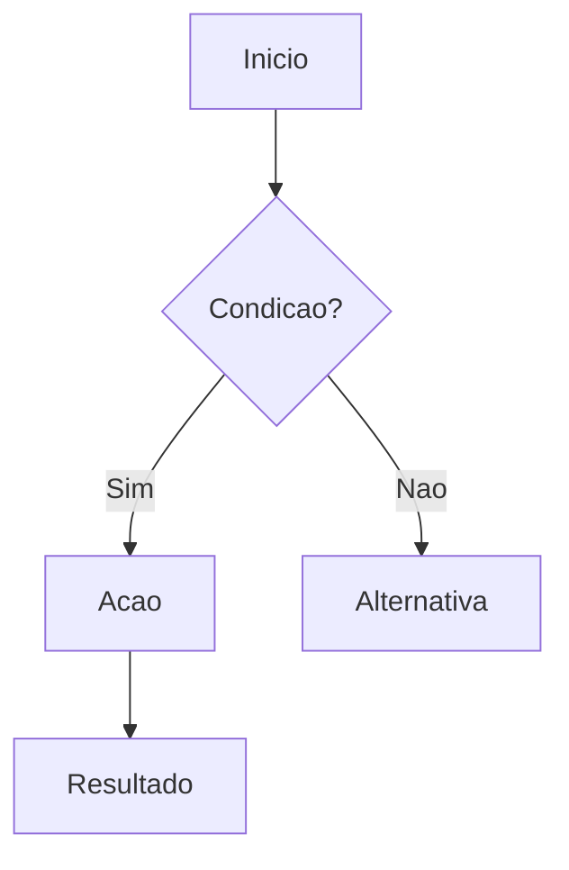
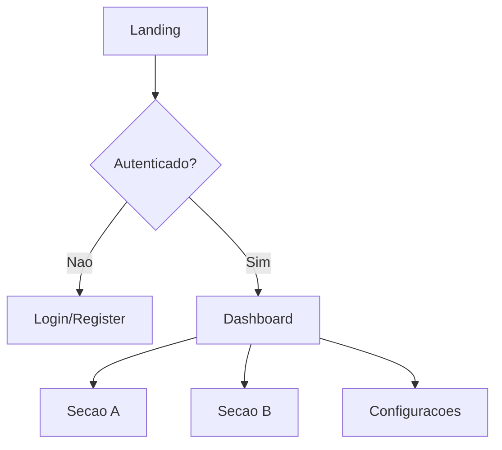
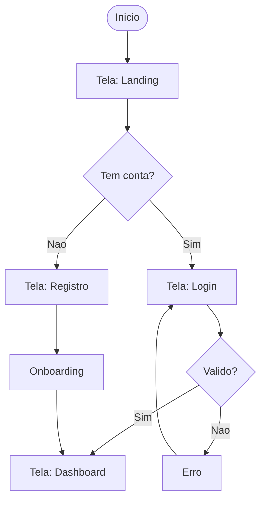
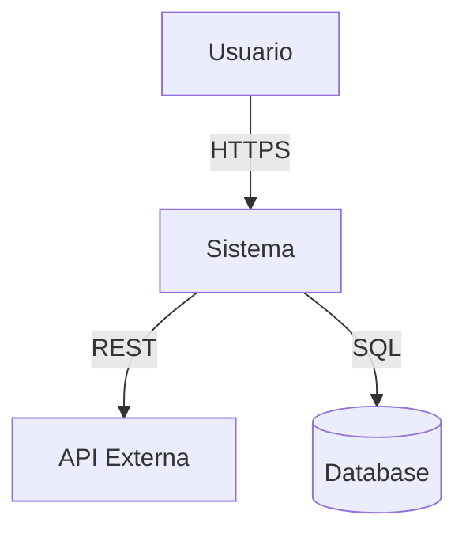
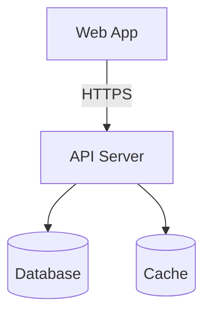
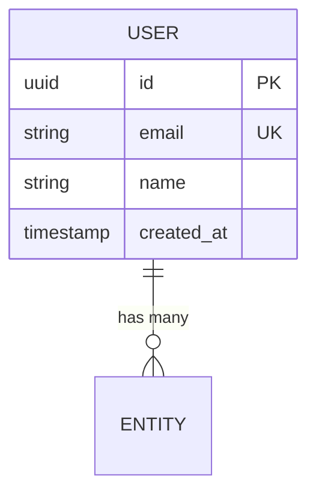
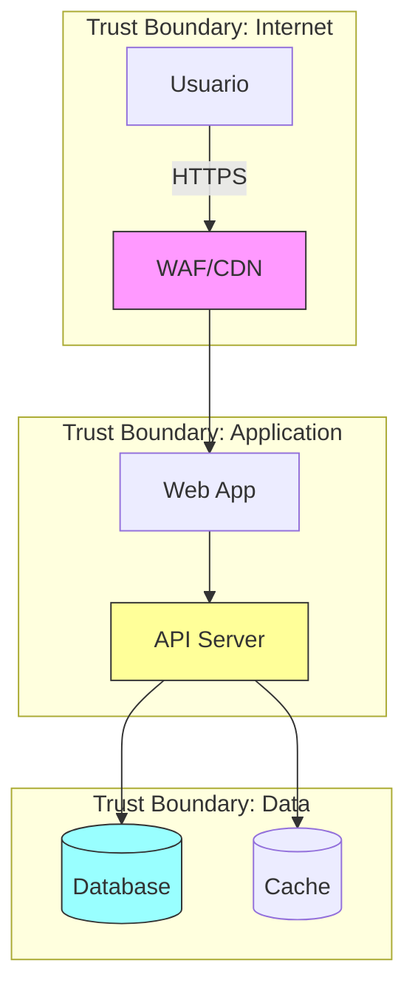

# Workflow: /define

> **Proposito:** Planejamento completo e PRECISO para projetos "do zero". Gera documentacao tecnica detalhada, acionavel e com GAP Analysis integrada em cada dimensao.

## Regras Criticas

1. **NAO ESCREVA CODIGO** — Este workflow gera apenas documentacao.
2. **SEQUENCIAL** — Cada documento depende dos anteriores.
3. **SOCRATIC GATE OBRIGATORIO** — Pergunte ANTES de criar.
4. **PRECISAO TECNICA** — Documentos devem ser especificos, nao genericos.
5. **VALIDACAO CONTINUA** — Confirme entendimento antes de cada fase.
6. **GAP ANALYSIS OBRIGATORIO** — Todos os documentos (exceto Brief) DEVEM incluir secao de GAP.
7. **REVISAO POS-GERACAO** — Documentos gerados pelo Antigravity DEVEM ser revisados por Claude Code/Codex usando a skill `doc-review`.

---

## Estrutura de Documentos

| Fase | Documento | Agente | Skills | GAP |
|------|-----------|--------|--------|-----|
| 0 | Discovery | (entrevista) | brainstorming | - |
| 1 | Brief | `product-manager` | brainstorming, plan-writing | Nenhum |
| 2 | PRD | `product-owner` | plan-writing, gap-analysis | Produto/Negocio |
| 3 | UX Concept | `ux-researcher` | ux-research, frontend-design, gap-analysis | Experiencia |
| 3.5 | Visual Mockups | `frontend-specialist` | stitch-ui-design, frontend-design | Visual |
| 4 | Architecture | `project-planner` | architecture, system-design, gap-analysis | Infraestrutura |
| 5 | Security | `security-auditor` | vulnerability-scanner, gap-analysis | Seguranca |
| 6 | Stack | `project-planner` | app-builder, architecture, gap-analysis | Tecnologia |
| 7 | Design System | `frontend-specialist` | frontend-design, tailwind-patterns, gap-analysis | Design |
| 8 | Backlog | `product-owner` | plan-writing, gap-analysis | Consolidacao |

---

## Fluxo de Execucao

### Fase 0: Setup e Discovery (OBRIGATORIO)

> **Objetivo:** Criar a estrutura organizacional de documentacao e extrair informacoes do projeto.

**1. Setup da Estrutura de Documentacao**

Antes de qualquer pergunta, execute:

```bash
mkdir -p docs/00-Contexto docs/01-Planejamento docs/02-Requisitos docs/03-Arquitetura/ADRs docs/04-API docs/08-Logs-Sessoes
echo "# Documentacao de Planejamento" > docs/01-Planejamento/README.md
```

> **Nota:** O `/define` cria a estrutura numerada (`docs/01-Planejamento/`). Projetos que nao passaram pelo `/define` podem usar `docs/planning/`. Ambos sao aceitos — ver tabela de aliases em `INSTRUCTIONS.md`.

**Estrutura Alvo:**
- `docs/00-Contexto/` (Context, Readiness)
- `docs/01-Planejamento/` (Brief, PRD, UX Concept, Architecture, Stack, Design System)
- `docs/02-Requisitos/` (Stories, Journeys)
- `docs/03-Arquitetura/` (ADRs, Diagramas)
- `docs/08-Logs-Sessoes/` (Logs diarios)

---

**2. Entrevista de Discovery**

Conduza a entrevista estruturada:

```markdown
## Discovery: Entendendo Seu Projeto

Vou fazer algumas perguntas para garantir que a documentacao seja precisa e util.

### Bloco 1: Problema e Contexto
1. **Qual problema especifico este sistema resolve?**
   - Descreva uma situacao real onde esse problema acontece

2. **Como esse problema e resolvido hoje (se existir solucao atual)?**
   - Quais sao as limitacoes da solucao atual?

### Bloco 2: Usuarios e Casos de Uso
3. **Quem sao os usuarios principais?** (Seja especifico)
   - Exemplo: "Gerentes de RH em empresas de 50-200 funcionarios" vs "usuarios"

4. **Descreva 3 cenarios de uso tipicos:**
   - Cenario 1: [Quem] quer [fazer o que] para [alcancar qual resultado]
   - Cenario 2: ...
   - Cenario 3: ...

### Bloco 3: Funcionalidades Core
5. **Liste as 5 funcionalidades ESSENCIAIS do MVP (em ordem de prioridade):**
   - Para cada uma, descreva o que o usuario deve conseguir fazer

6. **O que NAO faz parte do MVP?** (Igualmente importante)
   - Funcionalidades que podem esperar versoes futuras

### Bloco 4: Restricoes Tecnicas
7. **Stack tecnica preferida ou obrigatoria:**
   - Frontend: (React, Vue, Next.js, etc.)
   - Backend: (Node, Python, etc.)
   - Database: (PostgreSQL, MongoDB, Firebase, etc.)
   - Hosting: (Vercel, AWS, etc.)

8. **Integracoes obrigatorias:**
   - APIs externas (pagamento, email, auth, etc.)
   - Sistemas legados

### Bloco 5: Contexto de Negocio
9. **Modelo de monetizacao (se aplicavel):**
   - Free, Freemium, Subscription, One-time, etc.

10. **Metricas de sucesso (como saberemos que funcionou?):**
    - Metricas quantitativas (ex: 100 usuarios em 30 dias)
    - Metricas qualitativas (ex: NPS > 8)

### Bloco 6: Contexto Existente (Para GAP Analysis)
11. **Existe algo ja construido?** (codigo, prototipos, docs)
    - Se sim: qual o estado atual? O que funciona? O que nao funciona?
    - Se nao: e um projeto 100% greenfield?

12. **Existem sistemas legados que precisam ser considerados?**
    - Integracoes obrigatorias com sistemas existentes
    - Migracoes de dados necessarias

13. **O projeto tem interface visual (web, mobile, desktop)?**
    - Se sim: quais tipos de tela? (dashboard, landing, formularios, etc.)
    - Se nao: e uma API pura, CLI tool, ou backend-only?
    - **Guardar resposta como flag `HAS_UI=true/false`**
```

**REGRA:** NAO prossiga ate ter respostas claras para TODAS as perguntas.

Se o usuario for vago, faca follow-up:
```markdown
Preciso de mais detalhes sobre [X]. Voce mencionou "[resposta vaga]", mas:
- Quantos [usuarios/registros/etc] voce espera?
- Com que frequencia [acao] acontece?
- Qual e o impacto se [cenario de falha]?
```

---

### Fase 1: Product Brief

**Agente:** `product-manager`
**Output:** `docs/01-Planejamento/01-product-brief.md`
**Skills:** `brainstorming`, `plan-writing`

```markdown
# Product Brief: {Nome do Projeto}

## Metadados
- **Data de criacao:** {YYYY-MM-DD}
- **Autor:** AI Product Manager
- **Versao:** 1.0
- **Status:** Draft | Em Revisao | Aprovado

---

## 1. Visao do Produto

### 1.1 Declaracao de Visao
> "Para [PUBLICO-ALVO] que [TEM NECESSIDADE], o [NOME DO PRODUTO] e um [CATEGORIA] que [BENEFICIO PRINCIPAL]. Diferente de [ALTERNATIVA], nosso produto [DIFERENCIAL]."

### 1.2 Elevator Pitch (30 segundos)
[Versao expandida da visao para apresentacao rapida]

---

## 2. Problema

### 2.1 Declaracao do Problema
| Aspecto | Descricao |
|---------|-----------|
| **O problema** | [Descricao especifica] |
| **Afeta** | [Quem sofre com isso - seja especifico] |
| **O impacto e** | [Consequencias mensuraveis] |
| **Hoje e resolvido por** | [Solucoes atuais e suas limitacoes] |

### 2.2 Evidencias do Problema
- [Dado/Estatistica 1 que comprova o problema]
- [Dado/Estatistica 2]
- [Citacao/Feedback de usuario potencial]

### 2.3 Consequencias de Nao Resolver
- Curto prazo: [O que acontece em semanas]
- Medio prazo: [O que acontece em meses]
- Longo prazo: [O que acontece em anos]

---

## 3. Solucao

### 3.1 Descricao da Solucao
[2-3 paragrafos explicando como o produto resolve o problema]

### 3.2 Proposta de Valor Unica (UVP)
| Diferencial | Como entregamos | Beneficio para usuario |
|-------------|-----------------|----------------------|
| [Diferencial 1] | [Implementacao] | [Resultado] |
| [Diferencial 2] | [Implementacao] | [Resultado] |
| [Diferencial 3] | [Implementacao] | [Resultado] |

### 3.3 Funcionalidades Core do MVP
| # | Funcionalidade | Descricao | Justificativa (Por que MVP?) |
|---|----------------|-----------|------------------------------|
| 1 | [Nome] | [O que faz] | [Por que e essencial] |
| 2 | [Nome] | [O que faz] | [Por que e essencial] |
| 3 | [Nome] | [O que faz] | [Por que e essencial] |
| 4 | [Nome] | [O que faz] | [Por que e essencial] |
| 5 | [Nome] | [O que faz] | [Por que e essencial] |

### 3.4 Fora do Escopo (Explicitamente)
| Funcionalidade | Por que nao esta no MVP | Versao planejada |
|----------------|-------------------------|------------------|
| [Feature A] | [Motivo] | v1.1 |
| [Feature B] | [Motivo] | v2.0 |

---

## 4. Publico-Alvo

### 4.1 Persona Primaria
| Atributo | Descricao |
|----------|-----------|
| **Nome ficticio** | [Ex: "Carlos, o RH Sobrecarregado"] |
| **Cargo/Papel** | [Funcao especifica] |
| **Empresa/Contexto** | [Tamanho, setor, regiao] |
| **Objetivos** | [O que quer alcancar] |
| **Frustracoes** | [Dores atuais] |
| **Comportamento digital** | [Como usa tecnologia] |
| **Quote caracteristica** | ["Frase que essa pessoa diria"] |

### 4.2 Persona Secundaria (se houver)
[Mesmo formato]

### 4.3 Anti-Persona (Quem NAO e nosso usuario)
[Descreva quem nao deve usar o produto e por que]

---

## 5. Metricas de Sucesso

### 5.1 North Star Metric
> **A unica metrica que define sucesso:** [Metrica + meta]

### 5.2 Metricas de Acompanhamento
| Categoria | Metrica | Meta MVP | Como medir |
|-----------|---------|----------|------------|
| **Aquisicao** | [Ex: Sign-ups/semana] | [Ex: 50] | [Ferramenta] |
| **Ativacao** | [Ex: % que completa onboarding] | [Ex: 60%] | [Ferramenta] |
| **Retencao** | [Ex: % volta em 7 dias] | [Ex: 40%] | [Ferramenta] |
| **Receita** | [Ex: MRR] | [Ex: $1000] | [Ferramenta] |
| **Referencia** | [Ex: NPS] | [Ex: > 30] | [Ferramenta] |

### 5.3 Criterios de Sucesso do MVP
O MVP sera considerado bem-sucedido se:
- [ ] [Criterio 1 - especifico e mensuravel]
- [ ] [Criterio 2]
- [ ] [Criterio 3]

---

## 6. Riscos e Mitigacoes

| Risco | Probabilidade | Impacto | Mitigacao |
|-------|---------------|---------|-----------|
| [Risco tecnico 1] | Alta/Media/Baixa | Alto/Medio/Baixo | [Plano] |
| [Risco de mercado 1] | Alta/Media/Baixa | Alto/Medio/Baixo | [Plano] |
| [Risco de execucao 1] | Alta/Media/Baixa | Alto/Medio/Baixo | [Plano] |

---

## Aprovacoes

| Papel | Nome | Status | Data |
|-------|------|--------|------|
| Product Owner | [Nome/Usuario] | Pendente | - |
| Tech Lead | [Nome/Usuario] | Pendente | - |
```

**CHECKPOINT:**
```markdown
Documento gerado: docs/01-Planejamento/01-product-brief.md

Por favor, revise o Product Brief e responda:
- ok — Aprovar e continuar para PRD
- editar [secao] — Ajustar secao especifica (ex: "editar personas")
- cancelar — Parar o workflow

Perguntas de validacao:
1. A visao do produto captura sua ideia corretamente?
2. As personas representam seus usuarios reais?
3. As metricas de sucesso sao realistas?
```

**AGUARDE** resposta antes de prosseguir.

---

### Fase 2: PRD (Product Requirements Document)

**Agente:** `product-owner`
**Output:** `docs/01-Planejamento/02-prd.md`
**Skills:** `plan-writing`, `gap-analysis`
**Referencia:** Leia `01-product-brief.md` antes de comecar

```markdown
# PRD: {Nome do Projeto}

## Metadados
- **Baseado em:** 01-product-brief.md
- **Data:** {YYYY-MM-DD}
- **Versao:** 1.0

---

## 1. Requisitos Funcionais

### Legenda de Prioridade
- **P0 (Critico):** Sem isso, o produto nao funciona. Bloqueador de lancamento.
- **P1 (Importante):** Essencial para a proposta de valor. Pode lancar sem, mas prejudica.
- **P2 (Desejavel):** Melhora a experiencia, mas nao e essencial para MVP.

---

### RF01: [Nome do Requisito]
| Campo | Valor |
|-------|-------|
| **ID** | RF01 |
| **Titulo** | [Nome claro e descritivo] |
| **Descricao** | Como [PERSONA], eu quero [ACAO] para que [BENEFICIO] |
| **Prioridade** | P0 / P1 / P2 |
| **Epico relacionado** | [Nome do Epico] |

**Criterios de Aceite (Gherkin):**
```gherkin
DADO que [contexto/pre-condicao]
QUANDO [acao do usuario]
ENTAO [resultado esperado]
E [resultado adicional se houver]
```

**Casos de Borda:**
- [ ] [Cenario limite 1 e comportamento esperado]
- [ ] [Cenario limite 2 e comportamento esperado]

**Regras de Negocio:**
- RN01: [Regra especifica]
- RN02: [Regra especifica]

**Dependencias:**
- Depende de: [RF## se houver]
- Bloqueia: [RF## se houver]

---

[Repetir para cada RF]

---

## 2. Requisitos Nao-Funcionais

### RNF01: Performance
| Aspecto | Requisito | Como medir |
|---------|-----------|------------|
| Tempo de carregamento inicial | < 3 segundos (LCP) | Lighthouse |
| Tempo de resposta de API | < 200ms (p95) | APM |
| Time to Interactive | < 5 segundos | Lighthouse |

### RNF02: Escalabilidade
| Aspecto | Requisito MVP | Requisito v1.0 |
|---------|---------------|----------------|
| Usuarios simultaneos | [N] | [N] |
| Requisicoes/minuto | [N] | [N] |
| Dados armazenados | [N]GB | [N]GB |

### RNF03: Seguranca
| Requisito | Implementacao |
|-----------|---------------|
| Autenticacao | [JWT / Session / OAuth] |
| Autorizacao | [RBAC / ABAC] |
| Criptografia em transito | TLS 1.3 |
| Conformidade | [LGPD / GDPR se aplicavel] |

### RNF04: Acessibilidade
- **Nivel WCAG:** AA
- **Leitores de tela:** Compativel
- **Navegacao por teclado:** Completa

---

## 3. Fluxos de Usuario (User Journeys)

### Fluxo 1: [Nome do Fluxo Principal]

**Objetivo:** [O que o usuario quer alcancar]
**Persona:** [Qual persona]



**Passos detalhados:**
| # | Acao do Usuario | Resposta do Sistema | Dados envolvidos |
|---|-----------------|---------------------|------------------|
| 1 | [Acao] | [Resposta] | [Entidades] |

---

## 4. Regras de Negocio Globais

### RN-G01: [Nome da Regra]
- **Descricao:** [O que a regra define]
- **Condicao:** SE [condicao]
- **Acao:** ENTAO [resultado]
- **Excecao:** EXCETO QUANDO [excecao]
- **Afeta:** [Quais RFs sao impactados]

---

## 5. Integracoes

### INT01: [Nome da Integracao]
| Campo | Valor |
|-------|-------|
| **Servico** | [Nome do servico externo] |
| **Proposito** | [Para que e usado] |
| **Tipo** | REST API / Webhook / SDK / OAuth |
| **Autenticacao** | API Key / OAuth2 / JWT |
| **Rate Limits** | [Limites conhecidos] |
| **Fallback** | [O que fazer se falhar] |

---

## 6. Matriz de Rastreabilidade

| Requisito | Epico | User Story | Criterio de Teste |
|-----------|-------|------------|-------------------|
| RF01 | Epic 1 | Story 1.1 | TC001, TC002 |

---

## 7. GAP Analysis: Produto e Negocio

> Skill: `gap-analysis` — Dimensao: Product/Business

### 7.1 Feature Coverage
| Feature | Expectativa de Mercado | Estado Atual | GAP | Prioridade |
|---------|----------------------|--------------|-----|------------|
| [Feature A] | [O que concorrentes oferecem] | [O que temos] | [Delta] | P0/P1/P2 |

### 7.2 Capability Assessment
| Capacidade | Nivel Necessario | Nivel Atual | GAP | Esforco |
|------------|-----------------|-------------|-----|---------|
| [Capacidade] | [Alvo] | [Atual] | [Delta] | S/M/L/XL |

### 7.3 Metrics GAP
| Metrica | Valor Atual | Valor Alvo | GAP | Estrategia |
|---------|------------|------------|-----|-----------|
| [Metrica] | [Atual ou N/A] | [Alvo] | [Delta] | [Como fechar] |

### 7.4 GAP Inventory
| ID | Area | AS-IS | TO-BE | GAP | Severidade | Prioridade |
|----|------|-------|-------|-----|------------|------------|
| G-PRD-01 | [Area] | [Atual] | [Necessario] | [O que falta] | Critical/High/Medium/Low | P0/P1/P2 |

---

## Glossario

| Termo | Definicao |
|-------|-----------|
| [Termo 1] | [Definicao clara] |
```

**CHECKPOINT:**
```markdown
Documento gerado: docs/01-Planejamento/02-prd.md

Por favor, revise o PRD e responda:
- ok — Aprovar e continuar para UX Concept
- editar [requisito] — Ajustar requisito especifico
- cancelar — Parar o workflow

Perguntas de validacao:
1. Os requisitos funcionais cobrem todos os cenarios?
2. Os criterios de aceite sao verificaveis?
3. Os GAPs de produto sao relevantes?
```

**AGUARDE** resposta antes de prosseguir.

---

### Fase 3: UX Concept

**Agente:** `ux-researcher`
**Output:** `docs/01-Planejamento/03-ux-concept.md`
**Skills:** `ux-research`, `frontend-design`, `gap-analysis`
**Referencia:** Leia `01-product-brief.md` e `02-prd.md`

```markdown
# UX Concept: {Nome do Projeto}

## Metadados
- **Baseado em:** 01-product-brief.md, 02-prd.md
- **Data:** {YYYY-MM-DD}
- **Autor:** AI UX Researcher
- **Versao:** 1.0

---

## 1. Estrategia de UX

### 1.1 Visao da Experiencia
> [Uma frase descrevendo a experiencia ideal]

### 1.2 Principios de UX
1. **[Principio]:** [Como se aplica]
2. **[Principio]:** [Como se aplica]
3. **[Principio]:** [Como se aplica]

### 1.3 Metricas de Experiencia
| Metrica | Alvo | Como Medir |
|---------|------|-----------|
| Task Success Rate | > 90% | Testes de usabilidade |
| Tempo na Tarefa Principal | < [N]s | Analytics |
| Taxa de Erro | < 5% | Logs |
| SUS Score | > 70 | Survey |

---

## 2. Arquitetura de Informacao

### 2.1 Mapa da Aplicacao



### 2.2 Padrao de Navegacao
| Padrao | Justificativa | Lei UX |
|--------|--------------|--------|
| [Padrao] | [Por que] | [Lei aplicada] |

### 2.3 Organizacao de Conteudo
| Secao | Tipos de Conteudo | Prioridade | Frequencia |
|-------|-------------------|------------|-----------|
| [Secao] | [Tipos] | Primary/Secondary | Alta/Media/Baixa |

---

## 3. User Flows

### 3.1 Flow: [Fluxo Principal]

**Objetivo:** [O que o usuario quer]
**Persona:** [Qual persona]



**Passos:**
| Step | Acao | Resposta | Tela | Lei UX |
|------|------|---------|------|--------|
| 1 | [Acao] | [Resposta] | [Tela] | [Lei] |

### 3.2 Fluxos de Erro
[Cenarios de erro e recuperacao]

---

## 4. Descricoes de Tela (Wireframes Textuais)

### 4.1 Tela: [Nome]
**Proposito:** [Por que existe]
**Entrada:** [Como chega]
**Saida:** [Para onde vai]

**Layout:**
```
+--------------------------------------------------+
| [Header: Logo | Navegacao | Menu Usuario]        |
+--------------------------------------------------+
| [Sidebar]  | [Area de Conteudo Principal]         |
|            |                                      |
|            | [Titulo da Secao]                    |
|            | [Conteudo]                            |
|            |                                      |
|            | [Barra de Acoes: CTA Primario]       |
+--------------------------------------------------+
```

**Elementos:**
| Elemento | Tipo | Comportamento | Prioridade |
|----------|------|--------------|------------|
| [Elemento] | [Tipo] | [Interacao] | Primary/Secondary |

**Estados:**
| Estado | Trigger | Display |
|--------|---------|---------|
| Vazio | Sem dados | [Mensagem + CTA] |
| Carregando | Fetch | [Skeleton] |
| Erro | Falha | [Mensagem + retry] |
| Sucesso | Acao ok | [Confirmacao] |

---

## 5. Avaliacao Heuristica (Nielsen's 10)

| # | Heuristica | Status | Problemas | Severidade (0-4) | Fix |
|---|-----------|--------|-----------|-------------------|-----|
| 1 | Visibilidade do Status | Pass/Fail | [Issue] | [0-4] | [Fix] |
| 2 | Correspondencia Sistema-Mundo | Pass/Fail | [Issue] | [0-4] | [Fix] |
| 3 | Controle e Liberdade | Pass/Fail | [Issue] | [0-4] | [Fix] |
| 4 | Consistencia e Padroes | Pass/Fail | [Issue] | [0-4] | [Fix] |
| 5 | Prevencao de Erros | Pass/Fail | [Issue] | [0-4] | [Fix] |
| 6 | Reconhecimento vs Memorizacao | Pass/Fail | [Issue] | [0-4] | [Fix] |
| 7 | Flexibilidade e Eficiencia | Pass/Fail | [Issue] | [0-4] | [Fix] |
| 8 | Estetica Minimalista | Pass/Fail | [Issue] | [0-4] | [Fix] |
| 9 | Recuperacao de Erros | Pass/Fail | [Issue] | [0-4] | [Fix] |
| 10 | Ajuda e Documentacao | Pass/Fail | [Issue] | [0-4] | [Fix] |

---

## 6. Mapa de Friccao

| Fluxo | Passo | Tipo | Severidade (1-5) | Causa | Solucao | Prioridade |
|-------|-------|------|------------------|-------|---------|------------|
| [Fluxo] | [Passo] | Cognitiva/Interacao/Emocional | [1-5] | [Causa] | [Fix] | P0/P1/P2 |

---

## 7. Acessibilidade

| Categoria | Criterio | Nivel | Status | Notas |
|----------|----------|-------|--------|-------|
| Perceptivel | Contraste 4.5:1 | AA | Pass/Fail | |
| Operavel | Navegacao teclado | A | Pass/Fail | |
| Compreensivel | Erros claros | A | Pass/Fail | |

---

## 8. GAP Analysis: Experiencia do Usuario

> Skill: `gap-analysis` — Dimensao: Experience

### 8.1 Flow Assessment
| User Flow | Estado Atual | Estado Ideal | Friccoes | Severidade |
|-----------|-------------|-------------|----------|------------|
| [Fluxo] | [Atual] | [Ideal] | [Friccoes] | Critical/High/Medium/Low |

### 8.2 UX Pattern Coverage
| Padrao | Standard | Atual | GAP | Impacto |
|--------|---------|-------|-----|---------|
| Onboarding | [Best practice] | [O que existe] | [Falta] | High/Medium/Low |
| Empty States | [Best practice] | [O que existe] | [Falta] | High/Medium/Low |

### 8.3 Accessibility GAP
| WCAG Criterion | Necessario | Atual | GAP | Fix |
|----------------|----------|-------|-----|-----|
| [Criterio] | AA | [Atual] | [Delta] | [Fix] |

### 8.4 GAP Inventory
| ID | Area | AS-IS | TO-BE | GAP | Severidade | Prioridade |
|----|------|-------|-------|-----|------------|------------|
| G-UX-01 | [Area] | [Atual] | [Necessario] | [Falta] | [Severidade] | P0/P1/P2 |
```

**CHECKPOINT:**
```markdown
Documento gerado: docs/01-Planejamento/03-ux-concept.md

Por favor, revise o UX Concept e responda:
- ok — Aprovar e continuar para Architecture
- editar [secao] — Ajustar secao especifica
- cancelar — Parar o workflow
```

**AGUARDE** resposta antes de prosseguir.

---

### Fase 3.5: Visual Mockups [OBRIGATORIO se projeto tem UI]

> **SKIP:** Apenas se o projeto NAO tem interface visual (API pura, CLI tool, backend-only).
> **Para todos os projetos com UI:** Esta fase e OBRIGATORIA. Nao avancar para Fase 4 sem mockups aprovados.
>
> **Condicao de Ativacao:** HAS_UI=true (definido na Fase 0, pergunta #13)

**Agente:** `frontend-specialist`
**Output:** `docs/01-Planejamento/03.5-visual-mockups.md`
**Skills:** `stitch-ui-design`, `frontend-design`
**Referencia:** Leia `01-product-brief.md` e `03-ux-concept.md`

**GATE DE BLOQUEIO (INVIOLAVEL):**
> Se HAS_UI=true, a Fase 4 (Architecture) esta **BLOQUEADA** ate que:
> 1. O arquivo `docs/01-Planejamento/03.5-visual-mockups.md` exista E tenha conteudo
> 2. **TODAS** as telas identificadas no UX Concept tenham prototipo correspondente
> 3. O usuario aprove os mockups com "ok"
>
> **Cobertura total obrigatoria:** O agente NAO pode se contentar com prototipar 1 ou 2 telas.
> Cada tela documentada na Section 4 do UX Concept DEVE ter seu prototipo gerado.

**Processo:**

1. **Verificar disponibilidade do Stitch MCP**
   - Invocar `mcp__stitch__list_projects` para confirmar conectividade
   - **Se Stitch DISPONIVEL:** Uso e OBRIGATORIO — gerar prototipos via Stitch para TODAS as telas
   - **Se Stitch NAO DISPONIVEL e HAS_UI=true:** **PARAR** e informar usuario para configurar Stitch MCP antes de continuar
   - Se HAS_UI=false: pular para Fase 4

2. **Extrair lista completa de telas**
   - Ler Section 4 do UX Concept (Descricoes de Tela / Wireframes Textuais)
   - Ler Section 3 (User Flows) para identificar telas referenciadas nos fluxos
   - Ler PRD Section 3 (Fluxos de Usuario) para telas de edge case
   - **Montar lista exaustiva:** Cada tela = 1 item obrigatorio para prototipagem
   - Incluir telas de estado: Empty, Error, Loading, Success (para telas criticas)
   - Incluir telas de edge case: 404, Offline, Permission Denied (se documentadas)

3. **Criar projeto Stitch**
   - Invocar `mcp__stitch__create_project` com titulo do projeto
   - Registrar Project ID

4. **Converter wireframes em prompts**
   - Carregar skill `stitch-ui-design` → ler `wireframe-to-prompt.md`
   - Aplicar algoritmo de conversao de 7 passos para CADA tela da lista

5. **Gerar TODAS as telas via Stitch**
   - Telas-chave (Dashboard, Landing, Onboarding): GEMINI_3_PRO + MOBILE + DESKTOP
   - Telas secundarias (Settings, Lists, Forms): GEMINI_3_FLASH + MOBILE
   - Respeitar regras anti-cliche do `@frontend-specialist`
   - **NAO parar ate que todas as telas da lista estejam geradas**

6. **Validar cobertura (OBRIGATORIO antes do checkpoint)**
   - Comparar lista de telas extraida (passo 2) com telas geradas (passo 5)
   - Se alguma tela da lista NAO tem prototipo: **GERAR** antes de prosseguir
   - Preencher tabela de cobertura no documento de output (ver template abaixo)

7. **Documentar resultados**
   - Criar arquivo de output com template abaixo

```markdown
# Visual Mockups: {Nome do Projeto}

## Metadados
- **Baseado em:** 03-ux-concept.md
- **Data:** {YYYY-MM-DD}
- **Autor:** AI Frontend Specialist (via Stitch MCP)
- **Stitch Project ID:** {project_id}

---

## Telas Geradas

| # | Tela | Device | Screen ID | Modelo | Status |
|---|------|--------|-----------|--------|--------|
| 1 | [Nome] | MOBILE | [id] | PRO | Pendente |
| 2 | [Nome] | DESKTOP | [id] | FLASH | Pendente |

---

## Cobertura

| Tela do UX Concept | MOBILE | DESKTOP | Estados |
|---------------------|--------|---------|---------|
| [Tela 1] | Sim | Sim | Success |
| [Tela 2] | Sim | Nao | Success, Empty |

---

## Insights para Design System

- **Cor primaria observada:** [cor dos mockups]
- **Estilo tipografico:** [serif/sans/display]
- **Geometria:** [sharp/rounded/mixed]
- **Padroes notaveis:** [padroes de UI dos mockups]

---

## Notas
- Mockups sao referencia visual, nao source of truth
- Design System (Fase 7) formaliza as decisoes de design
- IDs de telas podem ser usados para iteracao futura via Stitch
```

**CHECKPOINT:**
```markdown
Documento gerado: docs/01-Planejamento/03.5-visual-mockups.md

**Cobertura de Telas:**
- Total de telas no UX Concept: [N]
- Telas prototipadas via Stitch: [N]
- Cobertura: [N/N] = [100%]

Foram geradas [N] telas visuais via Stitch MCP.

Por favor, revise os mockups e responda:
- ok — Aprovar e continuar para Architecture
- refinar [tela] — Regenerar tela especifica com feedback
- faltou [tela] — Adicionar tela que nao foi prototipada
- cancelar — Parar o workflow

> **GATE DE BLOQUEIO:** Se cobertura < 100%, BLOQUEAR avanco para Fase 4.
> Gerar telas faltantes antes de pedir aprovacao.
```

**AGUARDE** resposta antes de prosseguir.

---

### Fase 4: Architecture

**Agente:** `project-planner`
**Output:** `docs/01-Planejamento/04-architecture.md`
**Skills:** `architecture`, `system-design`, `gap-analysis`
**Referencia:** Leia todos os documentos anteriores

```markdown
# Architecture: {Nome do Projeto}

## Metadados
- **Baseado em:** Brief, PRD, UX Concept
- **Data:** {YYYY-MM-DD}
- **Versao:** 1.0

---

## 1. System Context (C4 Level 1)

### 1.1 Atores
| Ator | Tipo | Descricao | Interacao |
|------|------|-----------|-----------|
| [Ator] | Pessoa/Sistema | [Quem] | [Como interage] |

### 1.2 Sistemas Externos
| Sistema | Protocolo | Dados Trocados |
|---------|----------|----------------|
| [Sistema] | REST/gRPC | [Dados] |

### 1.3 Diagrama de Contexto


---

## 2. Container Diagram (C4 Level 2)

| Container | Tecnologia | Proposito | Comunica Com |
|-----------|------------|---------|--------------|
| Web App | [Tech] | UI | API Server |
| API Server | [Tech] | Logica | Database |
| Database | [Tech] | Storage | API Server |



---

## 3. Padrao Arquitetural

### 3.1 Decisoes
| Aspecto | Decisao | Justificativa |
|---------|---------|---------------|
| Padrao | [Monolith/Microservices/etc.] | [Por que] |
| Comunicacao | [REST/GraphQL/gRPC] | [Por que] |
| Renderizacao | [SSR/SSG/SPA] | [Por que] |

### 3.2 ADRs

#### ADR-001: [Titulo]
**Status:** Accepted
**Contexto:** [Situacao]
**Decisao:** [O que e por que]
**Alternativas:**
| Alternativa | Pros | Contras | Motivo Rejeicao |
|------------|------|---------|-----------------|
| [Opcao A] | [Pros] | [Contras] | [Razao] |
**Consequencias:** [Positivas e negativas]

---

## 4. Database Design

### 4.1 Diagrama ER


### 4.2 Schemas Detalhados

#### Tabela: users
| Coluna | Tipo | Constraints | Default | Descricao |
|--------|------|-------------|---------|-----------|
| id | UUID | PK | gen_random_uuid() | ID unico |
| email | VARCHAR(255) | UNIQUE, NOT NULL | - | Email |
| created_at | TIMESTAMP | NOT NULL | now() | Criacao |

**Indices:**
| Nome | Colunas | Tipo | Proposito |
|------|---------|------|-----------|
| users_pkey | id | PRIMARY | PK |
| users_email_key | email | UNIQUE | Busca |

[Repetir para cada tabela]

### 4.3 Relacionamentos
| Origem | Destino | Tipo | FK | On Delete |
|--------|---------|------|-----|-----------|
| users | [entity] | 1:N | [entity].user_id | RESTRICT |

### 4.4 Migrations
1. `001_create_users.sql`
2. `002_create_[entities].sql`
3. `003_add_indexes.sql`

---

## 5. Integracoes e Data Flow

### 5.1 Inventario
| Integracao | Proposito | Protocolo | Auth | Fallback | Prioridade |
|-----------|---------|----------|------|----------|----------|
| [Servico] | [Para que] | REST | API Key | [Fallback] | MVP |

### 5.2 Data Flow
| Fluxo | Origem | Destino | Dados | Frequencia |
|-------|--------|---------|-------|-----------|
| [Fluxo] | [De] | [Para] | [Dados] | [Freq] |

---

## 6. Seguranca

### 6.1 Autenticacao e Autorizacao
| Aspecto | Decisao | Justificativa |
|---------|---------|---------------|
| Metodo | [JWT/Session/OAuth] | [Por que] |
| Modelo | [RBAC/ABAC] | [Por que] |

### 6.2 Checklist
- [ ] Auth strategy definida (ADR)
- [ ] Rate limiting planejado
- [ ] Validacao de input
- [ ] CORS configurado
- [ ] Gestao de secrets
- [ ] HTTPS obrigatorio

---

## 7. Infraestrutura

### 7.1 Ambientes
| Ambiente | URL | Database | Deploy Trigger |
|----------|-----|----------|---------------|
| Dev | localhost | Local | Manual |
| Staging | staging.app.com | Copia | PR merge |
| Production | app.com | Producao | Release |

### 7.2 Scaling
| Nivel | Usuarios | Estrategia |
|-------|---------|-----------|
| Launch | 0-100 | Single instance |
| Growth | 100-1K | Horizontal |
| Scale | 1K-10K | Distributed |

### 7.3 Observabilidade
| Camada | Monitorar | Ferramentas | Prioridade |
|--------|----------|-------------|----------|
| App | Erros, latencia | Sentry | P0 |
| Infra | CPU, memoria | Platform | P1 |
| Business | Signups | PostHog | P1 |

---

## 8. GAP Analysis: Infraestrutura

> Skill: `gap-analysis` — Dimensao: Infrastructure

### 8.1 Architecture Assessment
| Componente | Atual | Necessario | GAP | Esforco |
|-----------|-------|-----------|-----|---------|
| [Componente] | [Atual] | [Necessario] | [Delta] | S/M/L/XL |

### 8.2 Scalability Assessment
| Dimensao | Atual | 6mo | 12mo | GAP |
|----------|-------|-----|------|-----|
| Usuarios | [N] | [N] | [N] | [Delta] |

### 8.3 Technical Debt
| Debito | Impacto | Risco Futuro | Esforco | Prioridade |
|--------|---------|-------------|---------|------------|
| [Debito] | [Impacto] | [Risco] | S/M/L/XL | P0/P1/P2 |

### 8.4 GAP Inventory
| ID | Area | AS-IS | TO-BE | GAP | Severidade | Prioridade |
|----|------|-------|-------|-----|------------|------------|
| G-ARCH-01 | [Area] | [Atual] | [Necessario] | [Falta] | [Severidade] | P0/P1/P2 |
```

**CHECKPOINT:**
```markdown
Documento gerado: docs/01-Planejamento/04-architecture.md

Por favor, revise e responda: ok / editar [secao] / cancelar
```

**AGUARDE** resposta antes de prosseguir.

---

### Fase 5: Security

**Agente:** `security-auditor`
**Output:** `docs/01-Planejamento/05-security.md`
**Skills:** `vulnerability-scanner`, `gap-analysis`
**Referencia:** Leia Brief, PRD, UX Concept e Architecture

```markdown
# Security: {Nome do Projeto}

## Metadados
- **Baseado em:** Brief, PRD, UX Concept, Architecture
- **Data:** {YYYY-MM-DD}
- **Autor:** AI Security Auditor
- **Versao:** 1.0

---

## 1. Security Overview

### 1.1 Classificacao do Sistema
| Aspecto | Valor |
|---------|-------|
| **Dados sensiveis** | Sim/Nao — [Que tipo: PII, financeiro, saude] |
| **Compliance obrigatorio** | [LGPD / GDPR / SOC2 / HIPAA / Nenhum] |
| **Nivel de risco** | Critico / Alto / Medio / Baixo |
| **Exposicao** | Internet-facing / Intranet / Hybrid |

### 1.2 Principios de Seguranca
1. **Defense in Depth** — Multiplas camadas de protecao
2. **Least Privilege** — Minimo acesso necessario
3. **Zero Trust** — Nunca confiar, sempre verificar
4. **Secure by Default** — Seguro na configuracao padrao

---

## 2. Threat Model

### 2.1 Atores de Ameaca
| Ator | Motivacao | Capacidade | Probabilidade |
|------|-----------|-----------|---------------|
| Script Kiddie | Vandalismo | Baixa (ferramentas automaticas) | Alta |
| Atacante Externo | Dados/Financeiro | Media (exploits conhecidos) | Media |
| Insider Malicioso | Dados/Sabotagem | Alta (acesso interno) | Baixa |
| Competidor | Espionagem | Media | Baixa |

### 2.2 Superficie de Ataque
| Superficie | Componentes Expostos | Risco | Mitigacao |
|-----------|---------------------|-------|-----------|
| **Web Frontend** | Formularios, uploads, URLs | [Risco] | [Mitigacao] |
| **API** | Endpoints publicos, auth | [Risco] | [Mitigacao] |
| **Database** | Queries, stored data | [Risco] | [Mitigacao] |
| **Integracoes** | APIs terceiros, webhooks | [Risco] | [Mitigacao] |
| **Infraestrutura** | DNS, CDN, hosting | [Risco] | [Mitigacao] |

### 2.3 Diagrama de Ameacas (STRIDE)


---

## 3. OWASP Top 10 Assessment

| # | Vulnerabilidade | Aplicavel? | Risco | Mitigacao Planejada | Status |
|---|----------------|-----------|-------|---------------------|--------|
| A01 | Broken Access Control | Sim/Nao | [Risco] | [Mitigacao] | Planejado/Implementado |
| A02 | Cryptographic Failures | Sim/Nao | [Risco] | [Mitigacao] | Planejado/Implementado |
| A03 | Injection (SQL, XSS, etc) | Sim/Nao | [Risco] | [Mitigacao] | Planejado/Implementado |
| A04 | Insecure Design | Sim/Nao | [Risco] | [Mitigacao] | Planejado/Implementado |
| A05 | Security Misconfiguration | Sim/Nao | [Risco] | [Mitigacao] | Planejado/Implementado |
| A06 | Vulnerable Components | Sim/Nao | [Risco] | [Mitigacao] | Planejado/Implementado |
| A07 | Auth & Identity Failures | Sim/Nao | [Risco] | [Mitigacao] | Planejado/Implementado |
| A08 | Software & Data Integrity | Sim/Nao | [Risco] | [Mitigacao] | Planejado/Implementado |
| A09 | Security Logging & Monitoring | Sim/Nao | [Risco] | [Mitigacao] | Planejado/Implementado |
| A10 | Server-Side Request Forgery | Sim/Nao | [Risco] | [Mitigacao] | Planejado/Implementado |

---

## 4. Autenticacao e Autorizacao

### 4.1 Estrategia de Auth
| Aspecto | Decisao | Justificativa |
|---------|---------|---------------|
| Metodo | [JWT / Session / OAuth 2.0 / Passkeys] | [Por que] |
| Provider | [Clerk / Auth0 / NextAuth / Custom] | [Por que] |
| MFA | [Sim/Nao] — [TOTP / SMS / WebAuthn] | [Por que] |
| Session Duration | [Tempo] | [Por que] |
| Refresh Strategy | [Rotation / Sliding / Fixed] | [Por que] |

### 4.2 Modelo de Autorizacao
| Aspecto | Decisao |
|---------|---------|
| Modelo | [RBAC / ABAC / ReBAC] |
| Roles | [Admin, User, Viewer, etc.] |
| Granularidade | [Por recurso / Por acao / Por campo] |

### 4.3 Matriz de Permissoes
| Recurso | Admin | User | Viewer | Anonimo |
|---------|-------|------|--------|---------|
| [Recurso A] | CRUD | CR | R | - |
| [Recurso B] | CRUD | CRU | R | R |
| [Admin Panel] | CRUD | - | - | - |

---

## 5. Protecao de Dados

### 5.1 Classificacao de Dados
| Dado | Classificacao | Armazenamento | Encriptacao | Retencao |
|------|-------------|---------------|-------------|----------|
| Password | Critico | Hash (bcrypt/argon2) | At rest | Indefinido |
| Email | PII | Plaintext | At rest + transit | Ate exclusao |
| Tokens | Critico | Memory/HttpOnly cookie | Transit | Session duration |
| Logs | Interno | Log service | Transit | 90 dias |

### 5.2 Compliance
| Regulamento | Aplicavel? | Requisitos Chave | Status |
|-------------|-----------|-----------------|--------|
| LGPD | Sim/Nao | Consentimento, direito ao esquecimento, DPO | [Status] |
| GDPR | Sim/Nao | Same + data portability, DPA | [Status] |
| SOC 2 | Sim/Nao | Security, availability, processing integrity | [Status] |

### 5.3 Privacy by Design
- [ ] Coleta minima de dados (so o necessario)
- [ ] Consentimento explicito para dados sensiveis
- [ ] Direito de exclusao implementado
- [ ] Exportacao de dados do usuario
- [ ] Logs de acesso a dados pessoais
- [ ] Anonimizacao de dados em ambientes nao-producao

---

## 6. Seguranca de API

### 6.1 Protecoes
| Protecao | Implementacao | Configuracao |
|----------|---------------|-------------|
| Rate Limiting | [Lib/Service] | [Limites por endpoint] |
| Input Validation | [Zod / Joi / custom] | Schema-based |
| CORS | [Configuracao] | [Origins permitidas] |
| CSRF Protection | [Token / SameSite] | [Estrategia] |
| Content Security Policy | [Headers] | [Diretivas] |
| HTTP Security Headers | [Helmet / custom] | HSTS, X-Frame, etc. |

### 6.2 Endpoints Sensiveis
| Endpoint | Risco | Protecoes Especificas |
|----------|-------|----------------------|
| POST /auth/login | Brute force | Rate limit, captcha apos N falhas |
| POST /auth/register | Spam accounts | Rate limit, email verification |
| DELETE /users/:id | Data loss | Auth + confirmation + soft delete |
| GET /admin/* | Privilege escalation | RBAC + IP whitelist |

---

## 7. Seguranca de Infraestrutura

### 7.1 Network Security
| Camada | Protecao | Ferramenta |
|--------|----------|-----------|
| Edge | WAF, DDoS protection | [Cloudflare / AWS WAF] |
| Transport | TLS 1.3, HSTS | [Auto / Manual] |
| Application | CSP, CORS | [Headers config] |
| Data | Encryption at rest | [DB encryption / disk] |

### 7.2 Secret Management
| Secret | Armazenamento | Rotacao | Acesso |
|--------|---------------|---------|--------|
| API Keys | [Env vars / Vault] | [Frequencia] | [Quem] |
| DB Credentials | [Env vars / Vault] | [Frequencia] | [Quem] |
| JWT Secret | [Env vars / Vault] | [Frequencia] | [Quem] |
| Encryption Keys | [KMS / Vault] | [Frequencia] | [Quem] |

---

## 8. Incident Response Plan

### 8.1 Classificacao de Incidentes
| Severidade | Definicao | Tempo de Resposta | Exemplo |
|-----------|-----------|-------------------|---------|
| P0 - Critico | Data breach, system down | Imediato | Vazamento de dados |
| P1 - Alto | Vulnerabilidade explorada | < 4h | SQL injection detectado |
| P2 - Medio | Vulnerabilidade descoberta | < 24h | Dependencia com CVE |
| P3 - Baixo | Best practice violation | < 1 semana | Header faltando |

### 8.2 Procedimento
1. **Detectar** — Monitoring, alerts, reports
2. **Conter** — Isolar sistema afetado
3. **Investigar** — Root cause analysis
4. **Remediar** — Fix + deploy
5. **Comunicar** — Stakeholders + usuarios (se necessario)
6. **Prevenir** — Post-mortem + melhorias

---

## 9. Security Testing Plan

| Tipo | Ferramenta | Frequencia | Responsavel |
|------|-----------|-----------|-------------|
| SAST (Static Analysis) | [ESLint security / Semgrep] | Cada PR | CI/CD |
| Dependency Audit | [npm audit / Snyk] | Diario | CI/CD |
| DAST (Dynamic Analysis) | [OWASP ZAP] | Semanal | Security |
| Penetration Testing | [Manual / Bug bounty] | Trimestral | External |
| Secret Scanning | [GitGuardian / trufflehog] | Cada commit | CI/CD |

---

## 10. GAP Analysis: Seguranca

> Skill: `gap-analysis` — Dimensao: Security

### 10.1 OWASP Coverage
| Vulnerabilidade OWASP | Mitigacao Necessaria | Estado Atual | GAP | Prioridade |
|----------------------|---------------------|-------------|-----|------------|
| A01: Broken Access Control | RBAC + RLS | [Atual] | [Delta] | P0/P1/P2 |
| A03: Injection | Input validation + ORM | [Atual] | [Delta] | P0/P1/P2 |
| A07: Auth Failures | MFA + session mgmt | [Atual] | [Delta] | P0/P1/P2 |

### 10.2 Compliance GAP
| Requisito | Regulamento | Estado Atual | Estado Necessario | GAP | Esforco |
|-----------|-----------|-------------|------------------|-----|---------|
| Consentimento | LGPD | [Atual] | [Necessario] | [Delta] | S/M/L/XL |
| Data Encryption | LGPD/GDPR | [Atual] | [Necessario] | [Delta] | S/M/L/XL |

### 10.3 Security Controls GAP
| Controle | Necessario | Existe | Status | GAP | Prioridade |
|----------|----------|--------|--------|-----|------------|
| WAF | Sim/Nao | Sim/Nao | [Status] | [Delta] | P0/P1/P2 |
| Rate Limiting | Sim/Nao | Sim/Nao | [Status] | [Delta] | P0/P1/P2 |
| Secret Rotation | Sim/Nao | Sim/Nao | [Status] | [Delta] | P0/P1/P2 |
| Audit Logging | Sim/Nao | Sim/Nao | [Status] | [Delta] | P0/P1/P2 |

### 10.4 GAP Inventory
| ID | Area | AS-IS | TO-BE | GAP | Severidade | Prioridade |
|----|------|-------|-------|-----|------------|------------|
| G-SEC-01 | [Area] | [Atual] | [Necessario] | [Falta] | [Severidade] | P0/P1/P2 |
```

**CHECKPOINT:**
```markdown
Documento gerado: docs/01-Planejamento/05-security.md

Por favor, revise e responda: ok / editar [secao] / cancelar
```

**AGUARDE** resposta antes de prosseguir.

---

### Fase 6: Stack

**Agente:** `project-planner`
**Output:** `docs/01-Planejamento/06-stack.md`
**Skills:** `app-builder`, `architecture`, `gap-analysis`
**Referencia:** Leia todos os documentos anteriores (especialmente Architecture e Security)

```markdown
# Stack: {Nome do Projeto}

## Metadados
- **Baseado em:** Brief, PRD, Architecture
- **Data:** {YYYY-MM-DD}
- **Versao:** 1.0

---

## 1. Stack por Camada

| Camada | Tecnologia | Versao | Justificativa | Alternativas |
|--------|------------|--------|---------------|-------------|
| Framework Frontend | [Tech] | [Versao] | [Por que] | [Alt] |
| Linguagem | [Tech] | [Versao] | [Por que] | [Alt] |
| Styling | [Tech] | [Versao] | [Por que] | [Alt] |
| State Management | [Tech] | [Versao] | [Por que] | [Alt] |
| Backend Runtime | [Tech] | [Versao] | [Por que] | [Alt] |
| Database | [Tech] | [Versao] | [Por que] | [Alt] |
| ORM | [Tech] | [Versao] | [Por que] | [Alt] |
| Auth | [Provider] | [-] | [Por que] | [Alt] |
| Hosting | [Platform] | [-] | [Por que] | [Alt] |

---

## 2. Compatibilidade

### 2.1 Matriz de Compatibilidade
| Pacote A | Pacote B | Compativel? | Notas |
|----------|----------|-------------|-------|
| [A] | [B] | Sim/Nao | [Notas] |

### 2.2 Deprecation Watch
| Tecnologia | Versao Atual | EOL | Acao |
|------------|-------------|-----|------|
| [Tech] | [Versao] | [Data] | [Acao] |

---

## 3. Dependencias

### 3.1 Core (dependencies)
| Pacote | Versao | Proposito | Tamanho |
|--------|--------|---------|---------|
| [Pacote] | [Versao] | [Para que] | [KB] |

### 3.2 Dev (devDependencies)
| Pacote | Versao | Proposito |
|--------|--------|---------|
| [Pacote] | [Versao] | [Para que] |

---

## 4. Tooling

### 4.1 Developer Experience
| Ferramenta | Proposito | Config |
|------------|---------|-------|
| ESLint | Linting | eslint.config.js |
| Prettier | Formatting | .prettierrc |
| TypeScript | Types | tsconfig.json |

### 4.2 Testing Stack
| Tipo | Ferramenta | Config |
|------|-----------|-------|
| Unit | [Vitest/Jest] | vitest.config.ts |
| E2E | [Playwright] | playwright.config.ts |

### 4.3 CI/CD
| Stage | Ferramenta | Trigger |
|-------|-----------|---------|
| Build | [Tool] | PR/Push |
| Test | [Tool] | PR |
| Deploy | [Platform] | Merge to main |

---

## 5. Estrutura de Arquivos

```
project/
├── src/
│   ├── app/            # Pages / Routes
│   ├── components/     # Shared components
│   ├── lib/            # Utilities
│   ├── hooks/          # Custom hooks
│   ├── services/       # API clients
│   ├── types/          # TypeScript types
│   └── styles/         # Global styles
├── prisma/             # Database
├── public/             # Static assets
├── tests/              # Tests
└── docs/               # Documentation
```

---

## 6. GAP Analysis: Tecnologia

> Skill: `gap-analysis` — Dimensao: Technology

### 6.1 Stack Atual vs Necessaria
| Camada | Atual | Necessaria | Motivo | Esforco |
|--------|-------|-----------|--------|---------|
| [Camada] | [Atual/N/A] | [Necessaria] | [Por que] | S/M/L/XL |

### 6.2 Versoes e Deprecations
| Tech | Atual | Ultima Estavel | EOL | Acao |
|------|-------|---------------|-----|------|
| [Tech] | [Atual] | [Ultima] | [Data] | [Acao] |

### 6.3 Bibliotecas Faltantes
| Necessidade | Solucao | Alternativas | Prioridade |
|-------------|---------|-------------|------------|
| [Need] | [Lib] | [Alt] | P0/P1/P2 |

### 6.4 GAP Inventory
| ID | Area | AS-IS | TO-BE | GAP | Severidade | Prioridade |
|----|------|-------|-------|-----|------------|------------|
| G-STACK-01 | [Area] | [Atual] | [Necessario] | [Falta] | [Severidade] | P0/P1/P2 |
```

**CHECKPOINT:**
```markdown
Documento gerado: docs/01-Planejamento/06-stack.md

Por favor, revise e responda: ok / editar [secao] / cancelar
```

**AGUARDE** resposta antes de prosseguir.

---

### Fase 7: Design System

**Agente:** `frontend-specialist`
**Output:** `docs/01-Planejamento/07-design-system.md`
**Skills:** `frontend-design`, `tailwind-patterns`, `gap-analysis`
**Referencia:** Leia TODOS os documentos anteriores

```markdown
# Design System: {Nome do Projeto}

## Metadados
- **Baseado em:** Brief, PRD, UX Concept, Stack
- **Data:** {YYYY-MM-DD}
- **Framework CSS:** [Tailwind / CSS Modules / etc.]

---

## 1. Fundamentos

### 1.1 Principios de Design
1. **[Principio 1]:** [Descricao]
2. **[Principio 2]:** [Descricao]
3. **[Principio 3]:** [Descricao]

### 1.2 Tom Visual
- **Personalidade:** [Ex: Profissional mas acessivel]
- **Sensacao:** [Ex: Confianca, modernidade]

---

## 2. Paleta de Cores

### 2.1 Cores Primarias
| Token | Hex | RGB | Uso |
|-------|-----|-----|-----|
| --color-primary-50 | #[HEX] | rgb(R,G,B) | Backgrounds |
| --color-primary-500 | #[HEX] | rgb(R,G,B) | Botoes, links |
| --color-primary-600 | #[HEX] | rgb(R,G,B) | Hover |
| --color-primary-900 | #[HEX] | rgb(R,G,B) | Texto |

### 2.2 Cores Semanticas
| Token | Hex | Uso |
|-------|-----|-----|
| --color-success | #[HEX] | Confirmacoes |
| --color-warning | #[HEX] | Alertas |
| --color-error | #[HEX] | Erros |
| --color-info | #[HEX] | Informacoes |

### 2.3 Cores Neutras
| Token | Hex | Uso |
|-------|-----|-----|
| --color-gray-50 | #[HEX] | Background |
| --color-gray-200 | #[HEX] | Bordas |
| --color-gray-600 | #[HEX] | Texto secundario |
| --color-gray-900 | #[HEX] | Texto principal |

### 2.4 Dark Mode (se aplicavel)
| Light | Dark | Mapeamento |
|-------|------|------------|
| gray-50 | gray-900 | Background |
| gray-900 | gray-50 | Texto |

---

## 3. Tipografia

### 3.1 Familias
| Proposito | Fonte | Fallback |
|-----------|-------|----------|
| Headlines | [Fonte] | system-ui |
| Body | [Fonte] | system-ui |
| Code | [Fonte] | monospace |

### 3.2 Escala
| Token | Tamanho | Line Height | Uso |
|-------|---------|-------------|-----|
| --text-xs | 12px | 1.5 | Labels |
| --text-sm | 14px | 1.5 | Body small |
| --text-base | 16px | 1.5 | Body |
| --text-lg | 18px | 1.5 | Body large |
| --text-xl | 20px | 1.4 | H4 |
| --text-2xl | 24px | 1.3 | H3 |
| --text-3xl | 30px | 1.2 | H2 |
| --text-4xl | 36px | 1.1 | H1 |

---

## 4. Espacamento (Base 8px)

| Token | Valor | Uso |
|-------|-------|-----|
| --space-1 | 4px | Gaps minimos |
| --space-2 | 8px | Padding interno |
| --space-4 | 16px | Cards, botoes |
| --space-6 | 24px | Secoes |
| --space-8 | 32px | Blocos |
| --space-12 | 48px | Secoes maiores |

---

## 5. Layout

### Breakpoints
| Nome | Min-width | Uso |
|------|-----------|-----|
| sm | 640px | Tablet portrait |
| md | 768px | Tablet landscape |
| lg | 1024px | Desktop |
| xl | 1280px | Desktop grande |

### Grid: 12 colunas, gutter 24px (desktop) / 16px (mobile)

---

## 6. Componentes

### Buttons
| Variante | Uso |
|----------|-----|
| Primary | Acao principal |
| Secondary | Acoes secundarias |
| Outline | Acoes terciarias |
| Ghost | Acoes sutis |
| Destructive | Acoes perigosas |

**Estados:** Default, Hover, Active, Focus, Disabled, Loading
**Tamanhos:** Small (32px), Default (40px), Large (48px)

### Inputs
**Tipos:** Text, Textarea, Select, Checkbox, Radio, Toggle
**Estados:** Default, Hover, Focus, Error, Disabled

### Cards, Modals, Alerts, Tables, Tooltips, Skeletons
[Especificar variantes, tamanhos e estados para cada]

---

## 7. Iconografia
- **Biblioteca:** [Heroicons / Lucide / Phosphor]
- **Tamanhos:** 16px, 20px, 24px

---

## 8. Animacoes
| Duracao | Valor | Uso |
|---------|-------|-----|
| Fast | 100ms | Hovers |
| Default | 200ms | Transicoes |
| Slow | 300ms | Modais |

---

## 9. Acessibilidade
- [ ] Contraste 4.5:1 texto
- [ ] Contraste 3:1 graficos
- [ ] Focus states visiveis
- [ ] Labels em inputs
- [ ] Navegacao teclado

---

## 10. GAP Analysis: Design

> Skill: `gap-analysis` — Dimensao: Design

### 10.1 Component Coverage
| Componente | Necessario | Existe | GAP | Prioridade |
|-----------|-----------|--------|-----|------------|
| [Comp] | Sim | Sim/Nao | [Delta] | P0/P1/P2 |

### 10.2 Token Coverage
| Categoria | Definidos | Faltantes | % |
|----------|----------|----------|---|
| Cores | [N] | [N] | [%] |
| Tipografia | [N] | [N] | [%] |
| Espacamento | [N] | [N] | [%] |

### 10.3 GAP Inventory
| ID | Area | AS-IS | TO-BE | GAP | Severidade | Prioridade |
|----|------|-------|-------|-----|------------|------------|
| G-DS-01 | [Area] | [Atual] | [Necessario] | [Falta] | [Severidade] | P0/P1/P2 |
```

**CHECKPOINT:**
```markdown
Documento gerado: docs/01-Planejamento/07-design-system.md

Por favor, revise e responda: ok / editar [secao] / cancelar
```

**AGUARDE** resposta antes de prosseguir.

---

### Fase 8: Backlog + Story Files (Consolidacao de GAPs)

**Agente:** `product-owner`
**Outputs:** `docs/BACKLOG.md` (lean) + `docs/stories/STORY-*.md` (detalhados)
**Skills:** `plan-writing`, `gap-analysis`
**Referencia:** Leia TODOS os 7 documentos anteriores

> **REGRA v2:** O backlog e um INDICE de checkboxes. Todo detalhe vai nos story files.
> Nunca colocar descricoes, gherkin ou subtarefas no BACKLOG.md.

#### Output A: Lean BACKLOG.md

```markdown
# Backlog: {Nome do Projeto}

## Epic 0: {Nome} [P0] [OWNER: {owner}]
- [ ] Story 0.1: {Titulo}
- [ ] Story 0.2: {Titulo}

## Epic 1: {Nome} [P0]
- [ ] Story 1.1: {Titulo}
- [ ] Story 1.2: {Titulo}

## Epic 2: {Nome} [P1]
- [ ] Story 2.1: {Titulo}
```

**Regras do Backlog Lean:**
- SEM descricoes, SEM gherkin, SEM subtarefas
- Apenas: `## Epic N: Nome [Prioridade] [OWNER: agent]` + checkboxes
- O backlog e um indice/guia, NAO fonte de contexto

#### Output B: Story Files em docs/stories/

Para CADA story do backlog, criar um arquivo em `docs/stories/`:

```markdown
---
story: "{N.N}"
epic: "Epic {N}: {Nome do Epic}"
status: pending
agent: {agente-detectado}
tool: {codex|antigravity|claude_code}
depends_on: ["{dep1}", "{dep2}"]
unlocks: ["{unlock1}"]
priority: {P0|P1|P2}
---

# Story {N.N}: {Titulo}

## Contexto do Epic
{1-2 frases resumindo o objetivo do epic}

## Requisito
Como {persona}, quero {acao} para {beneficio}.

## Criterios de Aceite
DADO {precondição}
QUANDO {acao}
ENTAO {resultado esperado}

## Contexto de Dependencias
> Story {dep1}: {O que foi construido nessa story}
> Story {dep2}: {O que foi construido nessa story}
(Se nao tem dependencias: "> Sem dependencias anteriores")

## Agent Workspace
> Notas do agente durante implementacao
```

**Regras dos Story Files:**
- Campo `agent` detectado pelo conteudo (frontend-specialist, backend-specialist, etc.)
- Campo `tool` derivado do agente:
  - `antigravity`: ux-researcher, frontend-specialist (quando design/UI)
  - `codex`: backend-specialist, database-architect, security-auditor, etc.
  - `claude_code`: orchestrator, project-planner, product-manager, etc.
- Campo `depends_on`: IDs das stories anteriores necessarias
- Campo `unlocks`: IDs das stories que esta story desbloqueia
- `Contexto de Dependencias` pre-preenchido com o que se espera das stories anteriores
- NAO criar pasta `epics/`. Todo contexto epico cabe em 1-2 frases no story file

#### Consolidated GAP Summary (no BACKLOG.md ou em documento separado)

Se o projeto tiver GAPs identificados nas fases anteriores, incluir mapeamento GAP-to-Story:

```markdown
## GAP-to-Task Mapping
| GAP ID | Origem | Story | Prioridade |
|--------|--------|-------|------------|
| G-PRD-01 | PRD | Story 1.1 | P0 |
| G-UX-01 | UX | Story 2.2 | P1 |
```

> Nota: O mapeamento de GAPs pode ficar no final do BACKLOG.md lean (nao polui o indice) ou em doc separado conforme tamanho do projeto.

---

## Pos-Execucao

Apos criar todos os 8 documentos:

### Geracao Automatica de HANDOFF.md

Quando executado pelo Gemini CLI (Flow B), gerar automaticamente `docs/HANDOFF.md`:

```markdown
# HANDOFF — Gemini → Codex
- Data: {YYYY-MM-DD}
- Projeto: {nome}
- Status: PRONTO PARA IMPLEMENTACAO

## Documentos Prontos
- [x] Brief: docs/01-Planejamento/01-product-brief.md
- [x] PRD: docs/01-Planejamento/02-prd.md
- [x] UX Concept: docs/01-Planejamento/03-ux-concept.md
- [x] Visual Mockups: docs/01-Planejamento/03.5-visual-mockups.md (se HAS_UI)
- [x] Architecture: docs/01-Planejamento/04-architecture.md
- [x] Security: docs/01-Planejamento/05-security.md
- [x] Stack: docs/01-Planejamento/06-stack.md
- [x] Design System: docs/01-Planejamento/07-design-system.md
- [x] Backlog: docs/BACKLOG.md

## Prioridades de Implementacao
1. {Epic 1} [P0]
2. {Epic 2} [P0]
3. ...

## Decisoes Tecnicas Importantes
- Stack: {extraido do 06-stack.md}
- Auth: {extraido do 05-security.md}
- ...

## Notas para o Implementador
- Ler este documento ANTES de comecar qualquer implementacao
- Seguir a ordem de execucao definida no Backlog
- Nao alterar documentos de planejamento
```

> **Regra:** O HANDOFF.md e gerado automaticamente. No Claude Code (Flow A), este passo e opcional pois o mesmo agente faz planning + implementacao.

### Fase 8.5: Inicializar PROJECT_STATUS

Apos gerar o BACKLOG.md lean e os story files, executar:

```bash
python3 .agents/scripts/progress_tracker.py
```

Isso cria o `docs/PROJECT_STATUS.md` inicial com 0% de progresso e ponteiro para a primeira story.

### Resumo Final

```markdown
## Workflow /define Concluido!

### Documentos Gerados:
1. docs/01-Planejamento/01-product-brief.md — Visao e contexto
2. docs/01-Planejamento/02-prd.md — Requisitos + GAP produto
3. docs/01-Planejamento/03-ux-concept.md — UX + GAP experiencia
3.5. docs/01-Planejamento/03.5-visual-mockups.md — Mockups visuais (se HAS_UI)
4. docs/01-Planejamento/04-architecture.md — Arquitetura + DB + GAP infra
5. docs/01-Planejamento/05-security.md — Seguranca + GAP security
6. docs/01-Planejamento/06-stack.md — Stack + GAP tecnologia
7. docs/01-Planejamento/07-design-system.md — Design + GAP design
8. docs/BACKLOG.md — Indice lean (checkboxes apenas)
9. docs/stories/ — Story files com contexto completo
10. docs/PROJECT_STATUS.md — Ponteiro + progresso
11. docs/HANDOFF.md — Handoff para implementacao (se Flow B)

### Proximo Passo: Revisao
Documentos devem ser revisados com skill `doc-review` por Claude Code ou Codex.

### Apos Revisao:
1. /track — Verificar progresso
2. implementar Story 0.1 — Comecar implementacao (ler PROJECT_STATUS para saber qual story)

NAO inicio implementacao sem aprovacao explicita.
```

---

## Regras de Qualidade

### Documentacao Deve:
1. **Ser Especifica** — Sem "varios", "alguns", "etc"
2. **Ser Mensuravel** — Numeros, metricas, limites
3. **Ser Acionavel** — Executavel ou verificavel
4. **Ser Consistente** — Mesmos termos em todos os docs
5. **Ser Rastreavel** — Requisitos -> Stories -> Tasks
6. **Ter GAP Analysis** — Todos os docs exceto Brief

### Anti-Padroes:
- "Sistema deve ser rapido" -> "API < 200ms (p95)"
- "Usuarios fazem coisas" -> "Usuario cria ate 10 projetos"
- Omitir GAP -> Identificar gaps em TODAS as dimensoes (produto, UX, infra, seguranca, tech, design)

---

## Fluxo de Revisao

| Gerador | Revisor | Skill |
|---------|---------|-------|
| Antigravity | Claude Code / Codex | `doc-review` |

### Processo:
1. Revisor le TODOS os documentos
2. Aplica checklist `doc-review` (5 fases)
3. Gera Review Report
4. NEEDS REVISION -> lista issues
5. APPROVED -> pronto para implementacao
