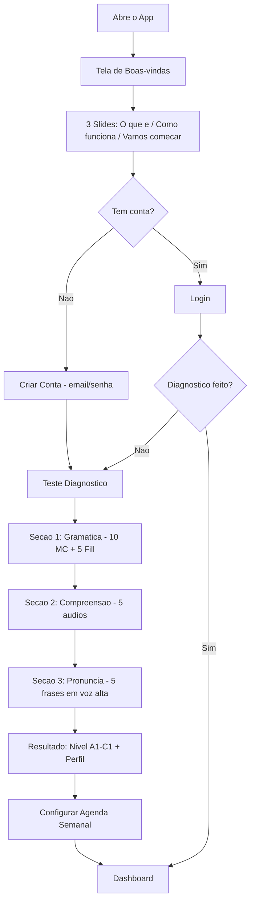
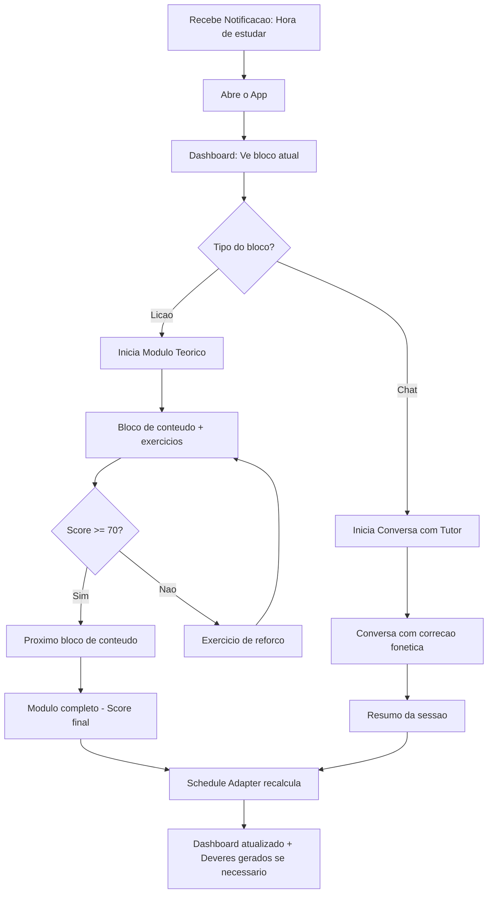
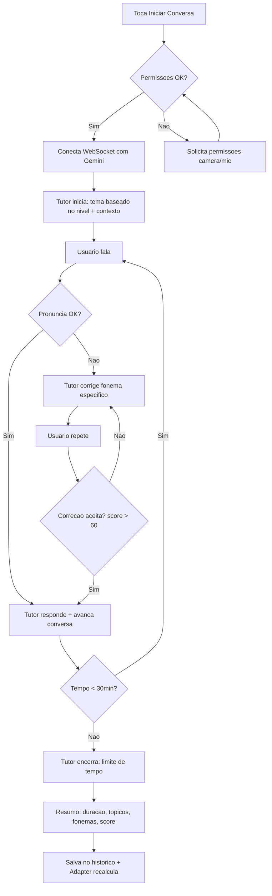
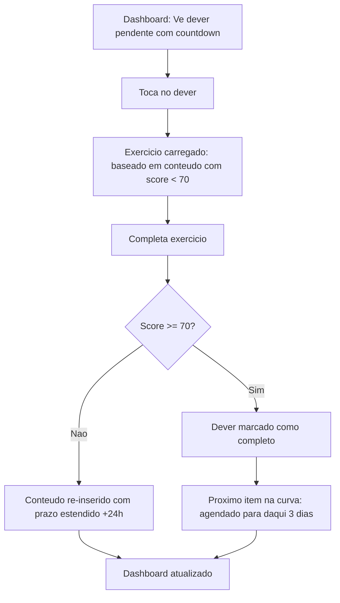
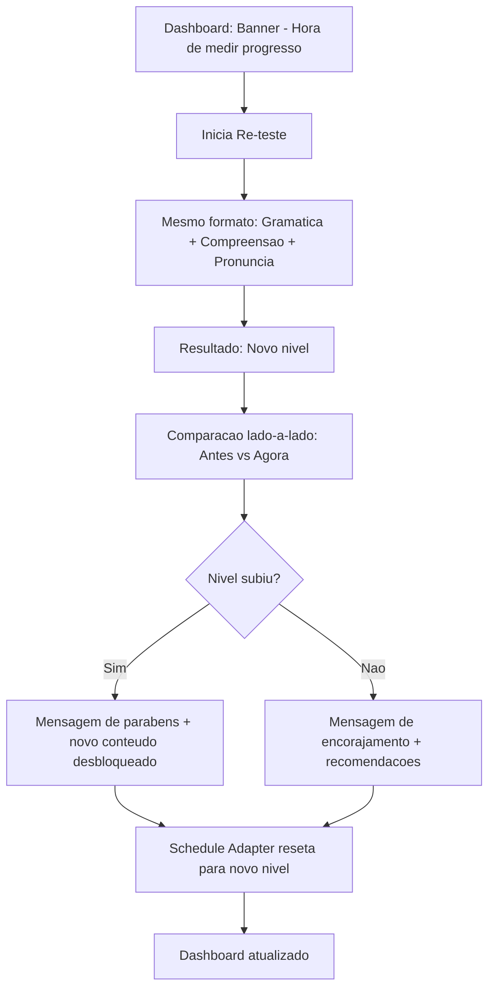

# PRD: Espanhol — Tutor AI de Espanhol para iPad

## Metadados
- **Baseado em:** 01-product-brief.md
- **Data:** 2026-02-22
- **Autor:** AI Product Owner
- **Versao:** 1.0
- **Status:** Draft

---

## 1. Requisitos Funcionais

### Legenda de Prioridade
- **P0 (Critico):** Sem isso, o produto nao funciona. Bloqueador de lancamento.
- **P1 (Importante):** Essencial para a proposta de valor. Pode lancar sem, mas prejudica.
- **P2 (Desejavel):** Melhora a experiencia, mas nao e essencial para MVP.

---

### RF01: Autenticacao e Perfis de Usuario
| Campo | Valor |
|-------|-------|
| **ID** | RF01 |
| **Titulo** | Autenticacao familiar e perfis individuais |
| **Descricao** | Como membro da familia, eu quero fazer login e acessar meu perfil individual para que meu progresso, nivel e agenda sejam independentes dos outros usuarios |
| **Prioridade** | P0 |
| **Epico relacionado** | Epic 0: Setup e Infraestrutura |

**Criterios de Aceite (Gherkin):**
```gherkin
DADO que o usuario abre o app pela primeira vez
QUANDO seleciona "Criar Conta"
ENTAO o Firebase Auth cria uma conta com email/senha
E o Firestore cria um documento de perfil com campos: nome, nivel (null), agenda (vazia), created_at

DADO que o usuario ja tem conta
QUANDO insere email e senha corretos
ENTAO e redirecionado ao Dashboard com seus dados individuais carregados

DADO que o usuario insere credenciais incorretas
QUANDO tenta fazer login
ENTAO recebe mensagem "Email ou senha incorretos" sem revelar qual campo esta errado
E apos 5 tentativas em 15 minutos, o login e bloqueado temporariamente por 30 minutos
```

**Casos de Borda:**
- [ ] Usuario tenta criar conta com email ja registrado → mensagem "Este email ja esta em uso"
- [ ] Sessao expira apos 7 dias de inatividade → redirecionar para login com mensagem explicativa
- [ ] Perda de conexao durante login → mensagem "Sem conexao. Verifique sua internet."

**Regras de Negocio:**
- RN01: Maximo de 5 contas por instalacao (familia)
- RN02: Cada perfil e independente — progresso, nivel, agenda e historico nao se misturam
- RN03: Nao ha roles administrativos no MVP; todos os usuarios tem as mesmas permissoes

**Dependencias:**
- Depende de: Nenhum
- Bloqueia: RF02, RF03, RF04, RF05, RF06, RF07

---

### RF02: Teste Diagnostico de Fluencia
| Campo | Valor |
|-------|-------|
| **ID** | RF02 |
| **Titulo** | Teste diagnostico obrigatorio com voz e texto |
| **Descricao** | Como novo usuario, eu quero realizar um teste diagnostico no primeiro acesso para que o sistema estabeleca minha linha de base de fluencia e personalize todo o conteudo subsequente |
| **Prioridade** | P0 |
| **Epico relacionado** | Epic 1: Teste Diagnostico |

**Criterios de Aceite (Gherkin):**
```gherkin
DADO que o usuario completou o cadastro e nunca fez o diagnostico
QUANDO acessa o Dashboard pela primeira vez
ENTAO e redirecionado obrigatoriamente para o Teste Diagnostico sem opcao de pular

DADO que o usuario esta no Teste Diagnostico
QUANDO completa a secao de gramatica (10 questoes de multipla escolha + 5 de preenchimento)
ENTAO o sistema registra score de gramatica (0-100) e tempo medio por questao

DADO que o usuario esta na secao de compreensao auditiva
QUANDO ouve 5 audios em espanhol paraguaio e responde questoes sobre o conteudo
ENTAO o sistema registra score de compreensao (0-100) e tipos de erro (vocabulario vs. velocidade vs. contexto)

DADO que o usuario esta na secao de pronuncia
QUANDO le em voz alta 5 frases exibidas na tela
ENTAO o Gemini analisa a pronuncia via audio streaming e retorna score fonetico (0-100) com lista de fonemas problematicos

DADO que o usuario completou as 3 secoes
QUANDO o teste e finalizado
ENTAO o sistema calcula o nivel geral (A1, A2, B1, B2, C1) usando media ponderada: gramatica (30%) + compreensao (30%) + pronuncia (40%)
E gera o perfil de fluencia com pontos fortes, pontos fracos e fonemas a trabalhar
E desbloqueia o Dashboard completo
```

**Casos de Borda:**
- [ ] Usuario fecha o app no meio do teste → progresso salvo; ao voltar, retoma de onde parou
- [ ] Microfone nao disponivel durante secao de pronuncia → oferecer opcao de "Tentar novamente" com instrucoes de permissao; nao permitir pular secao
- [ ] Score empatado entre dois niveis (ex: A2/B1) → atribuir o nivel inferior para garantir que conteudo nao seja dificil demais

**Regras de Negocio:**
- RN04: O teste diagnostico e obrigatorio — nenhuma funcionalidade (exceto perfil) e acessivel sem completa-lo
- RN05: Re-aplicacao automatica a cada 30 dias para medir evolucao; usuario pode antecipar manualmente
- RN06: Score fonetico usa o Gemini 3 Flash Multimodal com prompt calibrado para sotaque brasileiro falando espanhol
- RN07: Peso maior em pronuncia (40%) porque e o diferencial do produto e a dor principal dos usuarios

**Dependencias:**
- Depende de: RF01
- Bloqueia: RF03, RF04, RF05, RF06

---

### RF03: Chat Supervisionado (Voz + Visao)
| Campo | Valor |
|-------|-------|
| **ID** | RF03 |
| **Titulo** | Conversa com tutor AI usando camera e microfone com correcao fonetica em tempo real |
| **Descricao** | Como usuario, eu quero conversar com o tutor AI usando voz e camera para que eu pratique espanhol oral com correcao de pronuncia instantanea sem vergonha de errar |
| **Prioridade** | P0 |
| **Epico relacionado** | Epic 2: Chat Supervisionado |

**Criterios de Aceite (Gherkin):**
```gherkin
DADO que o usuario esta no Dashboard com diagnostico completo
QUANDO toca em "Iniciar Conversa"
ENTAO o app solicita permissao de camera e microfone (se ainda nao concedida)
E abre a tela de chat com video do usuario no canto, avatar do tutor no centro e area de legendas embaixo

DADO que a sessao de chat esta ativa
QUANDO o usuario fala uma frase em espanhol
ENTAO o Gemini recebe o audio via WebSocket bidirecional
E responde em audio (voz sintetizada) em menos de 1.5 segundos
E exibe legenda do que o usuario disse + legenda da resposta da IA simultaneamente

DADO que o usuario comete um erro de pronuncia
QUANDO o Gemini detecta fonema incorreto (ex: "rr" brasileiro vs. "rr" espanhol)
ENTAO o tutor interrompe o fluxo da conversa com correcao especifica
E exibe visualmente o fonema correto vs. o pronunciado
E pede ao usuario para repetir a palavra/frase corrigida
E so prossegue apos pronuncia aceitavel (score > 60 para o fonema)

DADO que o usuario quer encerrar a sessao
QUANDO toca em "Encerrar" ou diz "Encerrar sessao"
ENTAO o sistema gera resumo da sessao: duracao, topicos abordados, fonemas corrigidos, score geral
E salva no historico do usuario
```

**Casos de Borda:**
- [ ] Latencia excede 3 segundos → fallback para modo texto com mensagem "Conexao lenta. Mudando para modo texto."
- [ ] Camera bloqueada pelo iPadOS → sessao funciona apenas com audio; aviso "Sem camera, a IA nao podera analisar sua expressao facial"
- [ ] Usuario fica em silencio por mais de 30 segundos → tutor faz pergunta de estímulo contextualizada
- [ ] Ruido de fundo excessivo → tutor avisa "Estou com dificuldade de ouvir. Pode ir para um lugar mais silencioso?"

**Regras de Negocio:**
- RN08: Sessoes tem duracao minima de 3 minutos e maxima de 30 minutos (para controle de custo da API)
- RN09: O tutor adapta o tema da conversa ao nivel e contexto do usuario (medico para Renata, cotidiano para Joel, academico para Matheus)
- RN10: Correcoes foneticas sao obrigatorias, mas a intensidade adapta-se a persona:
  - **Matheus (iniciante):** Correcao intensiva — tutor interrompe a cada erro de fonema para construir base solida desde o inicio
  - **Renata (intermediaria):** Correcao moderada — tutor corrige fonemas especificos ao longo da fala e consolida correcoes ao final de cada frase completa
  - **Joel (profissional):** Correcao minima — tutor so interrompe em erros graves que comprometem a compreensao; demais erros sao anotados e apresentados no resumo da sessao
- RN11: Maximo de 3 sessoes de chat por dia por usuario (controle de custo)
- RN12: O contexto paraguaio e obrigatorio: vocabulario, expressoes e cenarios do Paraguai, nao da Espanha

**Dependencias:**
- Depende de: RF01, RF02
- Bloqueia: Nenhum (feature independente apos diagnostico)

---

### RF04: Licoes Teoricas + Quizzes Interativos
| Campo | Valor |
|-------|-------|
| **ID** | RF04 |
| **Titulo** | Material didatico interativo com flashcards, quizzes e supervisao por voz da IA |
| **Descricao** | Como usuario iniciante/intermediario, eu quero estudar gramatica e vocabulario com exercicios interativos supervisionados pela IA para que eu construa base teorica antes de praticar conversa |
| **Prioridade** | P0 |
| **Epico relacionado** | Epic 3: Licoes e Conteudo |

**Criterios de Aceite (Gherkin):**
```gherkin
DADO que o usuario acessa a secao "Licoes" no Dashboard
QUANDO visualiza a lista de modulos disponiveis
ENTAO ve apenas modulos desbloqueados para seu nivel atual (determinado pelo diagnostico)
E modulos futuros aparecem bloqueados com indicacao de pre-requisito

DADO que o usuario inicia um modulo
QUANDO a licao comeca
ENTAO o conteudo e apresentado em blocos de 3-5 minutos: explicacao visual + audio da IA + exemplo contextualizado
E apos cada bloco, 2-3 exercicios de verificacao imediata (flashcard, multipla escolha ou preenchimento)

DADO que o usuario erra um exercicio
QUANDO seleciona resposta incorreta
ENTAO recebe feedback imediato com a resposta correta, explicacao do porquê e um exercicio similar para tentar novamente

DADO que o usuario completa um modulo
QUANDO finaliza todos os blocos e exercicios
ENTAO recebe score final do modulo (0-100)
E exercicios com score < 70 sao marcados para revisao no Schedule Adapter
E o proximo modulo e desbloqueado se score >= 60
```

**Casos de Borda:**
- [ ] Usuario tenta acessar modulo bloqueado → mensagem "Complete [modulo X] primeiro para desbloquear"
- [ ] Exercicio de audio sem microfone → oferecer alternativa em texto para o mesmo exercicio
- [ ] Usuario completa modulo com score < 60 → modulo pode ser refeito; proximo nao desbloqueia

**Regras de Negocio:**
- RN13: Conteudo dos modulos e gerado pelo Gemini com base no nivel do usuario e contextualizado para espanhol paraguaio
- RN14: Cada modulo tem entre 15-25 minutos de conteudo total
- RN15: Exercicios de flashcard usam repeticao espacada (algoritmo SM-2 simplificado)
- RN16: A IA supervisiona verbalmente — pode ler enunciados em voz alta, dar dicas orais e explicar erros falando

**Dependencias:**
- Depende de: RF01, RF02
- Bloqueia: Nenhum (feature independente apos diagnostico)

---

### RF05: Schedule Adapter (Adaptador de Dificuldade)
| Campo | Valor |
|-------|-------|
| **ID** | RF05 |
| **Titulo** | Sistema de adaptacao dinamica de dificuldade e conteudo |
| **Descricao** | Como usuario, eu quero que o sistema ajuste automaticamente a dificuldade e o tipo de conteudo com base no meu desempenho recente para que eu esteja sempre aprendendo na zona ideal de desafio |
| **Prioridade** | P0 |
| **Epico relacionado** | Epic 4: Motor de Adaptacao |

**Criterios de Aceite (Gherkin):**
```gherkin
DADO que o usuario completou pelo menos 3 sessoes (chat ou licoes)
QUANDO o Schedule Adapter roda ao final de cada sessao
ENTAO calcula a taxa de acerto das ultimas 5 sessoes
E classifica o estado do usuario em: "Muito Facil" (>80%), "Zona Ideal" (60-80%), "Muito Dificil" (<60%)

DADO que o usuario esta na faixa "Muito Facil" (>80% acerto por 3 sessoes)
QUANDO o Adapter recalcula o conteudo
ENTAO aumenta a dificuldade: vocabulario mais avancado, frases mais longas, topicos mais complexos
E registra o ajuste no historico com timestamp e motivo

DADO que o usuario esta na faixa "Muito Dificil" (<60% acerto por 3 sessoes)
QUANDO o Adapter recalcula o conteudo
ENTAO reduz a dificuldade: revisa conteudo anterior, simplifica exercicios, reforça base
E registra o ajuste no historico

DADO que o usuario esta na "Zona Ideal" (60-80%)
QUANDO o Adapter recalcula
ENTAO mantem a dificuldade atual e introduz conteudo novo progressivamente
```

**Casos de Borda:**
- [ ] Usuario nao completa sessoes suficientes (< 3) → Adapter nao roda; usa nivel do diagnostico como base
- [ ] Usuario tem desempenho erratico (alterna muito facil/dificil) → Adapter usa media movel de 7 sessoes em vez de 5
- [ ] Re-teste diagnostico mostra nivel diferente do Adapter → diagnostico prevalece; Adapter reseta para o novo nivel

**Regras de Negocio:**
- RN17: O Adapter roda automaticamente apos CADA sessao completada (chat ou licao)
- RN18: Ajustes de dificuldade sao graduais — nunca pular mais de 1 sub-nivel por vez
- RN19: O historico de ajustes e visivel para o usuario em "Meu Progresso"
- RN20: O Adapter considera tipo de atividade separadamente: fonetica, gramatica e vocabulario podem estar em niveis diferentes

**Dependencias:**
- Depende de: RF01, RF02, RF03 ou RF04 (precisa de dados de sessoes)
- Bloqueia: RF06 (a agenda usa o Adapter para gerar exercicios)

---

### RF06: Agenda Rigida + Deveres com Prazo
| Campo | Valor |
|-------|-------|
| **ID** | RF06 |
| **Titulo** | Sistema de agenda semanal fixa com exercicios e prazos baseados em curva de esquecimento |
| **Descricao** | Como usuario, eu quero definir blocos fixos de estudo na semana e receber exercicios com prazo para que eu mantenha disciplina e consistencia no aprendizado |
| **Prioridade** | P0 |
| **Epico relacionado** | Epic 5: Agenda e Disciplina |

**Criterios de Aceite (Gherkin):**
```gherkin
DADO que o usuario acessou o Dashboard apos diagnostico
QUANDO navega para "Minha Agenda"
ENTAO ve um calendario semanal vazio
E pode definir blocos de estudo arrastando/tocando nos horarios desejados (minimo 3 blocos de 15min por semana)

DADO que o usuario definiu seus blocos semanais
QUANDO um bloco agendado chega no horario definido
ENTAO o app exibe notificacao "Hora de estudar! Seu bloco de [tipo] comeca agora."
E ao abrir, o conteudo do bloco ja esta preparado pelo Schedule Adapter

DADO que o usuario completou uma sessao
QUANDO o sistema detecta conteudo que precisa de reforço (score < 70)
ENTAO gera automaticamente um "Dever" com prazo de 48 horas
E o dever aparece na aba "Deveres" com countdown visivel

DADO que um dever vence sem ser completado
QUANDO o prazo de 48 horas expira
ENTAO o dever e marcado como "Vencido" (vermelho)
E o conteudo e re-inserido na proxima sessao agendada com prioridade alta
E a metrica de aderencia do usuario e penalizada
```

**Casos de Borda:**
- [ ] Usuario tenta definir menos de 3 blocos semanais → mensagem "Minimo de 3 blocos por semana para garantir progresso"
- [ ] Usuario nao abre o app por 7 dias consecutivos → ao voltar, ver resumo "Voce perdeu X blocos" + deveres acumulados priorizados
- [ ] Todos os deveres estao em dia → mensagem positiva "Tudo em dia! Continue assim." + sugestao de sessao extra opcional

**Regras de Negocio:**
- RN21: Minimo de 3 blocos semanais de 15 minutos cada (45 min/semana)
- RN22: Deveres usam curva de esquecimento — conteudo errado revisitado em: 1h → 1 dia → 3 dias → 7 dias → 30 dias
- RN23: Notificacoes sao enviadas 5 minutos antes do bloco e no momento do bloco
- RN24: Streak contabiliza dias consecutivos com pelo menos 1 sessao completada (minimo 10 min)
- RN25: A agenda pode ser editada a qualquer momento, mas blocos passados nao-cumpridos contam como perdidos
- RN26-RF06: Janela de tolerancia de 75 minutos: sessoes iniciadas ate 75min antes ou depois do horario agendado marcam automaticamente o slot correspondente como `completed` em `scheduleLogs`. Sessoes fora da janela geram eventos de alerta e nao contam para o slot agendado

**Dependencias:**
- Depende de: RF01, RF02, RF05
- Bloqueia: Nenhum

---

### RF07: Dashboard e Progresso
| Campo | Valor |
|-------|-------|
| **ID** | RF07 |
| **Titulo** | Tela principal com visao geral de progresso, agenda e acoes rapidas |
| **Descricao** | Como usuario, eu quero ver meu progresso, proximos blocos de estudo e deveres pendentes em uma unica tela para que eu saiba exatamente o que fazer ao abrir o app |
| **Prioridade** | P1 |
| **Epico relacionado** | Epic 6: Dashboard e Analytics |

**Criterios de Aceite (Gherkin):**
```gherkin
DADO que o usuario fez login e ja completou o diagnostico
QUANDO acessa o Dashboard
ENTAO ve: nivel atual (A1-C1), streak atual, proximo bloco agendado, deveres pendentes (com prazo), e botoes de acesso rapido ("Iniciar Conversa", "Estudar Licao")

DADO que o usuario quer ver seu historico detalhado
QUANDO toca em "Meu Progresso"
ENTAO ve: grafico de evolucao semanal (sessoes completadas vs agendadas), historico de scores por tipo (fonetica/gramatica/vocabulario), lista de fonemas melhorados e pendentes, comparacao com diagnostico anterior

DADO que o re-teste diagnostico esta disponivel (30 dias desde o ultimo)
QUANDO o usuario acessa o Dashboard
ENTAO ve banner "Hora de medir seu progresso! Faca o diagnostico novamente."
E ao completar, ve comparacao lado-a-lado: diagnostico anterior vs atual
```

**Casos de Borda:**
- [ ] Usuario sem nenhuma sessao completada alem do diagnostico → Dashboard mostra "Comece sua primeira licao!" com CTA destacado
- [ ] Todos os deveres estao vencidos → alerta amarelo "Voce tem X deveres atrasados. Vamos colocar em dia?"

**Regras de Negocio:**
- RN33: O Dashboard e a tela inicial apos login (nao landing page)
- RN34: Dados de progresso sao atualizados em tempo real via listener do Firestore
- RN35: Relatorio semanal automatico gerado toda segunda-feira com resumo da semana anterior

**Dependencias:**
- Depende de: RF01, RF02
- Bloqueia: Nenhum

---

### RF08: Onboarding Guiado
| Campo | Valor |
|-------|-------|
| **ID** | RF08 |
| **Titulo** | Fluxo de primeiro acesso com orientacao passo-a-passo |
| **Descricao** | Como novo usuario, eu quero ser guiado pelos primeiros passos (criar conta, entender o app, fazer diagnostico, configurar agenda) para que eu comece a usar o app sem confusao |
| **Prioridade** | P1 |
| **Epico relacionado** | Epic 1: Teste Diagnostico |

**Criterios de Aceite (Gherkin):**
```gherkin
DADO que o usuario acabou de criar conta
QUANDO e redirecionado ao app pela primeira vez
ENTAO ve tela de boas-vindas com 3 slides: (1) "O que e o Espanhol" (2) "Como funciona" (3) "Vamos comecar"
E apos slides, e direcionado ao Teste Diagnostico

DADO que o usuario completou o diagnostico
QUANDO recebe o resultado
ENTAO ve explicacao do que significa seu nivel
E e direcionado para configurar a agenda semanal
E apos configurar, ve o Dashboard completo pela primeira vez
```

**Casos de Borda:**
- [ ] Usuario pula slides rapidamente → slides tem botao "Pular" mas diagnostico continua obrigatorio

**Regras de Negocio:**
- RN29: Onboarding completo (slides + diagnostico + agenda) deve ser concluido em no maximo 20 minutos
- RN30: Permissoes de camera e microfone sao solicitadas no contexto — antes da secao de pronuncia do diagnostico, nao durante o onboarding

**Dependencias:**
- Depende de: RF01, RF02
- Bloqueia: Nenhum

---

### RF09: Feedback e Reporte de Erros
| Campo | Valor |
|-------|-------|
| **ID** | RF09 |
| **Titulo** | Botao de feedback para reportar erros de conteudo da IA |
| **Descricao** | Como usuario, eu quero reportar quando a IA gera conteudo incorreto (erro gramatical, traducao errada, correcao fonetica indevida) para que o conteudo seja revisado |
| **Prioridade** | P2 |
| **Epico relacionado** | Epic 6: Dashboard e Analytics |

**Criterios de Aceite (Gherkin):**
```gherkin
DADO que o usuario esta em qualquer tela com conteudo gerado pela IA
QUANDO toca no icone de "Reportar Erro" (flag)
ENTAO abre modal com opcoes: "Erro gramatical", "Traducao incorreta", "Correcao fonetica indevida", "Outro"
E permite adicionar texto livre (opcional)
E salva o report no Firestore com contexto (tela, conteudo, sessao, timestamp)
```

**Regras de Negocio:**
- RN31: Reports sao salvos no Firestore para revisao manual pelo PO (Joel)
- RN32: Nao ha resposta automatica ao report — revisao e manual

**Dependencias:**
- Depende de: RF01
- Bloqueia: Nenhum

---

## 2. Requisitos Nao-Funcionais

### RNF01: Performance
| Aspecto | Requisito | Como medir |
|---------|-----------|------------|
| Latencia E2E de conversacao (voz) | < 1.5 segundos (p95) | Timestamp no WebSocket: delta entre ultimo frame de audio enviado e primeiro frame de audio recebido |
| Tempo de carregamento inicial do app (LCP) | < 3 segundos | Lighthouse no Safari/iPadOS |
| Time to Interactive | < 4 segundos | Lighthouse |
| Tempo de geracao de licao pelo Gemini | < 5 segundos | Timestamp no Cloud Function |
| Renderizacao de exercicios (flashcards, quizzes) | < 500ms | Performance API do browser |

### RNF02: Escalabilidade
| Aspecto | Requisito MVP | Requisito v1.0 |
|---------|---------------|----------------|
| Usuarios simultaneos | 3 (familia) | 3 |
| Sessoes de chat simultaneas | 1 por vez (familia compartilha iPad) | 1 |
| Dados armazenados no Firestore | < 1GB | < 5GB |
| Chamadas Gemini API / dia | < 100 | < 200 |
| Minutos de audio processado / dia | < 90 minutos (30min x 3 usuarios) | < 120 minutos |

### RNF03: Seguranca
| Requisito | Implementacao |
|-----------|---------------|
| Autenticacao | Firebase Auth com email/senha |
| Autorizacao | Firestore Security Rules (por uid) |
| Criptografia em transito | TLS 1.3 (Firebase default) |
| Criptografia em repouso | Firestore encryption at rest (Google default) |
| Conformidade | LGPD nao obrigatorio (uso familiar privado, sem coleta de dados de terceiros) |
| API Keys | Gemini API key armazenada em Cloud Functions (server-side), nunca exposta no cliente |

### RNF04: Acessibilidade
- **Nivel WCAG:** AA (foco em contraste e navegacao por toque)
- **Tamanho minimo de toque:** 44x44 pontos (Apple HIG)
- **Leitores de tela:** Suporte basico VoiceOver para navegacao (nao para sessoes de chat por voz)
- **Orientacao:** Landscape e portrait suportados; layout otimizado para landscape (iPad em mesa)

### RNF05: Compatibilidade
| Aspecto | Requisito |
|---------|-----------|
| Dispositivo | iPad (9a geracao ou superior) |
| SO | iPadOS 17+ |
| Browser | Safari (PWA) |
| Resolucao | 2160x1620 (10.2") ate 2732x2048 (12.9") |
| Conexao | Wi-Fi ou 4G (minimo 5Mbps para video streaming) |

### RNF06: Disponibilidade
| Aspecto | Requisito |
|---------|-----------|
| Uptime | 99% (Firebase SLA) |
| Tolerancia a falha do Gemini | Fallback para modo texto se API indisponivel |
| Dados offline | Nenhum (MVP sem suporte offline) |

---

## 3. Fluxos de Usuario (User Journeys)

### Fluxo 1: Primeiro Acesso (Onboarding Completo)

**Objetivo:** Criar conta, fazer diagnostico e configurar agenda
**Persona:** Qualquer (Matheus, Renata ou Joel)



**Passos detalhados:**
| # | Acao do Usuario | Resposta do Sistema | Dados envolvidos |
|---|-----------------|---------------------|------------------|
| 1 | Abre o app | Exibe splash + tela de boas-vindas | - |
| 2 | Navega pelos 3 slides | Exibe slides com animacoes | - |
| 3 | Toca "Criar Conta" | Exibe formulario email/senha | Firebase Auth |
| 4 | Preenche e confirma | Cria conta + doc no Firestore | users/{uid} |
| 5 | Inicia diagnostico | Carrega secao de gramatica | diagnostics/{uid} |
| 6 | Responde gramatica | Registra respostas + score parcial | diagnostics/{uid}/grammar |
| 7 | Ouve audios e responde | Registra respostas + score parcial | diagnostics/{uid}/listening |
| 8 | Le frases em voz alta | Gemini analisa pronuncia via audio | diagnostics/{uid}/speaking |
| 9 | Ve resultado | Exibe nivel + perfil + fonemas | users/{uid}/profile |
| 10 | Configura agenda | Salva blocos semanais | users/{uid}/schedule |
| 11 | Acessa Dashboard | Exibe dados personalizados | Agregacao de collections |

---

### Fluxo 2: Sessao Diaria de Estudo

**Objetivo:** Completar bloco agendado (licao ou chat)
**Persona:** Matheus (iniciante — prefere licoes teoricas)



---

### Fluxo 3: Conversa com Tutor (Chat Supervisionado)

**Objetivo:** Praticar espanhol oral com correcao em tempo real
**Persona:** Renata (intermediaria — foco em pronuncia medica)



---

### Fluxo 4: Deveres com Prazo

**Objetivo:** Completar exercicio de reforco antes do prazo
**Persona:** Joel (profissional — sessoes curtas)



---

### Fluxo 5: Re-teste Diagnostico (Mensal)

**Objetivo:** Medir evolucao apos 30 dias
**Persona:** Qualquer



---

## 4. Regras de Negocio Globais

### RN-G01: Idioma da Interface
- **Descricao:** A interface do app (menus, botoes, labels) e em portugues brasileiro. O conteudo pedagogico (licoes, exercicios, conversas) e em espanhol.
- **Condicao:** SE elemento e da interface do app ENTAO exibir em PT-BR
- **Acao:** SE elemento e conteudo pedagogico ENTAO exibir em espanhol
- **Excecao:** Explicacoes de gramatica podem mesclar PT-BR (explicacao) com espanhol (exemplos)
- **Afeta:** RF03, RF04, RF07, RF08

### RN-G02: Contexto Paraguaio Obrigatorio
- **Descricao:** Todo conteudo gerado pela IA deve usar espanhol paraguaio como referencia
- **Condicao:** SE o Gemini gera conteudo (texto, audio, exercicios)
- **Acao:** ENTAO deve usar vocabulario, expressoes e cenarios do Paraguai (nao Espanha, nao Mexico)
- **Excecao:** Gramatica formal (conjugacoes, tempos verbais) segue espanhol padrao
- **Afeta:** RF02, RF03, RF04

### RN-G03: Limites de Uso da API Gemini
- **Descricao:** Controlar custos limitando chamadas a API
- **Condicao:** SE usuario atinge limite diario
- **Acao:** ENTAO bloqueia novas sessoes de chat para o dia; licoes pre-geradas continuam acessiveis
- **Excecao:** EXCETO QUANDO limite e re-configurado pelo PO
- **Afeta:** RF03, RF04, RF05

### RN-G04: Persistencia de Progresso
- **Descricao:** Todo progresso e salvo em tempo real no Firestore
- **Condicao:** SE qualquer acao gera dados de progresso (score, sessao, dever)
- **Acao:** ENTAO salvar imediatamente via Firestore real-time
- **Excecao:** EXCETO QUANDO sem conexao → dados perdidos (sem modo offline no MVP)
- **Afeta:** RF02, RF03, RF04, RF05, RF06, RF07

### RN-G05: Privacy Familiar
- **Descricao:** Cada usuario so ve seus proprios dados
- **Condicao:** SE usuario A acessa o app
- **Acao:** ENTAO Firestore Security Rules filtram apenas documentos onde uid == usuario A
- **Excecao:** Nenhuma — sem funcionalidades sociais ou comparacao entre usuarios no MVP
- **Afeta:** RF01, RF07

---

## 5. Integracoes

### INT01: Google Gemini 3 Flash (Multimodal)
| Campo | Valor |
|-------|-------|
| **Servico** | Google Gemini 3 Flash Multimodal API |
| **Proposito** | Motor de IA para: analise fonetica, geracao de conteudo, conversacao em tempo real, avaliacao de pronuncia |
| **Tipo** | WebSocket bidirecional (para chat em tempo real) + REST API (para geracao de conteudo) |
| **Autenticacao** | API Key (server-side via Cloud Functions) |
| **Rate Limits** | Dependente do tier contratado; monitorar via Cloud Monitoring |
| **Fallback** | Chat: modo texto se WebSocket falhar. Licoes: cache de conteudo pre-gerado. Diagnostico: retry apos 10 segundos, max 3 tentativas |

### INT02: Firebase Authentication
| Campo | Valor |
|-------|-------|
| **Servico** | Firebase Auth |
| **Proposito** | Autenticacao de usuarios (email/senha) |
| **Tipo** | SDK client-side |
| **Autenticacao** | Firebase project config (client-side) |
| **Rate Limits** | 100 sign-ups/IP/hora (Firebase default) |
| **Fallback** | Retry com backoff exponencial; se persistir, mensagem de erro |

### INT03: Cloud Firestore
| Campo | Valor |
|-------|-------|
| **Servico** | Cloud Firestore |
| **Proposito** | Persistencia de dados: perfis, progresso, sessoes, agendas, deveres |
| **Tipo** | SDK client-side com real-time listeners |
| **Autenticacao** | Firebase Auth token (automatico via SDK) |
| **Rate Limits** | 1 write/segundo/documento (Firestore limit) |
| **Fallback** | Firestore offline persistence desabilitado no MVP (sem modo offline) |

### INT04: Firebase Cloud Functions
| Campo | Valor |
|-------|-------|
| **Servico** | Cloud Functions for Firebase (2nd gen) |
| **Proposito** | Proxy seguro para Gemini API; logica server-side (Schedule Adapter, geracao de deveres, re-teste automatico) |
| **Tipo** | HTTP triggers + Firestore triggers |
| **Autenticacao** | Firebase Auth token validado no server |
| **Rate Limits** | Configuravel; default 1000 invocacoes/100s |
| **Fallback** | Retry automatico para funcoes idempotentes; dead-letter queue para falhas persistentes |

### INT05: Firebase Hosting
| Campo | Valor |
|-------|-------|
| **Servico** | Firebase Hosting |
| **Proposito** | Hospedar PWA (arquivos estaticos + service worker) |
| **Tipo** | CDN global |
| **Autenticacao** | N/A (hosting publico; auth no app) |
| **Rate Limits** | 10GB/mes no plano Blaze (pay-as-you-go) |
| **Fallback** | CDN global do Firebase garante disponibilidade |

---

## 6. Matriz de Rastreabilidade

| Requisito | Epico | User Stories | Criterios de Teste |
|-----------|-------|------------|-------------------|
| RF01 | Epic 0: Setup | Story 0.1: Firebase Auth setup, Story 0.2: Perfis no Firestore | TC001: Login sucesso, TC002: Login falha, TC003: Criar conta, TC004: Isolamento de perfis |
| RF02 | Epic 1: Diagnostico | Story 1.1: Teste gramatica, Story 1.2: Teste compreensao, Story 1.3: Teste pronuncia, Story 1.4: Calculo de nivel | TC005: Score gramatica, TC006: Score compreensao, TC007: Score fonetico, TC008: Nivel calculado, TC009: Retomada apos interrupcao |
| RF03 | Epic 2: Chat | Story 2.1: WebSocket setup, Story 2.2: UI de chat, Story 2.3: Correcao fonetica, Story 2.4: Resumo de sessao | TC010: Latencia <1.5s, TC011: Correcao fonetica, TC012: Fallback texto, TC013: Limite 30min |
| RF04 | Epic 3: Licoes | Story 3.1: Geracao de conteudo, Story 3.2: Flashcards + quizzes, Story 3.3: Supervisao por voz, Story 3.4: Desbloqueio progressivo | TC014: Conteudo por nivel, TC015: Score + feedback, TC016: Repeticao espacada, TC017: Modulo bloqueado |
| RF05 | Epic 4: Adapter | Story 4.1: Calculo de taxa de acerto, Story 4.2: Regras de ajuste, Story 4.3: Historico de ajustes | TC018: Subida de dificuldade, TC019: Reducao de dificuldade, TC020: Zona ideal mantida |
| RF06 | Epic 5: Agenda | Story 5.1: Calendario semanal, Story 5.2: Notificacoes, Story 5.3: Deveres + prazo, Story 5.4: Curva de esquecimento | TC021: Definir blocos, TC022: Notificacao no horario, TC023: Dever gerado, TC024: Dever vencido, TC025: Repeticao espacada |
| RF07 | Epic 6: Dashboard | Story 6.1: Tela principal, Story 6.2: Meu Progresso, Story 6.3: Comparacao diagnosticos | TC026: Dados corretos, TC027: Grafico evolucao, TC028: Comparacao pre/pos |
| RF08 | Epic 1: Diagnostico | Story 1.5: Onboarding slides | TC029: Fluxo completo primeiro acesso |
| RF09 | Epic 6: Dashboard | Story 6.4: Botao feedback | TC030: Report salvo no Firestore |

---

## 7. GAP Analysis: Produto e Negocio

> Skill: `gap-analysis` — Dimensao: Product/Business

### 7.1 Feature Coverage
| Feature | Expectativa de Mercado (Duolingo, Babbel, etc.) | Estado Atual | GAP | Prioridade |
|---------|------------------------------------------------|--------------|-----|------------|
| Gamificacao (XP, ligas, streak visual) | Presente em todos os concorrentes | Apenas streak simples (dias consecutivos) | Sem gamificacao complexa | P2 — nao essencial para familia motivada intrinsecamente |
| Analise fonetica em tempo real | Duolingo tem basico (certo/errado); nenhum concorrente faz correcao de fonema especifico | Nao implementado (greenfield) | Implementar do zero via Gemini — e o diferencial | P0 |
| Conteudo contextualizado (espanhol paraguaio) | Nenhum concorrente oferece | Nao implementado (greenfield) | Implementar via prompt engineering no Gemini | P0 |
| Modo offline | Duolingo tem; Babbel parcial | Nao planejado para MVP | Sem offline — aceitavel para uso domestico com Wi-Fi | P2 (v2.0) |
| Conversacao por voz com IA | Duolingo Max (GPT-4) tem; outros nao | Nao implementado | Core do produto — Gemini multimodal + WebSocket | P0 |
| Agenda rigida com cobranca | Nenhum concorrente obriga agenda; todos usam gamificacao como incentivo | Nao implementado | Diferencial — implementar sistema de agenda fixa | P0 |
| Multi-plataforma | Todos suportam iOS + Android + Web | Apenas iPad (PWA) | Limitacao aceita para MVP familiar | P2 (v2.0) |

### 7.2 Capability Assessment
| Capacidade | Nivel Necessario | Nivel Atual | GAP | Esforco |
|------------|-----------------|-------------|-----|---------|
| Processamento de audio em tempo real via WebSocket | Alto (latencia <1.5s) | Inexistente | Implementar conexao WebSocket bidirecional com Gemini | L |
| Geracao de conteudo adaptativo por IA | Alto (personalizacao por usuario) | Inexistente | Implementar Schedule Adapter + prompts dinamicos | L |
| Analise fonetica (fonema-a-fonema) | Alto (identificar fonemas errados e sugerir correcao) | Inexistente | Depende 100% da capacidade do Gemini 3 Flash; testar e calibrar | M |
| Persistencia de dados em tempo real | Medio (3 usuarios, baixo volume) | Inexistente | Firebase Firestore — setup padrao | S |
| PWA com acesso a camera/microfone no iPad | Alto (critico para funcionalidade core) | Inexistente | Testar compatibilidade Safari/iPadOS no Sprint 0 | S |

### 7.3 Metrics GAP
| Metrica | Valor Atual | Valor Alvo | GAP | Estrategia |
|---------|------------|------------|-----|-----------|
| Taxa de conclusao de licoes mensais | N/A (produto novo) | > 85% | 85 pontos percentuais | Sistema de agenda rigida + notificacoes + deveres com prazo |
| Latencia E2E conversacao | N/A | < 1.5s | Total | Otimizacao de WebSocket + buffer de audio local |
| Aderencia ao calendario semanal | N/A | >= 80% | Total | Notificacoes + sistema de deveres + streak |
| Reducao de vicios de pronuncia | N/A | 30% em 10 sessoes | Total | Correcao fonetica obrigatoria + repeticao ate acerto |
| Retencao (dias ativos/semana) | N/A | >= 4 dias | Total | Agenda fixa + conteudo adaptativo que evita tedio |

### 7.4 GAP Inventory
| ID | Area | AS-IS | TO-BE | GAP | Severidade | Prioridade |
|----|------|-------|-------|-----|------------|------------|
| G-PRD-01 | Infraestrutura de audio | Inexistente | WebSocket bidirecional com Gemini + camera/mic iPad | Implementacao completa de streaming de audio/video em PWA | Critical | P0 |
| G-PRD-02 | Motor de IA pedagogica | Inexistente | Gemini calibrado para ensino de espanhol paraguaio com correcao fonetica | Prompt engineering + testes extensivos com sotaque brasileiro | Critical | P0 |
| G-PRD-03 | Sistema de adaptacao | Inexistente | Schedule Adapter com algoritmo de ajuste de dificuldade + curva de esquecimento | Logica de negocio completa + integracao com Firestore | High | P0 |
| G-PRD-04 | Validacao de plataforma | Desconhecido | PWA no iPad com acesso completo a camera, microfone e notificacoes | Teste de compatibilidade Safari/iPadOS — bloqueador se falhar | Critical | P0 |
| G-PRD-05 | Conteudo educacional | Inexistente | Modulos de espanhol A1-B2 contextualizados para Paraguai | Geracao via Gemini + revisao manual pelo PO | High | P0 |
| G-PRD-06 | Multi-plataforma | Apenas iPad | iOS + Android + Web | Expansao para multiplas plataformas | Low | P2 |
| G-PRD-07 | Modo offline | Sem suporte | Cache de licoes + exercicios offline | Implementar service worker com cache estrategico | Low | P2 |

---

## Glossario

| Termo | Definicao |
|-------|-----------|
| **Schedule Adapter** | Algoritmo que analisa taxas de acerto recentes do usuario e recalcula automaticamente a dificuldade e tipo de conteudo das proximas sessoes |
| **Dever** | Exercicio de reforco gerado automaticamente quando o usuario tem score < 70 em algum conteudo; possui prazo de 48 horas |
| **Streak** | Contagem de dias consecutivos em que o usuario completou pelo menos 1 sessao de estudo (minimo 10 minutos) |
| **Chat Supervisionado** | Sessao de conversacao em tempo real com o tutor AI usando camera + microfone, com correcao fonetica obrigatoria |
| **Score Fonetico** | Pontuacao de 0-100 atribuida pelo Gemini a pronuncia do usuario, considerando fonemas individuais, entonacao e fluencia |
| **Zona Ideal** | Faixa de taxa de acerto entre 60-80% onde o aprendizado e mais eficaz — desafiador o suficiente sem ser frustrante |
| **Curva de Esquecimento** | Modelo de repeticao espacada (baseado em SM-2) que agenda revisoes em intervalos crescentes: 1h → 1 dia → 3 dias → 7 dias → 30 dias |
| **PWA** | Progressive Web App — aplicacao web que pode ser instalada no iPad e acessar camera/microfone via APIs do browser |
| **Fonema** | Unidade minima de som que distingue significado em um idioma; ex: o "rr" espanhol vs. o "r" brasileiro |
| **Espanhol Paraguaio** | Variante do espanhol falada no Paraguai, com influencias do guarani, vocabulario e expressoes proprias distintas do espanhol da Espanha ou do Mexico |
| **Bloco de Estudo** | Periodo fixo de tempo (minimo 15 minutos) definido pelo usuario em seu calendario semanal para atividades de aprendizado |
| **Diagnostico** | Teste de avaliacao de fluencia composto por 3 secoes (gramatica, compreensao auditiva, pronuncia) que determina o nivel do usuario (A1-C1) |
