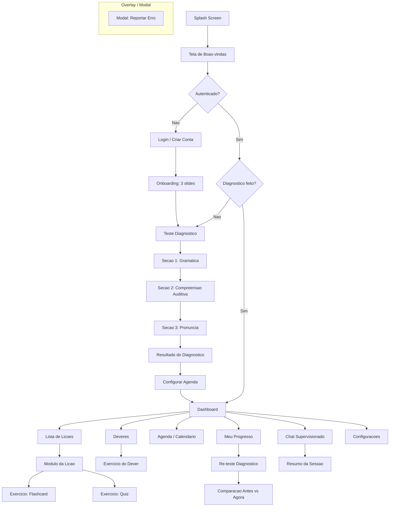
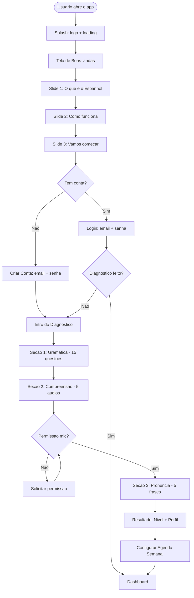
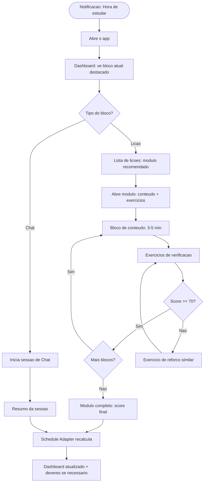
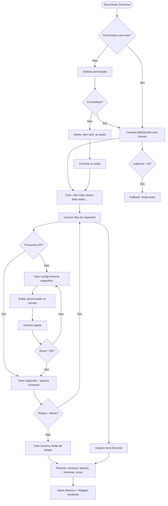
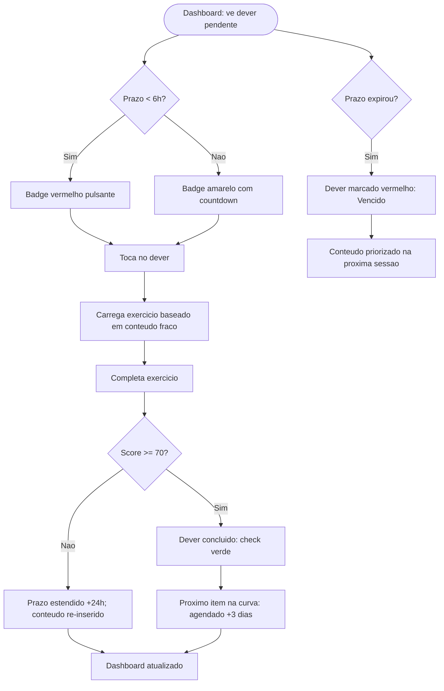
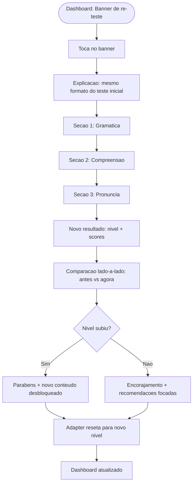

# UX Concept: Espanhol — Tutor AI de Espanhol para iPad

## Metadados
- **Baseado em:** 01-product-brief.md, 02-prd.md
- **Data:** 2026-02-23
- **Autor:** AI UX Researcher
- **Versao:** 1.0

---

## 1. Estrategia de UX

### 1.1 Visao da Experiencia
> Abrir o app deve sentir como sentar com um professor particular paciente que conhece seu nivel, corrige sem julgar e cobra disciplina sem ser chato — tudo na familiaridade do iPad de casa.

### 1.2 Principios de UX

1. **Transparencia de Progresso (Visibility of System Status):** O usuario nunca deve se perguntar "estou melhorando?". Cada sessao termina com feedback visivel, cada semana tem relatorio, cada mes tem re-teste comparativo. A curva de aprendizado e tangivel, nao abstrata.

2. **Friccao Intencional, Nao Acidental (Tesler's Law):** A complexidade pedagogica (correcao fonetica obrigatoria, deveres com prazo, agenda rigida) e friccao intencional que gera valor. Toda friccao acidental (navegacao confusa, estados sem feedback, fluxos longos) deve ser eliminada.

3. **Familiaridade sobre Inovacao (Jakob's Law):** Os usuarios usam iPad diariamente. A navegacao, gestos e padroes devem seguir convencoes iPadOS/Safari que eles ja conhecem. Nao reinventar paradigmas de interacao.

4. **Foco por Contexto (Hick's Law):** Cada tela tem uma unica acao primaria. O Dashboard nao compete com a tela de Chat. A lista de licoes nao distrai do exercicio atual. Menos opcoes = decisoes mais rapidas = mais tempo estudando.

5. **Respeito ao Tempo (Doherty Threshold):** Sessoes de 10-30 minutos entre aulas/plantoes/reunioes. Cada segundo de latencia ou carregamento e um segundo roubado do estudo. Interacoes devem responder em < 400ms; conversacao em < 1.5s.

### 1.3 Metricas de Experiencia
| Metrica | Alvo | Como Medir |
|---------|------|-----------|
| Task Success Rate (completar sessao agendada) | > 90% | Sessoes iniciadas vs. sessoes finalizadas com score |
| Time to First Study (onboarding ate primeira licao) | < 20 minutos | Timestamp: create_account ate first_lesson_start |
| Latencia percebida no Chat | < 1.5s (p95) | Delta WebSocket: ultimo frame enviado vs. primeiro recebido |
| Taxa de erro em navegacao | < 3% | Cliques em botao "Voltar" / toques em areas nao-interativas |
| SUS Score | > 75 | Questionario pos-4-semanas com os 3 usuarios |
| Conclusao de deveres no prazo | > 80% | Deveres entregues antes do deadline / total gerado |

---

## 2. Arquitetura de Informacao

### 2.1 Mapa da Aplicacao



### 2.2 Padrao de Navegacao
| Padrao | Justificativa | Lei UX |
|--------|--------------|--------|
| **Sidebar vertical colapsavel (padrao iPadOS)** | iPad em landscape usa sidebar como padrao nativo (Split View). 5 itens (Dashboard, Chat, Licoes, Agenda, Progresso) + Configuracoes. Sidebar colapsavel: visivel em Dashboard/Licoes/Agenda, **colapsa automaticamente** ao entrar no Chat (modo imersivo full-screen). Familiaridade com apps iPadOS como Notes, Files e Mail | **Jakob's Law** (padrao nativo iPadOS que usuarios ja conhecem), **Miller's Law** (5 itens no sidebar) |
| **Navegacao hierarquica (push/pop)** | Dentro de cada secao, telas empilham (Lista > Detalhe > Exercicio). Padrao nativo iPadOS que os usuarios ja conhecem | **Jakob's Law** (transferencia de expectativa do iOS) |
| **Header contextual com breadcrumb** | Em telas profundas (Licao > Modulo > Exercicio), breadcrumb mostra caminho e permite voltar. Evita desorientacao | **Heuristica 1: Visibility of System Status** |
| **FAB contextual no Dashboard** | Botao flutuante "Iniciar Conversa" no Dashboard — acao primaria sempre acessivel e visualmente distinta | **Von Restorff Effect** (elemento distinto e memoravel) |
| **Full-screen imersivo no Chat** | Durante sessoes de conversacao, sidebar desaparece e a tela ocupa 100% do espaco. Atencao total na voz da IA e no rosto do aluno. Controles flutuantes minimos | **Heuristica 8: Estetica Minimalista** (remover tudo que nao e essencial na tarefa core) |

### 2.3 Organizacao de Conteudo
| Secao | Tipos de Conteudo | Prioridade | Frequencia de Acesso |
|-------|-------------------|------------|---------------------|
| Dashboard | Nivel atual, streak, proximo bloco, deveres pendentes, CTAs | Primary | Muito Alta (entrada do app) |
| Chat Supervisionado | Stream de video/audio, legendas, correcoes, resumo | Primary | Alta (sessoes diarias) |
| Licoes | Lista de modulos, conteudo teorico, flashcards, quizzes | Primary | Alta (sessoes diarias) |
| Agenda/Calendario | Calendario semanal, blocos de estudo, notificacoes | Primary | Media (configuracao + consulta) |
| Deveres | Lista de exercicios com prazo, countdown, status | Primary | Alta (cobrados a cada sessao) |
| Meu Progresso | Graficos de evolucao, historico de scores, fonemas | Secondary | Media (consulta semanal) |
| Configuracoes | Perfil, notificacoes, permissoes, sobre | Tertiary | Baixa (setup inicial) |

---

## 3. User Flows

### 3.1 Flow: Onboarding Completo (Primeiro Acesso)

**Objetivo:** Criar conta, entender o app, fazer diagnostico e configurar agenda
**Persona:** Qualquer (Matheus, Renata ou Joel)



**Passos:**
| Step | Acao do Usuario | Resposta do Sistema | Tela | Lei UX |
|------|----------------|---------------------|------|--------|
| 1 | Abre o app | Splash com logo por 2s, carrega assets | Splash | Doherty Threshold (< 400ms percebido com animacao) |
| 2 | Ve tela de boas-vindas | Ilustracao + titulo + botao "Comecar" | Welcome | Von Restorff (CTA unico e destacado) |
| 3 | Navega pelos 3 slides | Swipe horizontal com dots de progresso | Onboarding Slides | Jakob's Law (padrao de carousel iOS) |
| 4 | Toca "Criar Conta" | Formulario simples: nome, email, senha | Register | Hick's Law (3 campos apenas) |
| 5 | Submete formulario | Firebase cria conta + spinner + redirect | Register > Diagnostico | Visibility of System Status (spinner) |
| 6 | Le intro do diagnostico | Explica as 3 secoes e tempo estimado | Diag Intro | Error Prevention (define expectativa) |
| 7 | Responde gramatica | Questoes com progresso (1/15, 2/15...) | Diag: Gramatica | Visibility of System Status (barra de progresso) |
| 8 | Ouve audios | Audio player + questoes de compreensao | Diag: Listening | Recognition vs Recall (opcoes visiveis) |
| 9 | Le frases em voz alta | Gemini analisa; visual wave feedback | Diag: Speaking | Visibility of System Status (onda sonora) |
| 10 | Ve resultado | Nivel (A1-C1), pontos fortes/fracos, fonemas | Resultado | Peak-End Rule (momento de revelacao) |
| 11 | Configura agenda | Calendario semanal drag-to-set blocos | Schedule Setup | Fitts's Law (areas grandes para arrastar) |
| 12 | Acessa Dashboard | Tela completa com dados personalizados | Dashboard | Aesthetic-Usability (primeiro contato positivo) |

### 3.2 Flow: Estudo Diario (Sessao Agendada)

**Objetivo:** Completar bloco de estudo agendado
**Persona:** Matheus (iniciante, prefere licoes teoricas)



**Passos:**
| Step | Acao do Usuario | Resposta do Sistema | Tela | Lei UX |
|------|----------------|---------------------|------|--------|
| 1 | Recebe notificacao | Push: "Hora de estudar! Bloco de Gramatica" | Notificacao iPadOS | Doherty Threshold (notificacao imediata) |
| 2 | Abre o app | Dashboard com bloco atual destacado em amarelo | Dashboard | Von Restorff (destaque visual do bloco) |
| 3 | Toca no bloco | Abre modulo recomendado pelo Adapter | Modulo da Licao | Tesler's Law (complexidade no backend) |
| 4 | Estuda conteudo | Apresentacao visual + audio da IA explicando | Conteudo do Modulo | Miller's Law (chunks de 3-5 min) |
| 5 | Responde exercicios | Feedback imediato: certo/errado + explicacao | Exercicio | Error Prevention + Recovery |
| 6 | Completa modulo | Score final + animacao de conclusao | Resultado do Modulo | Peak-End Rule (final positivo) |

### 3.3 Flow: Chat Supervisionado (Voz + Camera)

**Objetivo:** Praticar conversacao com correcao fonetica em tempo real
**Persona:** Renata (intermediaria, foco em vocabulario medico)



**Passos:**
| Step | Acao do Usuario | Resposta do Sistema | Tela | Lei UX |
|------|----------------|---------------------|------|--------|
| 1 | Toca "Iniciar Conversa" | Verifica permissoes de camera e microfone | Dashboard | Fitts's Law (botao grande e acessivel) |
| 2 | Concede permissoes | Conecta WebSocket; indicador de conexao visivel | Chat Session | Visibility of System Status |
| 3 | Ouve tema do tutor | Tutor fala + legenda aparece; tema baseado no perfil | Chat Session | Tesler's Law (IA escolhe tema adequado) |
| 4 | Fala em espanhol | Onda sonora anima em tempo real; legenda transcreve | Chat Session | Visibility of System Status (feedback visual) |
| 5 | Pronuncia errada | Tutor interrompe; mostra fonema correto vs errado | Chat Session | Heuristica 9: Recovery from Errors |
| 6 | Repete palavra | Sistema avalia novamente; indicador verde/vermelho | Chat Session | Visibility of System Status |
| 7 | Toca "Encerrar" | Gera resumo com metricas da sessao | Chat Summary | Peak-End Rule (resumo memoravel) |

### 3.4 Flow: Deveres com Prazo

**Objetivo:** Completar exercicio de reforco antes do deadline
**Persona:** Joel (profissional, sessoes curtas de 10-15 min)



**Passos:**
| Step | Acao do Usuario | Resposta do Sistema | Tela | Lei UX |
|------|----------------|---------------------|------|--------|
| 1 | Ve dever no Dashboard | Countdown visivel (ex: "5h 23m restantes") | Dashboard | Visibility of System Status |
| 2 | Toca no dever | Carrega exercicio contextualizado | Homework Exercise | Doherty Threshold (< 500ms para carregar) |
| 3 | Completa exercicio | Feedback imediato + resultado | Homework Exercise | Peak-End Rule |
| 4 | Score suficiente | Check verde + proximo agendamento visivel | Homework List | Visibility of System Status |

### 3.5 Flow: Re-teste Diagnostico (Mensal)

**Objetivo:** Medir evolucao e comparar com baseline
**Persona:** Qualquer



**Passos:**
| Step | Acao do Usuario | Resposta do Sistema | Tela | Lei UX |
|------|----------------|---------------------|------|--------|
| 1 | Ve banner no Dashboard | Banner destacado: "30 dias! Hora de medir progresso" | Dashboard | Von Restorff (banner distinto) |
| 2 | Toca no banner | Explica formato e tempo estimado | Re-test Intro | Error Prevention (define expectativa) |
| 3 | Completa 3 secoes | Mesmo fluxo do diagnostico inicial | Re-test Sections | Consistency and Standards |
| 4 | Ve resultado | Nivel novo + comparacao visual com anterior | Comparison | Peak-End Rule (momento revelador) |
| 5 | Analisa evolucao | Graficos: score antigo vs novo por categoria | Comparison | Recognition vs Recall (dados visuais) |

### 3.6 Fluxos de Erro

| Cenario de Erro | Trigger | Resposta do Sistema | Recuperacao |
|----------------|---------|---------------------|-------------|
| Login incorreto | Email/senha errados | "Email ou senha incorretos" (sem revelar qual) | Permitir tentar novamente; apos 5 tentativas, bloquear 30min |
| Sem conexao (login) | Rede indisponivel | "Sem conexao. Verifique sua internet." | Retry automatico ao reconectar |
| Sem conexao (chat) | Queda durante sessao | "Conexao perdida. Reconectando..." com spinner | Retry automatico 3x; fallback para modo texto |
| Latencia alta (chat) | WebSocket > 3s | "Conexao lenta. Mudando para modo texto." | Automatico; usuario pode tentar voltar para voz |
| Microfone bloqueado | Permissao negada no diagnostico | "Precisamos do microfone para avaliar sua pronuncia" + link para Ajustes | Nao permitir pular secao; guiar para Ajustes do iPad |
| Camera bloqueada | Permissao negada no chat | "Sem camera, a IA nao analisara sua expressao" | Sessao continua so com audio |
| App fechado no diagnostico | Kill app no meio do teste | Progresso salvo; ao voltar, retoma de onde parou | Automatico |
| Score < 60 no modulo | Desempenho abaixo do minimo | "Vamos revisar! Complete novamente para desbloquear o proximo" | Refazer modulo; proximo permanece bloqueado |
| Dever vencido | Prazo 48h expirou | Badge vermelho "Vencido"; conteudo priorizado na proxima sessao | Automatico; penaliza metrica de aderencia |
| Erro de conteudo IA | IA gera informacao incorreta | Icone de flag em todo conteudo IA; abre modal de report | Report salvo no Firestore para revisao do PO |

---

## 4. Descricoes de Tela (Wireframes Textuais)

### 4.1 Tela: Splash Screen

**Proposito:** Exibir marca do app enquanto carrega assets iniciais. Criar primeira impressao positiva.
**Entrada:** Usuario abre o app (cold start ou reopen)
**Saida:** Welcome (se nao autenticado) ou Dashboard (se autenticado com diagnostico)

**Layout:**
```
+================================================================+
|                                                                  |
|                                                                  |
|                                                                  |
|                        [LOGO: Espanhol]                          |
|                    Tutor AI de Espanhol                           |
|                                                                  |
|                       [Loading spinner]                           |
|                                                                  |
|                                                                  |
|                                                                  |
+================================================================+
```

**Elementos:**
| Elemento | Tipo | Comportamento | Prioridade |
|----------|------|--------------|------------|
| Logo do App | Imagem/SVG | Fade-in com leve scale animation | Primary |
| Subtitulo "Tutor AI de Espanhol" | Texto | Fade-in apos logo (200ms delay) | Secondary |
| Loading spinner | Animacao | Gira enquanto verifica auth state | Tertiary |

**Estados:**
| Estado | Trigger | Display |
|--------|---------|---------|
| Carregando | App abre | Logo + spinner; verifica Firebase Auth state |
| Autenticado | Auth token valido | Redirect para Dashboard (ou Diagnostico se pendente) |
| Nao autenticado | Sem token | Redirect para Welcome apos 2s |
| Erro | Firebase indisponivel | Mensagem "Sem conexao" + botao "Tentar novamente" |

---

### 4.2 Tela: Welcome (Boas-vindas)

**Proposito:** Primeira impressao do app. Convidar o usuario a comecar o fluxo de onboarding.
**Entrada:** Splash screen (usuario nao autenticado)
**Saida:** Onboarding Slide 1 (botao "Comecar") ou Login (botao "Ja tenho conta")

**Layout:**
```
+================================================================+
|                                                                  |
|                                                                  |
|      [Ilustracao: familia estudando                              |
|       no iPad em ambiente                                        |
|       paraguaio]                        [LOGO: Espanhol]         |
|                                                                  |
|                                         Seu tutor particular     |
|                                         de espanhol com IA       |
|                                                                  |
|                                    +========================+    |
|                                    |     Comecar            |    |
|                                    +========================+    |
|                                                                  |
|                                    Ja tenho conta? Entrar        |
|                                                                  |
+================================================================+
```

**Elementos:**
| Elemento | Tipo | Comportamento | Prioridade |
|----------|------|--------------|------------|
| Ilustracao tematica | Imagem | Estatica; contextualizada (familia + Paraguai) | Primary |
| Logo + tagline | Texto | "Espanhol — Seu tutor particular de espanhol com IA" | Primary |
| Botao "Comecar" | Button (CTA) | Navega para Onboarding Slide 1; filled, cor primaria | Primary |
| Link "Ja tenho conta? Entrar" | Text link | Navega para Login; texto discreto abaixo do CTA | Secondary |

**Estados:**
| Estado | Trigger | Display |
|--------|---------|---------|
| Default | Tela carregada | Ilustracao + CTA visivel |
| Erro de rede | Sem internet ao carregar | Tela exibe normalmente (e local); erro aparece so ao tentar login/register |

---

### 4.3 Tela: Login / Criar Conta

**Proposito:** Autenticar usuario existente ou criar nova conta familiar.
**Entrada:** Welcome (toca "Comecar" para Register ou "Entrar" para Login)
**Saida:** Onboarding Slides (registro novo) ou Dashboard/Diagnostico (login existente)

**Layout:**
```
+================================================================+
| [< Voltar]                                                       |
|                                                                  |
|                        [LOGO: Espanhol]                          |
|                                                                  |
|        +-------- [Login] ---- [Criar Conta] ---------+           |
|        |                                              |           |
|        |   Nome (so em Criar Conta)                   |           |
|        |   +--------------------------------------+   |           |
|        |   | Matheus                              |   |           |
|        |   +--------------------------------------+   |           |
|        |                                              |           |
|        |   Email                                      |           |
|        |   +--------------------------------------+   |           |
|        |   | matheus@email.com                     |   |           |
|        |   +--------------------------------------+   |           |
|        |                                              |           |
|        |   Senha                                      |           |
|        |   +--------------------------------------+   |           |
|        |   | ********           [Mostrar/Ocultar] |   |           |
|        |   +--------------------------------------+   |           |
|        |                                              |           |
|        |   +======================================+   |           |
|        |   |           Entrar / Criar Conta       |   |           |
|        |   +======================================+   |           |
|        |                                              |           |
|        +----------------------------------------------+           |
|                                                                  |
+================================================================+
```

**Elementos:**
| Elemento | Tipo | Comportamento | Prioridade |
|----------|------|--------------|------------|
| Tab Login/Criar Conta | Tab switcher | Alterna entre formularios; tab ativa = underline | Primary |
| Campo Nome | Text input | Visivel apenas no tab "Criar Conta"; validacao: min 2 chars | Primary (register) |
| Campo Email | Email input | Validacao de formato email; keyboard tipo email | Primary |
| Campo Senha | Password input | Toggle mostrar/ocultar; min 6 caracteres | Primary |
| Botao "Entrar/Criar Conta" | Button CTA | Submete formulario; disabled ate campos validos | Primary |
| Botao Voltar | Icon button | Retorna para Welcome | Secondary |

**Estados:**
| Estado | Trigger | Display |
|--------|---------|---------|
| Default | Tela carregada | Formulario vazio, botao disabled |
| Preenchido | Campos validos | Botao habilitado (cor primaria) |
| Carregando | Submit | Spinner no botao; campos disabled |
| Erro de login | Credenciais invalidas | Toast: "Email ou senha incorretos" |
| Erro de registro | Email ja existe | Inline error: "Este email ja esta em uso" |
| Bloqueado | 5 tentativas em 15min | Mensagem: "Login bloqueado. Tente em 30 minutos." |
| Sem conexao | Rede indisponivel | Toast: "Sem conexao. Verifique sua internet." |

---

### 4.4 Tela: Onboarding Slide 1 — "O que e o Espanhol"

**Proposito:** Apresentar o conceito do app ao novo usuario.
**Entrada:** Registro concluido ou tela Welcome (botao "Comecar")
**Saida:** Onboarding Slide 2 (swipe ou botao "Proximo")

**Layout:**
```
+================================================================+
|                                                    [Pular >]     |
|                                                                  |
|   +---------------------+                                        |
|   |                     |     O que e o Espanhol?                |
|   |   [Ilustracao:      |                                        |
|   |    tutor AI no      |     Seu tutor particular de espanhol   |
|   |    iPad]            |     com inteligencia artificial.       |
|   |                     |                                        |
|   |                     |     Ele ve, ouve e conversa com voce   |
|   |                     |     em tempo real — sem julgamento,     |
|   +---------------------+     sem vergonha.                      |
|                                                                  |
|                                                                  |
|                          (o) ( ) ( )                             |
|                                                                  |
|                    +========================+                    |
|                    |       Proximo           |                    |
|                    +========================+                    |
+================================================================+
```

**Elementos:**
| Elemento | Tipo | Comportamento | Prioridade |
|----------|------|--------------|------------|
| Ilustracao | Imagem | iPad com tutor AI conversando | Primary |
| Titulo "O que e o Espanhol?" | Heading | Texto grande, destaque | Primary |
| Descricao | Paragrafo | 2-3 linhas explicando o conceito | Primary |
| Dots de progresso | Indicator | 3 dots; primeiro ativo | Secondary |
| Botao "Proximo" | Button CTA | Avanca para Slide 2 | Primary |
| Link "Pular" | Text link | Pula direto para Diagnostico Intro | Tertiary |

**Estados:**
| Estado | Trigger | Display |
|--------|---------|---------|
| Default | Tela carregada | Conteudo do slide 1 com animacao de entrada |

---

### 4.5 Tela: Onboarding Slide 2 — "Como funciona"

**Proposito:** Explicar o metodo do app: diagnostico, licoes adaptativas, agenda rigida.
**Entrada:** Slide 1 (swipe ou "Proximo")
**Saida:** Slide 3 (swipe ou "Proximo")

**Layout:**
```
+================================================================+
|                                                    [Pular >]     |
|                                                                  |
|   +---------------------+                                        |
|   |                     |     Como funciona?                     |
|   |   [Ilustracao:      |                                        |
|   |    3 etapas          |     1. Teste diagnostico avalia seu   |
|   |    do metodo]       |        nivel em gramatica, escuta      |
|   |                     |        e pronuncia                     |
|   |                     |                                        |
|   |                     |     2. Licoes e conversas adaptam      |
|   |                     |        ao seu ritmo                    |
|   +---------------------+                                        |
|                               3. Agenda fixa + deveres com       |
|                                  prazo garantem disciplina       |
|                                                                  |
|                          ( ) (o) ( )                             |
|                                                                  |
|                    +========================+                    |
|                    |       Proximo           |                    |
|                    +========================+                    |
+================================================================+
```

**Elementos:**
| Elemento | Tipo | Comportamento | Prioridade |
|----------|------|--------------|------------|
| Ilustracao | Imagem | 3 icones representando as etapas | Primary |
| Titulo "Como funciona?" | Heading | Texto grande | Primary |
| Lista de 3 etapas | Ordered list | Descricao concisa de cada passo | Primary |
| Dots de progresso | Indicator | 3 dots; segundo ativo | Secondary |
| Botao "Proximo" | Button CTA | Avanca para Slide 3 | Primary |
| Link "Pular" | Text link | Pula para Diagnostico Intro | Tertiary |

**Estados:**
| Estado | Trigger | Display |
|--------|---------|---------|
| Default | Tela carregada | Conteudo do slide 2 com transicao lateral |

---

### 4.6 Tela: Onboarding Slide 3 — "Vamos comecar"

**Proposito:** Motivar o usuario e direcionalo para o teste diagnostico.
**Entrada:** Slide 2 (swipe ou "Proximo")
**Saida:** Diagnostico Intro (botao "Comecar Teste")

**Layout:**
```
+================================================================+
|                                                                  |
|                                                                  |
|   +---------------------+                                        |
|   |                     |     Vamos comecar!                     |
|   |   [Ilustracao:      |                                        |
|   |    usuario           |     Primeiro, vamos descobrir seu     |
|   |    confiante         |     nivel de espanhol.                |
|   |    falando           |                                        |
|   |    espanhol]         |     O teste dura cerca de 15 minutos  |
|   |                     |     e avalia: gramatica, compreensao   |
|   |                     |     e pronuncia.                      |
|   +---------------------+                                        |
|                                                                  |
|                          ( ) ( ) (o)                             |
|                                                                  |
|                    +==============================+              |
|                    |     Comecar Teste             |              |
|                    +==============================+              |
+================================================================+
```

**Elementos:**
| Elemento | Tipo | Comportamento | Prioridade |
|----------|------|--------------|------------|
| Ilustracao | Imagem | Usuario confiante praticando | Primary |
| Titulo "Vamos comecar!" | Heading | Tom motivacional | Primary |
| Descricao do teste | Paragrafo | Tempo estimado + 3 secoes | Primary |
| Dots de progresso | Indicator | 3 dots; terceiro ativo | Secondary |
| Botao "Comecar Teste" | Button CTA | Navega para Diagnostico Intro; maior e mais destacado | Primary |

**Estados:**
| Estado | Trigger | Display |
|--------|---------|---------|
| Default | Tela carregada | Conteudo do slide 3; CTA destacado |

---

### 4.7 Tela: Teste Diagnostico — Secao Gramatica

**Proposito:** Avaliar nivel gramatical do usuario com 10 questoes de multipla escolha + 5 de preenchimento.
**Entrada:** Onboarding Slide 3 ou Dashboard (re-teste)
**Saida:** Secao Listening (ao completar)

**Layout:**
```
+================================================================+
| [Teste Diagnostico]               Secao 1 de 3: Gramatica       |
|                                                                  |
| [============================--------------------] 7/15          |
|                                                                  |
| +------------------------------------------------------------+  |
| |                                                              |  |
| |   Questao 7 de 15                                           |  |
| |                                                              |  |
| |   Complete la frase:                                         |  |
| |   "Ayer nosotros _______ al supermercado."                   |  |
| |                                                              |  |
| |   +---------------------------+  +-------------------------+ |  |
| |   |  A) fuimos                |  |  B) vamos              | |  |
| |   +---------------------------+  +-------------------------+ |  |
| |                                                              |  |
| |   +---------------------------+  +-------------------------+ |  |
| |   |  C) iremos               |  |  D) ibamos             | |  |
| |   +---------------------------+  +-------------------------+ |  |
| |                                                              |  |
| +------------------------------------------------------------+  |
|                                                                  |
|                                         [Proximo >>]             |
+================================================================+
```

**Elementos:**
| Elemento | Tipo | Comportamento | Prioridade |
|----------|------|--------------|------------|
| Header com secao | Text | "Secao 1 de 3: Gramatica" — contexto fixo | Secondary |
| Barra de progresso | Progress bar | Preenchida proporcionalmente (7/15) | Primary |
| Contador de questoes | Text | "Questao 7 de 15" | Primary |
| Enunciado | Text | Frase em espanhol com lacuna | Primary |
| Opcoes de resposta (MC) | Button group | 4 botoes; ao tocar, seleciona com destaque; para preenchimento: campo texto | Primary |
| Botao "Proximo" | Button | Avanca para proxima questao; disabled ate selecionar resposta | Primary |

**Estados:**
| Estado | Trigger | Display |
|--------|---------|---------|
| Default | Questao carregada | Enunciado + 4 opcoes sem selecao |
| Selecionado | Toca em opcao | Opcao selecionada com borda/cor; botao "Proximo" habilitado |
| Preenchimento | Questao tipo fill | Campo de texto aberto em vez de opcoes MC |
| Carregando | Transicao entre questoes | Fade suave entre questoes |
| Pausado | App em background | Progresso salvo; ao voltar, retoma |

---

### 4.8 Tela: Teste Diagnostico — Secao Compreensao Auditiva

**Proposito:** Avaliar capacidade de compreensao oral do usuario com 5 audios em espanhol paraguaio.
**Entrada:** Secao Gramatica (completa)
**Saida:** Secao Pronuncia (ao completar)

**Layout:**
```
+================================================================+
| [Teste Diagnostico]          Secao 2 de 3: Compreensao Auditiva  |
|                                                                  |
| [==========================================------] 3/5           |
|                                                                  |
| +------------------------------------------------------------+  |
| |                                                              |  |
| |   Audio 3 de 5                                              |  |
| |                                                              |  |
| |   Ouca o audio e responda:                                  |  |
| |                                                              |  |
| |          +-----------------------------------+               |  |
| |          |  [>]  ====|===========  01:23      |               |  |
| |          +-----------------------------------+               |  |
| |          [Ouvir novamente]                                   |  |
| |                                                              |  |
| |   O que a pessoa esta pedindo?                               |  |
| |                                                              |  |
| |   +---------------------------+  +-------------------------+ |  |
| |   |  A) Direcoes para o      |  |  B) O preco de um       | |  |
| |   |     hospital             |  |     produto             | |  |
| |   +---------------------------+  +-------------------------+ |  |
| |   +---------------------------+  +-------------------------+ |  |
| |   |  C) Um remedio na        |  |  D) Horario do onibus   | |  |
| |   |     farmacia             |  |                         | |  |
| |   +---------------------------+  +-------------------------+ |  |
| +------------------------------------------------------------+  |
|                                                                  |
|                                         [Proximo >>]             |
+================================================================+
```

**Elementos:**
| Elemento | Tipo | Comportamento | Prioridade |
|----------|------|--------------|------------|
| Audio player | Audio control | Play/pause + barra de progresso + duracao; max 2 replays | Primary |
| Botao "Ouvir novamente" | Text button | Replay audio; max 2 vezes por questao | Secondary |
| Enunciado da pergunta | Text | Pergunta sobre o conteudo do audio | Primary |
| Opcoes de resposta | Button group | 4 opcoes de multipla escolha | Primary |
| Barra de progresso | Progress bar | 3/5 preenchida | Primary |

**Estados:**
| Estado | Trigger | Display |
|--------|---------|---------|
| Default | Audio carregado | Player pronto; opcoes visiveis |
| Reproduzindo | Toca play | Animacao no player; barra avanca |
| Replays esgotados | 2 replays usados | Botao "Ouvir novamente" disabled com tooltip |
| Selecionado | Toca em opcao | Opcao destacada; "Proximo" habilitado |

---

### 4.9 Tela: Teste Diagnostico — Secao Pronuncia

**Proposito:** Avaliar pronuncia do usuario pedindo que leia 5 frases em voz alta. Gemini analisa via audio streaming.
**Entrada:** Secao Compreensao Auditiva (completa)
**Saida:** Resultado do Diagnostico (ao completar 5 frases)

**Layout:**
```
+================================================================+
| [Teste Diagnostico]               Secao 3 de 3: Pronuncia       |
|                                                                  |
| [========================================--------] 3/5           |
|                                                                  |
| +------------------------------------------------------------+  |
| |                                                              |  |
| |   Frase 3 de 5                                              |  |
| |                                                              |  |
| |   Leia em voz alta:                                         |  |
| |                                                              |  |
| |   +------------------------------------------------------+  |  |
| |   |                                                        |  |  |
| |   |   "Buenos dias, me gustaria pedir una                  |  |  |
| |   |    cita con el doctor para manana."                    |  |  |
| |   |                                                        |  |  |
| |   +------------------------------------------------------+  |  |
| |                                                              |  |
| |                 [~~~~~ Onda Sonora ~~~~~]                    |  |
| |                                                              |  |
| |                      +============+                          |  |
| |                      | [Mic] Gravar |                        |  |
| |                      +============+                          |  |
| |                                                              |  |
| +------------------------------------------------------------+  |
|                                                                  |
+================================================================+
```

**Elementos:**
| Elemento | Tipo | Comportamento | Prioridade |
|----------|------|--------------|------------|
| Frase para leitura | Text (destaque) | Frase em espanhol em caixa destacada; fonte grande legivel | Primary |
| Botao "Gravar" | Button (mic) | Toggle: toca para iniciar gravacao; toca novamente para parar | Primary |
| Visualizacao de onda sonora | Canvas/Animation | Onda animada em tempo real durante gravacao | Primary |
| Indicador de gravacao | Badge | Ponto vermelho pulsante quando gravando | Secondary |
| Barra de progresso | Progress bar | 3/5 | Primary |

**Estados:**
| Estado | Trigger | Display |
|--------|---------|---------|
| Default | Frase carregada | Frase visivel; botao "Gravar" pronto |
| Gravando | Toca "Gravar" | Onda sonora anima; indicador vermelho pulsa; botao muda para "Parar" |
| Processando | Para gravacao | Spinner: "Analisando sua pronuncia..." |
| Proximo | Analise completa | Avanca automaticamente para proxima frase |
| Erro de mic | Permissao negada | Alert: "Precisamos do microfone" + link para Ajustes |
| Retry | Audio muito curto/ruido | "Nao consegui ouvir. Tente novamente em um lugar silencioso." |

---

### 4.10 Tela: Resultado do Diagnostico

**Proposito:** Apresentar o nivel de fluencia calculado, pontos fortes/fracos e fonemas a trabalhar. Momento de revelacao (Peak-End Rule).
**Entrada:** Secao Pronuncia (completa)
**Saida:** Schedule Setup (configurar agenda)

**Layout:**
```
+================================================================+
|                      Resultado do Diagnostico                    |
|                                                                  |
| +-------------------------------+  +---------------------------+ |
| |                               |  |                           | |
| |   Seu nivel:                  |  |   Detalhes por area       | |
| |                               |  |                           | |
| |       +=========+            |  |   Gramatica:    72/100    | |
| |       |         |            |  |   [========---]            | |
| |       |   A2    |            |  |                           | |
| |       |         |            |  |   Compreensao:  65/100    | |
| |       +=========+            |  |   [=======----]            | |
| |                               |  |                           | |
| |   Pre-Intermediario           |  |   Pronuncia:   58/100    | |
| |                               |  |   [======-----]           | |
| |   Voce entende o basico       |  |                           | |
| |   mas precisa praticar        |  +---------------------------+ |
| |   fala e escuta.              |                                |
| |                               |  +---------------------------+ |
| +-------------------------------+  |  Fonemas a trabalhar:     | |
|                                    |  - rr (vibrante multipla)  | |
|                                    |  - ll (lateral palatal)    | |
|                                    |  - z (interdental)         | |
|                                    +---------------------------+ |
|                                                                  |
|                    +==============================+              |
|                    |   Configurar Minha Agenda     |              |
|                    +==============================+              |
+================================================================+
```

**Elementos:**
| Elemento | Tipo | Comportamento | Prioridade |
|----------|------|--------------|------------|
| Badge de nivel | Badge (grande) | Nivel A1-C1 com cor correspondente; animacao de reveal | Primary |
| Descricao do nivel | Text | 2-3 linhas explicando o que o nivel significa | Primary |
| Barras de score por area | Progress bars | Gramatica (30%), Compreensao (30%), Pronuncia (40%); cores distintas | Primary |
| Lista de fonemas | List | Fonemas problematicos identificados pelo Gemini | Secondary |
| Botao "Configurar Minha Agenda" | Button CTA | Navega para Schedule Setup | Primary |

**Estados:**
| Estado | Trigger | Display |
|--------|---------|---------|
| Calculando | Secao 3 finalizada | Spinner: "Calculando seu nivel..." (2-3s) |
| Resultado | Calculo concluido | Animacao de reveal do nivel + barras preenchendo |
| Re-teste | Veio do fluxo de re-teste | Layout adicional com comparacao (ver tela 4.18) |

---

### 4.11 Tela: Schedule Setup (Configurar Agenda)

**Proposito:** Permitir que o usuario defina blocos semanais de estudo. Primeiro contato com o sistema de disciplina.
**Entrada:** Resultado do Diagnostico (primeiro acesso) ou Configuracoes (edicao posterior)
**Saida:** Dashboard (primeira vez) ou Agenda (edicao)

**Layout:**
```
+================================================================+
| [< Voltar]               Configurar Agenda                       |
|                                                                  |
|   Defina pelo menos 3 blocos de 15min por semana.               |
|   Arraste nos horarios desejados.                                |
|                                                                  |
| +------------------------------------------------------------+  |
| |       | Seg | Ter | Qua | Qui | Sex | Sab | Dom |          |  |
| | 06:00 |     |     |     |     |     |     |     |          |  |
| | 07:00 |     |     |     |     |     |     |     |          |  |
| | 08:00 |     |[###]|     |     |     |     |     |          |  |
| | 09:00 |     |     |     |     |     |     |     |          |  |
| | ...   |     |     |     |     |     |     |     |          |  |
| | 18:00 |[###]|     |     |     |     |[###]|     |          |  |
| | 19:00 |     |     |     |     |     |     |     |          |  |
| | 20:00 |     |     |[###]|     |     |     |     |          |  |
| | 21:00 |     |     |     |     |     |     |     |          |  |
| +------------------------------------------------------------+  |
|   [###] = Bloco de estudo (toque para remover)                   |
|                                                                  |
|   Blocos definidos: 4/3 (minimo atingido)                        |
|                                                                  |
|                    +==============================+              |
|                    |       Confirmar Agenda        |              |
|                    +==============================+              |
+================================================================+
```

**Elementos:**
| Elemento | Tipo | Comportamento | Prioridade |
|----------|------|--------------|------------|
| Grade semanal | Grid interativo | 7 colunas (dias) x faixas horarias; toque/drag para criar bloco de 15-30min | Primary |
| Blocos de estudo | Filled cells | Cor primaria; toque para remover; drag para mover | Primary |
| Contador de blocos | Counter | "4/3 (minimo atingido)" — atualiza em tempo real | Secondary |
| Instrucao | Text | "Defina pelo menos 3 blocos..." | Secondary |
| Botao "Confirmar Agenda" | Button CTA | Salva no Firestore; disabled se < 3 blocos | Primary |

**Estados:**
| Estado | Trigger | Display |
|--------|---------|---------|
| Vazio | Primeira vez | Grade vazia; contador "0/3"; CTA disabled |
| Parcial | 1-2 blocos definidos | Blocos visiveis; contador "2/3"; CTA disabled |
| Valido | >= 3 blocos | Contador verde "3/3 (minimo atingido)"; CTA habilitado |
| Editando | Arrastando bloco | Bloco segue o dedo; highlight na celula de destino |

---

### 4.12 Tela: Dashboard

**Proposito:** Hub central do app. Mostrar progresso, proxima acao, deveres pendentes e acesso rapido a todas as funcionalidades. O usuario deve saber exatamente o que fazer ao abrir o app.
**Entrada:** Login (usuario com diagnostico), qualquer tela via sidebar
**Saida:** Chat, Licoes, Agenda, Deveres, Progresso, Configuracoes

**Layout:**
```
+================================================================+
| [=] |  Ola, Matheus                  [Streak: 7 dias] [Gear]    |
|     |                                                            |
| +--+| +---------------------+ +-------------------------------+ |
| |Dash| |  Nivel atual: A2    | |  Proximo bloco:              | |
| |   || |  Pre-intermediario  | |  Hoje, 18:00 — Gramatica     | |
| |Chat| |  [=======---] 65%   | |  em 2h 15min                 | |
| |   || +---------------------+ +-------------------------------+ |
| |Lic ||                                                          |
| |oes|| +-------------------------------------------------+       |
| |   || |  Deveres pendentes (2)                          |       |
| |Age|| |                                                  |       |
| |nda|| |  [!] Verbos irregulares — 5h 23min  [Fazer >]   |       |
| |   || |  [ ] Vocabulario mercado — 1d 12h   [Fazer >]   |       |
| |Pro|| +-------------------------------------------------+       |
| |gr ||                                                          |
| |   || +--------------------+  +---------------------+          |
| |---|| |  [Mic icon]        |  |  [Book icon]        |          |
| |Con|| |  Iniciar Conversa  |  |  Estudar Licao      |          |
| |fig|| +--------------------+  +---------------------+          |
| |   ||                                                          |
| +--+| +--------------------------------------------------+      |
|     | | [Banner: Re-teste! 30 dias desde ultimo teste.]  |      |
|     | +--------------------------------------------------+      |
+================================================================+
```

> **Nota:** Sidebar vertical colapsavel no lado esquerdo (padrao iPadOS Split View). Itens: Dashboard, Chat, Licoes, Agenda, Progresso, separador, Configuracoes. Colapsa ao entrar no Chat (modo imersivo full-screen).

**Elementos:**
| Elemento | Tipo | Comportamento | Prioridade |
|----------|------|--------------|------------|
| Saudacao personalizada | Text | "Ola, {nome}" — contextualizado por hora do dia | Secondary |
| Streak badge | Badge | Numero de dias consecutivos; icone de chama | Secondary |
| Card de nivel | Card | Nivel (A1-C1) + barra de progresso + porcentagem | Primary |
| Card proximo bloco | Card | Data/hora + tipo + countdown | Primary |
| Lista de deveres | List | Deveres com deadline, ordenados por urgencia; badge de cor (vermelho urgente, amarelo normal) | Primary |
| Botao "Iniciar Conversa" | Card/Button | Icone de microfone + texto; navega para Chat | Primary |
| Botao "Estudar Licao" | Card/Button | Icone de livro + texto; navega para Licoes | Primary |
| Banner de re-teste | Banner | Visivel quando 30+ dias desde ultimo teste; CTA inline | Secondary |
| Sidebar | Navigation | Sidebar vertical colapsavel: Dashboard, Chat, Licoes, Agenda, Progresso + Configuracoes. Colapsa no modo Chat imersivo | Primary |
| Icone Settings | Icon button | Engrenagem no header; navega para Configuracoes | Tertiary |

**Estados:**
| Estado | Trigger | Display |
|--------|---------|---------|
| Normal | Dados carregados | Todos os cards preenchidos com dados reais |
| Primeiro acesso (pos-diagnostico) | Zero sessoes | "Comece sua primeira licao!" com CTA destacado; sem deveres |
| Deveres vencidos | Deadline expirado | Alerta amarelo: "Voce tem X deveres atrasados" |
| Tudo em dia | Zero deveres pendentes | Mensagem: "Tudo em dia! Continue assim." |
| Banner re-teste | 30+ dias desde teste | Banner azul com CTA "Medir progresso" |
| Sem conexao | Rede indisponivel | Banner vermelho topo: "Sem conexao" |
| Carregando | Fetch Firestore | Skeleton cards (shimmer) |
| Bloco agora | Horario do bloco atual | Card proximo bloco pulsante em amarelo: "Hora de estudar!" |

---

### 4.13 Tela: Chat Session (Voz + Camera)

**Proposito:** Sessao de conversacao em tempo real com tutor AI. Funcionalidade core do produto — pratica oral com correcao fonetica.
**Entrada:** Dashboard (botao "Iniciar Conversa") ou sidebar Chat
**Saida:** Chat Summary (encerrar sessao) ou Dashboard (voltar)

> **Modo Visual:** Dark mode leve (`bg-gray-900`) para imersao. Sidebar colapsa automaticamente — tela 100% dedicada a conversa. Contraste com o light mode do resto do app cria separacao psicologica entre "modo estudo" e "modo conversa", reduzindo ansiedade e focando atencao no tutor.

**Layout:**
```
+================================================================+
| [< Sair]    Chat com Tutor    [03:45 / 30:00]   [Reportar flag] |
|                                                                  |
| +------------------------------+  +---------------------------+  |
| |                              |  |   +---+                   |  |
| |                              |  |   |   | Video do          |  |
| |    [Avatar do Tutor AI]      |  |   |   | usuario           |  |
| |                              |  |   +---+ (camera)          |  |
| |    Tutor esta falando...     |  |                           |  |
| |                              |  |   Tema: Consulta medica   |  |
| |                              |  |   Nivel: B1              |  |
| +------------------------------+  +---------------------------+  |
|                                                                  |
| +------------------------------------------------------------+  |
| |  Tutor: "Buenos dias, doctora. Tengo un dolor fuerte        |  |
| |          en el pecho desde ayer."                            |  |
| +------------------------------------------------------------+  |
| |  Voce: "Buenos dias. Vamos a hacerle unos examenes."        |  |
| +------------------------------------------------------------+  |
|                                                                  |
| +------------------------------------------------------------+  |
| | [!] Correcao: "examenes" → pronuncie /ek-SA-me-nes/        |  |
| |     Voce disse: /e-xa-ME-nes/                               |  |
| |     [Repetir palavra]                                       |  |
| +------------------------------------------------------------+  |
|                                                                  |
|  [~~~~~ Onda sonora: ouvindo... ~~~~~]                          |
|                                                                  |
|      +==============+              +=============+               |
|      | [Mic] Falar   |              |  Encerrar   |               |
|      +==============+              +=============+               |
+================================================================+
```

**Elementos:**
| Elemento | Tipo | Comportamento | Prioridade |
|----------|------|--------------|------------|
| Avatar do tutor | Imagem/Animacao | Representacao visual do tutor AI; anima labios quando fala | Primary |
| Video do usuario | Video (camera) | PiP (picture-in-picture) no canto; video do iPad | Secondary |
| Timer da sessao | Counter | "03:45 / 30:00" — tempo decorrido / maximo | Secondary |
| Area de legendas | Text blocks | Legendas do tutor (azul) e do usuario (cinza) em blocos separados. Legenda do usuario gerada via **Web Speech API** rodando em paralelo ao stream de audio para o Gemini — permite que o usuario veja em tempo real o que o sistema esta captando, confirmando que esta sendo ouvido corretamente | Primary |
| Card de correcao fonetica | Card (destaque) | Fundo amarelo/laranja; mostra fonema errado vs correto; botao "Repetir" | Primary |
| Onda sonora | Canvas/Animation | Onda animada quando microfone ativo | Primary |
| Botao "Falar" | Button (mic) | Toggle: toca para ativar/desativar microfone | Primary |
| Botao "Encerrar" | Button (secondary) | Encerra sessao; gera resumo | Secondary |
| Info tema/nivel | Badge | Tema da conversa + nivel do usuario | Tertiary |
| Botao "Reportar" | Icon button (flag) | Abre modal de report de erro | Tertiary |

**Estados:**
| Estado | Trigger | Display |
|--------|---------|---------|
| Conectando | Sessao iniciada | "Conectando com o tutor..." + spinner |
| Tutor falando | Gemini enviando audio | Avatar anima; legenda aparece em tempo real |
| Ouvindo | Microfone ativo | Onda sonora animada; label "Ouvindo..." |
| Correcao ativa | Fonema incorreto detectado | Card de correcao aparece; conversa pausa |
| Repetindo | Usuario repete apos correcao | Onda sonora + indicador "Avaliando..." |
| Correcao aceita | Score fonema > 60 | Card verde "Muito bem!"; conversa retoma |
| Silencio longo | > 30s sem fala | Tutor pergunta: "Esta ai? Quer continuar?" |
| Latencia alta | > 3s de delay | Banner: "Conexao lenta. Mudando para texto." |
| Modo texto (fallback) | WebSocket falhou ou latencia | Area de chat com input de texto em vez de mic |
| Limite atingido | 30 min completos | Tutor: "Nosso tempo acabou! Ate a proxima." |
| Sem camera | Permissao negada | PiP nao aparece; aviso sutil no topo |

---

### 4.14 Tela: Lista de Licoes

**Proposito:** Exibir todos os modulos disponiveis para o nivel do usuario. Modulos desbloqueados vs bloqueados.
**Entrada:** Dashboard (botao "Estudar Licao") ou tab Licoes
**Saida:** Modulo da Licao (ao selecionar modulo desbloqueado)

**Layout:**
```
+================================================================+
| [< Dashboard]                    Licoes                          |
|                                                                  |
| +------------------------------------------------------------+  |
| | Filtro: [Todos] [Gramatica] [Vocabulario] [Conversacao]     |  |
| +------------------------------------------------------------+  |
|                                                                  |
| +------------------------------+  +---------------------------+  |
| | [check] Modulo 1             |  | [check] Modulo 2          |  |
| | Verbos no presente           |  | Artigos e genero          |  |
| | Score: 82/100                |  | Score: 75/100             |  |
| | Concluido                    |  | Concluido                 |  |
| +------------------------------+  +---------------------------+  |
|                                                                  |
| +------------------------------+  +---------------------------+  |
| | [>>] Modulo 3                |  | [lock] Modulo 4           |  |
| | Passado simples              |  | Subjuntivo basico         |  |
| | Recomendado pelo Adapter     |  | Requer: Modulo 3          |  |
| | [Iniciar]                    |  | Bloqueado                 |  |
| +------------------------------+  +---------------------------+  |
|                                                                  |
| +------------------------------+  +---------------------------+  |
| | [lock] Modulo 5              |  | [lock] Modulo 6           |  |
| | Vocabulario medico           |  | Expressoes paraguaias     |  |
| | Requer: Modulo 4             |  | Requer: Modulo 5          |  |
| | Bloqueado                    |  | Bloqueado                 |  |
| +------------------------------+  +---------------------------+  |
|                                                                  |
+---[Dashboard]---[Chat]---[Licoes]---[Agenda]---[Progresso]------+
```

**Elementos:**
| Elemento | Tipo | Comportamento | Prioridade |
|----------|------|--------------|------------|
| Filtros de categoria | Chip group | Filtra modulos por tipo; "Todos" ativo por default | Secondary |
| Card modulo concluido | Card | Check verde; score visivel; toque para revisar | Secondary |
| Card modulo recomendado | Card (destaque) | Borda destacada; label "Recomendado"; botao "Iniciar" | Primary |
| Card modulo bloqueado | Card (disabled) | Icone de cadeado; texto "Requer: Modulo X"; nao clicavel | Tertiary |
| Grid de cards | Grid layout | 2 colunas em landscape iPad | Primary |

**Estados:**
| Estado | Trigger | Display |
|--------|---------|---------|
| Normal | Dados carregados | Mix de modulos concluidos, desbloqueados e bloqueados |
| Vazio | Nenhum modulo gerado | "Seus modulos estao sendo preparados..." + spinner |
| Todos concluidos | Nivel completo | Banner: "Parabens! Faca o re-teste para desbloquear novos." |
| Carregando | Fetch | Skeleton cards (shimmer) |

---

### 4.15 Tela: Modulo da Licao (Conteudo + Exercicios)

**Proposito:** Apresentar conteudo teorico em blocos de 3-5 minutos intercalados com exercicios de verificacao.
**Entrada:** Lista de Licoes (toca em modulo desbloqueado)
**Saida:** Lista de Licoes (completa modulo) ou Dashboard

**Layout:**
```
+================================================================+
| [< Licoes]   Modulo 3: Passado Simples      Bloco 2/4           |
|                                                                  |
| [==========================---------] 60%                        |
|                                                                  |
| +------------------------------------------------------------+  |
| |                                                              |  |
| |   Preterito Indefinido: Verbos Regulares                     |  |
| |                                                              |  |
| |   En espanol, el preterito indefinido se usa para            |  |
| |   acciones completadas en el pasado.                         |  |
| |                                                              |  |
| |   +------------------------------------------------------+  |  |
| |   |  Conjugacao: HABLAR                                    |  |  |
| |   |  yo hable    |  nosotros hablamos                     |  |  |
| |   |  tu hablaste |  vosotros hablasteis                   |  |  |
| |   |  el hablo    |  ellos hablaron                        |  |  |
| |   +------------------------------------------------------+  |  |
| |                                                              |  |
| |   [Speaker icon] Ouvir explicacao da IA                     |  |
| |                                                              |  |
| +------------------------------------------------------------+  |
|                                                                  |
|                    +========================+                    |
|                    |   Proximo: Exercicio    |                    |
|                    +========================+                    |
+================================================================+
```

**Elementos:**
| Elemento | Tipo | Comportamento | Prioridade |
|----------|------|--------------|------------|
| Header do modulo | Text | Nome do modulo + indicador de bloco (2/4) | Secondary |
| Barra de progresso | Progress bar | Porcentagem do modulo completo | Primary |
| Conteudo teorico | Rich text | Explicacao em espanhol com tabelas de conjugacao | Primary |
| Botao "Ouvir explicacao" | Audio button | IA le o conteudo em voz alta; supervisao verbal | Secondary |
| Tabela de conjugacao | Table | Verbos conjugados com destaque nas terminacoes | Primary |
| Botao "Proximo: Exercicio" | Button CTA | Avanca para exercicio de verificacao | Primary |

**Estados:**
| Estado | Trigger | Display |
|--------|---------|---------|
| Conteudo | Bloco de teoria | Texto + tabelas + botao ouvir |
| Exercicio | Apos conteudo | Transiciona para flashcard ou quiz |
| Resultado do bloco | Exercicio completo | Score do bloco + transicao para proximo bloco |
| Modulo completo | Ultimo bloco feito | Tela de score final + animacao |

---

### 4.16 Tela: Exercicio Flashcard

> **Tipografia pedagogica:** Nas telas de licao, flashcard e quiz, o conteudo pedagogico (frases em espanhol, explicacoes gramaticais, enunciados) usa fonte **serif** (Lora ou Merriweather) para diferenciar visualmente do restante da UI (que usa sans-serif/Inter). Essa distincao cria separacao cognitiva entre "interface do app" e "material de estudo", facilitando o foco na aprendizagem.

**Proposito:** Exercicio de memorizacao com repeticao espacada. Card com frente (espanhol) e verso (portugues/explicacao).
**Entrada:** Modulo da Licao (bloco de exercicio) ou Dever
**Saida:** Proximo exercicio ou resultado do bloco

**Layout:**
```
+================================================================+
| [< Modulo]       Flashcards        Card 3/8                     |
|                                                                  |
| +------------------------------------------------------------+  |
| |                                                              |  |
| |                                                              |  |
| |                                                              |  |
| |                    "Ayer hable con                            |  |
| |                     mi vecino."                               |  |
| |                                                              |  |
| |                                                              |  |
| |               [Toque para virar]                             |  |
| |                                                              |  |
| |                                                              |  |
| +------------------------------------------------------------+  |
|                                                                  |
|     [Swipe esquerda]                    [Swipe direita]          |
|                                                                  |
|  +------------------+                  +-------------------+     |
|  | Nao sabia        |                  | Sabia             |     |
|  | (revisar depois) |                  | (proxima)         |     |
|  +------------------+                  +-------------------+     |
|                                                                  |
+================================================================+
```

**Elementos:**
| Elemento | Tipo | Comportamento | Prioridade |
|----------|------|--------------|------------|
| Card (frente) | Card interativo | Frase em espanhol; toque para virar (flip animation) | Primary |
| Card (verso) | Card interativo | Traducao + explicacao; swipe para classificar | Primary |
| Contador | Text | "Card 3/8" | Secondary |
| Botao "Nao sabia" | Button/Swipe left | Marca para revisao (SM-2: intervalo curto) | Primary |
| Botao "Sabia" | Button/Swipe right | Marca como aprendido (SM-2: intervalo longo) | Primary |

**Estados:**
| Estado | Trigger | Display |
|--------|---------|---------|
| Frente | Card carregado | Frase em espanhol visivel; instrucao "Toque para virar" |
| Verso | Toque no card | Flip animation; traducao + explicacao; botoes swipe aparecem |
| Swipe animacao | Arrastar card | Card segue o dedo; fundo verde (direita) ou vermelho (esquerda) |
| Proximo card | Swipe completo | Novo card entra com slide animation |
| Concluido | Ultimo card | Resumo: X sabia, Y revisar; score |

---

### 4.17 Tela: Exercicio Quiz

**Proposito:** Exercicio de verificacao com multipla escolha ou preenchimento de lacuna.
**Entrada:** Modulo da Licao (bloco de exercicio) ou Dever
**Saida:** Proximo exercicio ou resultado do bloco

**Layout:**
```
+================================================================+
| [< Modulo]           Quiz          Questao 2/5                   |
|                                                                  |
| +------------------------------------------------------------+  |
| |                                                              |  |
| |   Complete la frase:                                         |  |
| |                                                              |  |
| |   "Ayer Maria _______ al mercado y _______                   |  |
| |    muchas frutas."                                           |  |
| |                                                              |  |
| |   +---------------------------+  +-------------------------+ |  |
| |   |  A) fue / compro         |  |  B) fue / compra        | |  |
| |   +---------------------------+  +-------------------------+ |  |
| |                                                              |  |
| |   +---------------------------+  +-------------------------+ |  |
| |   |  C) iba / compraba       |  |  D) va / compre         | |  |
| |   +---------------------------+  +-------------------------+ |  |
| |                                                              |  |
| +------------------------------------------------------------+  |
|                                                                  |
| +------------------------------------------------------------+  |
| | [Feedback apos resposta]                                    |  |
| | Correto! "fue" e "compro" sao preterito indefinido          |  |
| | porque a acao foi completada ontem.                          |  |
| |                                                  [Proximo >] |  |
| +------------------------------------------------------------+  |
+================================================================+
```

**Elementos:**
| Elemento | Tipo | Comportamento | Prioridade |
|----------|------|--------------|------------|
| Enunciado | Text | Frase com lacuna(s) em espanhol | Primary |
| Opcoes (MC) | Button group | 4 opcoes; toque seleciona e submete automaticamente | Primary |
| Campo de preenchimento | Text input | Para questoes fill-in-the-blank; teclado espanhol | Primary |
| Feedback | Card (expandivel) | Verde (correto) ou vermelho (incorreto) + explicacao | Primary |
| Botao "Proximo" | Button | Avanca para proxima questao; aparece apos feedback | Primary |
| Contador | Text | "Questao 2/5" | Secondary |

**Estados:**
| Estado | Trigger | Display |
|--------|---------|---------|
| Default | Questao carregada | Enunciado + opcoes sem selecao |
| Correto | Resposta certa | Opcao verde + card feedback verde + "Proximo" |
| Incorreto | Resposta errada | Opcao vermelha + opcao correta verde + card feedback vermelho + explicacao |
| Proximo | Toca "Proximo" | Transicao para proxima questao |
| Resultado | Ultima questao respondida | Score do quiz + resumo de acertos/erros |

---

### 4.18 Tela: Agenda / Calendario

**Proposito:** Visualizar e editar a agenda semanal de estudo. Ver blocos cumpridos, perdidos e futuros.
**Entrada:** Sidebar "Agenda"
**Saida:** Dashboard, sessao de estudo (ao tocar em bloco futuro)

**Layout:**
```
+================================================================+
| Minha Agenda                    Semana de 17-23 Fev   [< >]      |
|                                                                  |
| +------------------------------------------------------------+  |
| |       | Seg | Ter | Qua | Qui | Sex | Sab | Dom |          |  |
| | 06:00 |     |     |     |     |     |     |     |          |  |
| | 07:00 |     |     |     |     |     |     |     |          |  |
| | 08:00 |     |[OK ]|     |     |     |     |     |          |  |
| | 09:00 |     |     |     |     |     |     |     |          |  |
| | ...   |     |     |     |     |     |     |     |          |  |
| | 18:00 |[OK ]|     |     |[>>]|     |[--]|     |          |  |
| | 19:00 |     |     |     |     |     |     |     |          |  |
| | 20:00 |     |     |[XX ]|     |     |     |     |          |  |
| | 21:00 |     |     |     |     |     |     |     |          |  |
| +------------------------------------------------------------+  |
|                                                                  |
|   Legenda:                                                       |
|   [OK] = Concluido (verde)     [>>] = Proximo (amarelo)          |
|   [XX] = Perdido (vermelho)    [--] = Futuro (cinza)             |
|                                                                  |
|   Aderencia esta semana: 3/4 blocos (75%)                       |
|                                                                  |
|   +========================+                                     |
|   |   Editar Agenda        |                                     |
|   +========================+                                     |
|                                                                  |
+---[Dashboard]---[Chat]---[Licoes]---[Agenda]---[Progresso]------+
```

**Elementos:**
| Elemento | Tipo | Comportamento | Prioridade |
|----------|------|--------------|------------|
| Grade semanal | Grid | 7 colunas x faixas horarias; blocos coloridos por status | Primary |
| Seletor de semana | Date picker | Setas < > para navegar entre semanas | Secondary |
| Blocos de estudo | Cells com status | Verde (OK), Amarelo (proximo), Vermelho (perdido), Cinza (futuro) | Primary |
| Legenda | Text | Explicacao dos codigos de cor | Tertiary |
| Porcentagem de aderencia | Text + barra | "3/4 blocos (75%)" com barra visual | Primary |
| Botao "Editar Agenda" | Button | Abre modo de edicao (igual Schedule Setup) | Secondary |

**Estados:**
| Estado | Trigger | Display |
|--------|---------|---------|
| Semana atual | Default | Grade com blocos do periodo atual |
| Semana passada | Navegar < | Blocos todos resolvidos (OK ou XX) |
| Semana futura | Navegar > | Blocos todos em cinza (futuro) |
| Editando | Toca "Editar Agenda" | Modo drag-to-set como Schedule Setup |
| Bloco agora | Horario do bloco | Bloco pulsante amarelo: "Hora de estudar!" |

---

### 4.19 Tela: Lista de Deveres

**Proposito:** Exibir todos os deveres pendentes, em andamento e concluidos com seus prazos.
**Entrada:** Dashboard (secao deveres) ou navegacao interna
**Saida:** Exercicio do Dever (ao tocar em dever pendente)

**Layout:**
```
+================================================================+
| [< Dashboard]                    Deveres                         |
|                                                                  |
| +------------------------------------------------------------+  |
| | Filtro: [Pendentes (3)] [Concluidos] [Vencidos]             |  |
| +------------------------------------------------------------+  |
|                                                                  |
| +------------------------------------------------------------+  |
| | [!] Verbos irregulares no passado                           |  |
| |     Tipo: Quiz (5 questoes)                                 |  |
| |     Prazo: 5h 23min restantes                               |  |
| |     Origem: Modulo 3 (score 62/100)                         |  |
| |                                    +==================+      |  |
| |                                    |    Fazer agora    |      |  |
| |                                    +==================+      |  |
| +------------------------------------------------------------+  |
|                                                                  |
| +------------------------------------------------------------+  |
| | [ ] Vocabulario do supermercado                             |  |
| |     Tipo: Flashcards (10 cards)                             |  |
| |     Prazo: 1d 12h restantes                                 |  |
| |     Origem: Chat sessao 15/02                               |  |
| |                                    +==================+      |  |
| |                                    |    Fazer agora    |      |  |
| |                                    +==================+      |  |
| +------------------------------------------------------------+  |
|                                                                  |
| +------------------------------------------------------------+  |
| | [X] Artigos definidos (VENCIDO)                             |  |
| |     Tipo: Quiz (3 questoes)                                 |  |
| |     Venceu em: 16/02 as 14:00                               |  |
| |     Sera incluido na proxima sessao                         |  |
| +------------------------------------------------------------+  |
|                                                                  |
+---[Dashboard]---[Chat]---[Licoes]---[Agenda]---[Progresso]------+
```

**Elementos:**
| Elemento | Tipo | Comportamento | Prioridade |
|----------|------|--------------|------------|
| Filtros de status | Chip group | Pendentes (default), Concluidos, Vencidos; badge com contagem | Primary |
| Card dever urgente | Card (destaque) | Borda vermelha; "!" badge; countdown < 6h | Primary |
| Card dever normal | Card | Borda neutra; countdown normal | Primary |
| Card dever vencido | Card (disabled) | Vermelho; "VENCIDO"; nao clicavel; info de re-insercao | Secondary |
| Countdown | Timer | Atualiza em tempo real (hh:mm ou dd:hh) | Primary |
| Botao "Fazer agora" | Button CTA | Navega para exercicio do dever | Primary |
| Info de origem | Text | De onde veio o dever (modulo ou sessao) | Tertiary |

**Estados:**
| Estado | Trigger | Display |
|--------|---------|---------|
| Com pendentes | Deveres ativos | Lista ordenada por urgencia |
| Tudo em dia | Zero deveres | Mensagem: "Tudo em dia! Continue assim." + sugestao de sessao extra |
| Todos vencidos | Deveres expirados | Alerta: "Voce tem X deveres atrasados" + recomendacao |
| Carregando | Fetch | Skeleton cards |

---

### 4.20 Tela: Exercicio do Dever (Homework Exercise)

**Proposito:** Executar o exercicio de reforco do dever. Mesmo formato de flashcard ou quiz, mas com contexto de dever.
**Entrada:** Lista de Deveres (botao "Fazer agora")
**Saida:** Lista de Deveres (dever concluido) ou Dashboard

**Layout:**
```
+================================================================+
| [< Deveres]    Dever: Verbos Irregulares    Vence em 5h 23min    |
|                                                                  |
| [============================--------------------] 3/5           |
|                                                                  |
| +------------------------------------------------------------+  |
| |                                                              |  |
| |   [Mesmo layout de Quiz ou Flashcard, dependendo do tipo]   |  |
| |                                                              |  |
| |   Questao 3 de 5:                                           |  |
| |   "El domingo pasado, ellos _______ a la iglesia."          |  |
| |                                                              |  |
| |   A) fueron    B) van    C) iran    D) iban                  |  |
| |                                                              |  |
| +------------------------------------------------------------+  |
|                                                                  |
| +------------------------------------------------------------+  |
| | [Feedback] Correto! "fueron" e preterito indefinido de ir.  |  |
| |                                                  [Proximo >] |  |
| +------------------------------------------------------------+  |
+================================================================+
```

**Elementos:**
| Elemento | Tipo | Comportamento | Prioridade |
|----------|------|--------------|------------|
| Header com deadline | Text + timer | "Vence em 5h 23min" — countdown ativo | Primary |
| Barra de progresso | Progress bar | X/Y questoes | Primary |
| Exercicio (quiz ou flashcard) | Component | Reutiliza layout de Quiz (4.17) ou Flashcard (4.16) | Primary |
| Feedback | Card | Igual ao quiz — correto/incorreto + explicacao | Primary |

**Estados:**
| Estado | Trigger | Display |
|--------|---------|---------|
| Em andamento | Exercicio carregado | Layout de quiz/flashcard com timer do deadline |
| Concluido com sucesso | Score >= 70 | "Dever concluido!" + check verde + proximo na curva agendado |
| Concluido sem sucesso | Score < 70 | "Precisa revisar. Prazo estendido +24h." |

---

### 4.21 Tela: Meu Progresso

**Proposito:** Visao completa da evolucao do usuario. Graficos, historico de scores, fonemas melhorados e comparacao com diagnostico.
**Entrada:** Sidebar "Progresso"
**Saida:** Re-teste (banner) ou Dashboard

**Layout:**
```
+================================================================+
| Meu Progresso                              Matheus — Nivel A2    |
|                                                                  |
| +------------------------------+  +---------------------------+  |
| |  Evolucao Semanal            |  |  Scores por Area          |  |
| |                              |  |                           |  |
| |  Sessoes                     |  |  Gramatica:   72 (+7)     |  |
| |  4|    #     #               |  |  [========---]             |  |
| |  3|  # # # #                 |  |                           |  |
| |  2|# # # # # #              |  |  Compreensao: 68 (+3)     |  |
| |  1|                          |  |  [=======----]             |  |
| |   +--+--+--+--+             |  |                           |  |
| |   S1  S2  S3  S4             |  |  Pronuncia:   63 (+5)     |  |
| |                              |  |  [======-----]             |  |
| +------------------------------+  +---------------------------+  |
|                                                                  |
| +------------------------------------------------------------+  |
| |  Fonemas                                                    |  |
| |                                                              |  |
| |  Melhorados:                  Pendentes:                     |  |
| |  [check] rr (vibrante)       [!] ll (lateral palatal)       |  |
| |  [check] z (interdental)     [!] j (fricativa velar)        |  |
| +------------------------------------------------------------+  |
|                                                                  |
| +------------------------------------------------------------+  |
| |  Historico de Sessoes                                       |  |
| |                                                              |  |
| |  22/02 - Chat (15min) — Score: 74 — Tema: Supermercado      |  |
| |  21/02 - Licao Mod.3 — Score: 82 — Passado simples          |  |
| |  20/02 - Chat (20min) — Score: 68 — Tema: Consulta medica   |  |
| |  19/02 - Licao Mod.2 — Score: 91 — Artigos                  |  |
| +------------------------------------------------------------+  |
|                                                                  |
| +------------------------------------------------------------+  |
| | [Banner: Re-teste disponivel! Ultimo teste: 23/01]          |  |
| +------------------------------------------------------------+  |
|                                                                  |
+---[Dashboard]---[Chat]---[Licoes]---[Agenda]---[Progresso]------+
```

**Elementos:**
| Elemento | Tipo | Comportamento | Prioridade |
|----------|------|--------------|------------|
| Grafico de evolucao | Bar chart | Sessoes por semana (4 semanas); barras empilhadas (chat vs licao) | Primary |
| Cards de score por area | Progress bars | Gramatica, Compreensao, Pronuncia com delta vs teste anterior | Primary |
| Lista de fonemas | Two-column list | Melhorados (check verde) e Pendentes (alerta amarelo) | Primary |
| Historico de sessoes | Scrollable list | Data + tipo + duracao + score + tema; ultimas 20 sessoes | Secondary |
| Banner re-teste | Banner | Visivel quando 30+ dias; CTA para iniciar | Secondary |
| Header com nivel | Badge | Nivel atual + nome do usuario | Primary |

**Estados:**
| Estado | Trigger | Display |
|--------|---------|---------|
| Normal | Dados carregados | Graficos + historico preenchidos |
| Poucas sessoes | < 5 sessoes | Grafico parcial; mensagem "Continue estudando para ver tendencias" |
| Re-teste disponivel | 30+ dias | Banner de re-teste visivel |
| Carregando | Fetch | Skeleton layout |

---

### 4.22 Tela: Comparacao de Re-teste (Antes vs Agora)

**Proposito:** Exibir comparacao lado-a-lado entre diagnostico anterior e re-teste. Momento de celebracao ou redirecionamento.
**Entrada:** Resultado do re-teste (apos completar as 3 secoes novamente)
**Saida:** Dashboard

**Layout:**
```
+================================================================+
|                    Sua Evolucao em 30 Dias                       |
|                                                                  |
| +------------------------------+  +---------------------------+  |
| |      ANTES (23/01)           |  |      AGORA (23/02)        |  |
| |                              |  |                           |  |
| |      +=========+            |  |      +=========+          |  |
| |      |   A2    |            |  |      |   B1    |          |  |
| |      +=========+            |  |      +=========+          |  |
| |                              |  |                           |  |
| |  Gramatica:    65           |  |  Gramatica:    78 (+13)   |  |
| |  [======-----]              |  |  [========--]  [arrow up]  |  |
| |                              |  |                           |  |
| |  Compreensao:  58           |  |  Compreensao:  71 (+13)   |  |
| |  [=====------]              |  |  [=======---]  [arrow up]  |  |
| |                              |  |                           |  |
| |  Pronuncia:    52           |  |  Pronuncia:    67 (+15)   |  |
| |  [=====------]              |  |  [======----]  [arrow up]  |  |
| +------------------------------+  +---------------------------+  |
|                                                                  |
| +------------------------------------------------------------+  |
| | Parabens! Voce subiu de A2 para B1!                         |  |
| | Seu maior avanco foi em Pronuncia (+15 pontos).             |  |
| | Novos modulos foram desbloqueados para o nivel B1.          |  |
| +------------------------------------------------------------+  |
|                                                                  |
|                    +==============================+              |
|                    |    Voltar ao Dashboard        |              |
|                    +==============================+              |
+================================================================+
```

**Elementos:**
| Elemento | Tipo | Comportamento | Prioridade |
|----------|------|--------------|------------|
| Coluna "Antes" | Card | Dados do diagnostico anterior: nivel + scores | Primary |
| Coluna "Agora" | Card | Dados do re-teste: nivel + scores + delta | Primary |
| Deltas | Badges | "+13", "+15" com seta para cima (verde) ou para baixo (vermelho) | Primary |
| Mensagem de resultado | Card | Paragrafo personalizado baseado nos resultados | Primary |
| Botao "Voltar ao Dashboard" | Button CTA | Retorna ao Dashboard com dados atualizados | Primary |

**Estados:**
| Estado | Trigger | Display |
|--------|---------|---------|
| Nivel subiu | Score medio melhorou >= 1 nivel | Mensagem de parabens + animacao festiva |
| Nivel manteve | Score medio no mesmo nivel | Mensagem de encorajamento + areas para focar |
| Nivel caiu | Score medio piorou | Mensagem suave: "Vamos reforcar os fundamentos" |

---

### 4.23 Tela: Modal — Reportar Erro

**Proposito:** Permitir que usuarios reportem erros no conteudo gerado pela IA (erro gramatical, traducao incorreta, correcao fonetica indevida).
**Entrada:** Icone de flag em qualquer tela com conteudo IA
**Saida:** Fecha modal; report salvo no Firestore

**Layout:**
```
+================================================================+
|                                                                  |
|   +--------------------------------------------------------+    |
|   |                                                          |    |
|   |   Reportar Erro              [X fechar]                 |    |
|   |                                                          |    |
|   |   O que esta errado?                                    |    |
|   |                                                          |    |
|   |   ( ) Erro gramatical                                   |    |
|   |   ( ) Traducao incorreta                                |    |
|   |   ( ) Correcao fonetica indevida                        |    |
|   |   ( ) Outro                                             |    |
|   |                                                          |    |
|   |   Detalhes (opcional):                                  |    |
|   |   +--------------------------------------------------+  |    |
|   |   |                                                    |  |    |
|   |   |                                                    |  |    |
|   |   +--------------------------------------------------+  |    |
|   |                                                          |    |
|   |   +================================================+    |    |
|   |   |              Enviar Report                      |    |    |
|   |   +================================================+    |    |
|   |                                                          |    |
|   +--------------------------------------------------------+    |
|                                                                  |
+================================================================+
```

**Elementos:**
| Elemento | Tipo | Comportamento | Prioridade |
|----------|------|--------------|------------|
| Titulo "Reportar Erro" | Heading | Titulo do modal | Primary |
| Botao fechar (X) | Icon button | Fecha modal sem enviar | Secondary |
| Radio group | Radio buttons | 4 opcoes de tipo de erro; selecao unica obrigatoria | Primary |
| Campo detalhes | Textarea | Texto livre opcional; max 500 chars | Secondary |
| Botao "Enviar Report" | Button CTA | Salva no Firestore com contexto (tela, conteudo, sessao, timestamp); fecha modal | Primary |

**Estados:**
| Estado | Trigger | Display |
|--------|---------|---------|
| Default | Modal aberto | Radio sem selecao; textarea vazio; botao disabled |
| Pronto | Opcao selecionada | Botao "Enviar" habilitado |
| Enviando | Toca "Enviar" | Spinner no botao; campos disabled |
| Sucesso | Salvou no Firestore | Toast: "Obrigado! Seu report foi enviado." + fecha modal |
| Erro | Falha no save | Toast: "Erro ao enviar. Tente novamente." |

---

### 4.24 Tela: Configuracoes

**Proposito:** Ajustes de perfil, notificacoes e informacoes do app.
**Entrada:** Dashboard (icone engrenagem)
**Saida:** Dashboard (voltar)

**Layout:**
```
+================================================================+
| [< Dashboard]              Configuracoes                         |
|                                                                  |
| +------------------------------------------------------------+  |
| |  Perfil                                                     |  |
| |  Nome: Matheus                                    [Editar]  |  |
| |  Email: matheus@email.com                                   |  |
| |  Nivel atual: A2                                            |  |
| |  Membro desde: 23/01/2026                                  |  |
| +------------------------------------------------------------+  |
|                                                                  |
| +------------------------------------------------------------+  |
| |  Notificacoes                                               |  |
| |  Lembrete de bloco de estudo           [Toggle: ON ]        |  |
| |  Aviso de dever vencendo               [Toggle: ON ]        |  |
| |  Relatorio semanal                     [Toggle: ON ]        |  |
| +------------------------------------------------------------+  |
|                                                                  |
| +------------------------------------------------------------+  |
| |  Permissoes                                                 |  |
| |  Camera                                [Concedida]          |  |
| |  Microfone                             [Concedida]          |  |
| |  Notificacoes                          [Abrir Ajustes >]    |  |
| +------------------------------------------------------------+  |
|                                                                  |
| +------------------------------------------------------------+  |
| |  Sobre                                                      |  |
| |  Versao: 1.0.0                                              |  |
| |  Termos de Uso                                   [>]        |  |
| |  Politica de Privacidade                         [>]        |  |
| +------------------------------------------------------------+  |
|                                                                  |
| +------------------------------------------------------------+  |
| |  [Sair da Conta]                                            |  |
| +------------------------------------------------------------+  |
|                                                                  |
+================================================================+
```

**Elementos:**
| Elemento | Tipo | Comportamento | Prioridade |
|----------|------|--------------|------------|
| Secao Perfil | Card | Nome editavel; email readonly; nivel readonly | Primary |
| Toggles de notificacao | Toggle switches | Liga/desliga notificacoes por tipo | Primary |
| Status de permissoes | Status badges | Verde (concedida) ou link para Ajustes do iPad | Secondary |
| Links legais | Links | Abre webview com termos/politica | Tertiary |
| Botao "Sair da Conta" | Button (destructive) | Confirma logout; Firebase signOut | Secondary |

**Estados:**
| Estado | Trigger | Display |
|--------|---------|---------|
| Normal | Tela carregada | Dados do perfil + toggles com estado atual |
| Editando nome | Toca "Editar" | Campo de texto editavel + botao "Salvar" |
| Confirmando logout | Toca "Sair" | Alert: "Tem certeza? Seu progresso esta salvo." |

---

## 5. Avaliacao Heuristica (Nielsen's 10)

| # | Heuristica | Status | Problemas Identificados | Severidade (0-4) | Recomendacao |
|---|-----------|--------|------------------------|-------------------|--------------|
| 1 | **Visibilidade do Status do Sistema** | Pass | Barra de progresso no diagnostico, countdown nos deveres, timer no chat, onda sonora durante gravacao, skeleton loading — todos fornecem feedback continuo | 0 | Manter; garantir que o estado de conexao WebSocket seja sempre visivel no chat |
| 2 | **Correspondencia entre Sistema e Mundo Real** | Pass | Interface em PT-BR, conteudo pedagogico em espanhol (conforme contexto real); termos como "Dever", "Licao", "Agenda" sao familiares | 0 | Validar com os 3 usuarios se a terminologia e natural |
| 3 | **Controle e Liberdade do Usuario** | Pass (com ressalva) | O diagnostico e obrigatorio (sem opcao de pular) — friccao intencional. Porem, o usuario pode sair do chat a qualquer momento, voltar em qualquer tela, e editar a agenda | 1 | Adicionar botao "Pausar" no diagnostico para sair e retomar depois (ja previsto nos edge cases) |
| 4 | **Consistencia e Padroes** | Pass | Sidebar consistente em todas as telas; cards com mesmo formato; botoes primarios sempre na mesma posicao; cores de status padronizadas (verde/amarelo/vermelho) | 0 | Documentar design tokens no Design System para garantir consistencia na implementacao |
| 5 | **Prevencao de Erros** | Pass | Botao "Confirmar Agenda" desabilitado ate minimo de blocos; validacao inline em formularios; confirmacao antes de logout; diagnostico salva progresso automaticamente | 0 | Adicionar confirmacao antes de sair do chat (para evitar perda de sessao acidental) |
| 6 | **Reconhecimento em vez de Memorizacao** | Pass | Modulos bloqueados mostram pre-requisito; deveres mostram origem; opcoes de quiz sao visiveis (nao exigem digitacao); navegacao via sidebar — sempre visivel (exceto no chat imersivo) | 0 | Na lista de licoes, mostrar preview do conteudo de cada modulo |
| 7 | **Flexibilidade e Eficiencia de Uso** | Pass (com ressalva) | Atalho "Iniciar Conversa" no Dashboard; filtros na lista de licoes e deveres. Porem, nao ha atalhos de teclado (iPad com teclado fisico) nem modo "sessao rapida" | 2 | Para v1.1: adicionar atalhos de teclado para usuarios de iPad + Smart Keyboard; modo "5 minutos" para Joel |
| 8 | **Design Estetico e Minimalista** | Pass | Cada tela tem uma acao primaria clara; informacao secundaria em cards colapsaveis; sem excesso de elementos decorativos | 0 | Manter disciplina de "uma acao primaria por tela" durante implementacao |
| 9 | **Ajudar Usuarios a Reconhecer, Diagnosticar e se Recuperar de Erros** | Pass | Mensagens de erro especificas ("Email ou senha incorretos", "Sem conexao"); fallback de texto no chat; retry automatico; modal de report | 1 | Garantir que mensagens de erro de pronuncia sejam encorajadoras, nao punitivas |
| 10 | **Ajuda e Documentacao** | Fail | Nao ha secao de ajuda, FAQ ou tutorial apos onboarding. Se o usuario esquecer como algo funciona, nao tem onde consultar | 2 | Adicionar secao "Como usar" em Configuracoes com mini-tutoriais por funcionalidade; tooltip em primeira interacao com cada feature |

---

## 6. Mapa de Friccao

| Fluxo | Passo | Tipo de Friccao | Severidade (1-5) | Causa Raiz | Solucao | Prioridade |
|-------|-------|----------------|------------------|------------|---------|------------|
| Onboarding | Diagnostico obrigatorio (15 min) | Temporal | 3 | Teste longo antes de ver qualquer funcionalidade | Friccao intencional — manter, mas mostrar progresso claro (barra + estimativa de tempo) | P1 (mitigar, nao eliminar) |
| Onboarding | Permissao de microfone na secao de pronuncia | Emocional | 2 | Usuario pode negar permissao por habito e nao conseguir continuar | Pedir permissao no contexto certo (antes da secao de pronuncia, nao antes); explicar por que e necessario | P0 |
| Chat | Correcao fonetica interrompe fluxo da conversa | Cognitiva | 3 | Repeticao obrigatoria ate score > 60 pode frustrar | Friccao intencional — manter, mas limitar a 3 tentativas por fonema; apos 3, registrar e prosseguir | P1 |
| Chat | Latencia > 1.5s quebra naturalidade | Temporal | 4 | Rede lenta no Paraguai + processamento Gemini | Buffer de audio local + streaming token-by-token; fallback automatico para texto | P0 |
| Chat | Limite de 30 min pode cortar conversa engajante | Emocional | 2 | Controle de custo da API | Aviso aos 25 min: "Restam 5 minutos"; permitir "estender +5min" (1 vez por sessao) | P1 |
| Licoes | Modulo bloqueado sem alternativa | Cognitiva | 2 | Usuario quer avancar mas nao completou pre-requisito | Mostrar claramente o pre-requisito e oferecer link direto para o modulo necessario | P1 |
| Deveres | Countdown gera ansiedade | Emocional | 2 | Prazo de 48h com timer visivel pode pressionar | Manter timer mas com tom encorajador (nao ameacador); "Voce ainda tem tempo!" | P2 |
| Deveres | Dever vencido penaliza sem opcao de recuperacao | Emocional | 3 | Conteudo e re-inserido mas metrica de aderencia cai | Permitir "completar atrasado" com penalidade reduzida (conta 50% na aderencia) | P1 |
| Agenda | Definir blocos requer decisao antecipada | Cognitiva | 2 | Usuario pode nao saber seus horarios disponiveis | Sugerir blocos baseado em padrao de uso (ex: "Voce costuma abrir o app as 18h") apos 2 semanas | P2 |
| Progresso | Graficos podem ser confusos sem contexto | Cognitiva | 2 | Muitos dados sem explicacao | Adicionar tooltips explicativos nos graficos; texto resumo em linguagem natural | P1 |
| Chat | Audio morre ao travar tela ou sair do Safari (iPadOS) | Tecnica | 5 | Safari/iPadOS tem politicas restritivas de captura de midia em background — AudioContext e WebRTC podem ser pausados pelo SO | Implementar Wake Lock API (`navigator.wakeLock.request('screen')`) para manter tela ativa durante sessao; AudioContext resume hack para Safari; aviso ao usuario se detectar perda de audio | P0 |

---

## 7. Avaliacao de Acessibilidade

| Categoria | Criterio | Nivel | Status | Notas |
|----------|----------|-------|--------|-------|
| **Perceptivel** | Alternativas de texto para imagens | A | Pass | Todas as ilustracoes e icones terao alt text descritivo |
| **Perceptivel** | Legendas para audio/video | A | Pass | Chat exibe legendas em tempo real para toda fala (tutor e usuario) |
| **Perceptivel** | Contraste de cor 4.5:1 (texto) | AA | Pass (planejar) | Definir paleta com contraste minimo AA no Design System |
| **Perceptivel** | Contraste de cor 3:1 (elementos UI) | AA | Pass (planejar) | Botoes, bordas e icones com contraste suficiente |
| **Perceptivel** | Reflow em 320px | AA | N/A | App otimizado para iPad (min 2160x1620); sem reflow para 320px |
| **Perceptivel** | Sem informacao so por cor | A | Pass | Status de deveres usa cor + icone + texto ("Vencido", "Concluido") |
| **Operavel** | Navegacao por teclado | A | Parcial | Suporte basico via Smart Keyboard; tab order logico nas telas principais |
| **Operavel** | Sem armadilhas de teclado | A | Pass | Modais tem botao de fechar acessivel; foco nao fica preso |
| **Operavel** | Alvo de toque minimo 44x44pt | AA | Pass | Seguir Apple HIG; todos os botoes e areas tocaveis >= 44x44 pontos |
| **Operavel** | Ordem de foco logica | A | Pass (planejar) | Tab order segue hierarquia visual: header > conteudo principal > acoes > nav |
| **Operavel** | Indicador de foco visivel | AA | Pass (planejar) | Ring de foco visivel para navegacao por teclado |
| **Compreensivel** | Idioma declarado | A | Pass | html lang="pt-BR"; conteudo pedagogico marcado como lang="es" |
| **Compreensivel** | Identificacao de erros clara | A | Pass | Mensagens de erro especificas em todas as telas (login, formularios, permissoes) |
| **Compreensivel** | Labels para inputs | A | Pass | Todos os campos de formulario tem labels visiveis (nao apenas placeholders) |
| **Robusto** | HTML valido | A | Pass (planejar) | Usar semantica HTML5 correta (nav, main, section, article) |
| **Robusto** | Name, Role, Value para widgets | A | Parcial | VoiceOver basico; componentes customizados (flashcard flip, audio player) precisam de ARIA |
| **Operavel** | Suporte VoiceOver | AA | Parcial | Navegacao principal OK; sessoes de chat por voz incompativeis com leitor de tela |

---

## 8. GAP Analysis: Experiencia do Usuario

> Skill: `gap-analysis` — Dimensao: Experience

### 8.1 Flow Assessment
| User Flow | Estado Atual | Estado Ideal | Friccoes | Severidade |
|-----------|-------------|-------------|----------|------------|
| Onboarding completo | Inexistente (greenfield) | Fluxo de 20min: slides + diagnostico + agenda, com progresso claro e retomada automatica | Teste diagnostico longo (15min) antes de qualquer funcionalidade; permissao de mic no meio do fluxo | Medium |
| Estudo diario | Inexistente | Notificacao > Dashboard > bloco preparado > exercicio > feedback > adapter recalcula | Dependencia de rede para tudo (sem cache offline); adapter precisa de >= 3 sessoes para funcionar | High |
| Chat supervisionado | Inexistente | Conexao WebSocket < 1.5s; correcao fonetica imediata; legendas real-time; resumo ao final | Latencia no Paraguai; correcao obrigatoria interrompe fluxo; limite de 30min | High |
| Deveres com prazo | Inexistente | Dever gerado automaticamente; countdown visivel; conclusao atualiza curva; vencido e re-inserido | Deadline rigido pode frustrar; sem "completar atrasado" com penalidade reduzida | Medium |
| Re-teste mensal | Inexistente | Banner automatico aos 30 dias; mesmo formato; comparacao lado-a-lado; adapter reseta | Repetir teste inteiro (15min) pode ser cansativo na segunda vez | Low |

### 8.2 UX Pattern Coverage
| Padrao | Standard da Industria | Implementacao Planejada | GAP | Impacto |
|--------|----------------------|------------------------|-----|---------|
| Onboarding | Slides + wizard progressivo (Duolingo: 5 telas) | 3 slides + diagnostico + agenda | Nenhum — alinhado com best practices | Low |
| Empty States | Mensagem + CTA em cada tela sem dados (Airbnb, Slack) | Planejado para Dashboard, Licoes, Deveres, Progresso | Garantir que TODAS as telas tenham empty state definido | Medium |
| Error States | Mensagem especifica + acao de recuperacao | Planejado para login, chat, diagnostico, exercicios | Nenhum gap significativo | Low |
| Loading States | Skeleton screens (LinkedIn, Facebook) | Skeleton shimmer para cards e listas | Nenhum — alinhado | Low |
| Feedback Imediato | Micro-interacoes apos cada acao (Instagram: like animation) | Feedback em exercicios e correcao fonetica | Falta micro-interacao no swipe de flashcard e selecao de opcao de quiz | Medium |
| Streak/Motivacao | Streak visual + celebracao (Duolingo: streak freeze, confetti) | Apenas contador de dias no Dashboard | Gap: sem celebracao ao atingir marcos (7 dias, 30 dias) | Medium |
| Ajuda/Tutorial | Tooltips + FAQ + onboarding contextual (Notion, Figma) | Apenas onboarding inicial; sem ajuda pos-onboarding | Gap: usuario sem referencia apos primeiro uso | High |
| Notificacoes | Push contextualizado + centro de notificacoes (Todoist) | Push para blocos e deveres | Nenhum gap critico para MVP familiar | Low |
| Acessibilidade | WCAG AA completo (governo, empresas grandes) | AA parcial (foco em toque e contraste; VoiceOver basico) | Gap: componentes customizados sem ARIA completo; chat por voz incompativel com leitor | Medium |
| Performance Percebida | Skeleton + optimistic updates + animacoes de transicao | Skeleton planejado; transicoes suaves entre telas | Falta optimistic update em acoes (ex: marcar dever como feito antes de confirmar server) | Medium |

### 8.3 Accessibility GAP
| WCAG Criterion | Nivel Necessario | Nivel Atual | GAP | Remediacao |
|----------------|-----------------|-------------|-----|------------|
| 1.1.1 Non-text Content | A | Planejado | Nenhum | Implementar alt text em todas as imagens |
| 1.2.1 Audio/Video Captions | A | Planejado (legendas no chat) | Nenhum | Legendas em tempo real ja previstas |
| 1.4.3 Contrast (Minimum) | AA | Nao validado | Validar apos Design System | Testar todas as cores com ferramenta de contraste |
| 1.4.11 Non-text Contrast | AA | Nao validado | Validar apos Design System | Garantir bordas e icones com 3:1 |
| 2.1.1 Keyboard | A | Parcial | Smart Keyboard nao testado | Implementar tab order logico; testar com teclado fisico |
| 2.4.3 Focus Order | A | Planejado | Nenhum | Seguir hierarquia visual |
| 2.4.7 Focus Visible | AA | Nao implementado | Falta focus ring | Adicionar outline visivel em todos os elementos focaveis |
| 3.1.1 Language of Page | A | Planejado | Nenhum | html lang="pt-BR"; conteudo es marcado |
| 3.3.2 Labels or Instructions | A | Planejado | Nenhum | Labels visiveis em todos os inputs |
| 4.1.2 Name, Role, Value | A | Parcial | Componentes customizados sem ARIA | Adicionar aria-label, role e aria-live em flashcard, audio player e chat |

### 8.4 GAP Inventory
| ID | Area | AS-IS | TO-BE | GAP | Severidade | Prioridade |
|----|------|-------|-------|-----|------------|------------|
| G-UX-01 | Ajuda pos-onboarding | Sem sistema de ajuda | Tooltips contextuais + secao "Como usar" em Config | Usuario pode esquecer funcionalidades sem referencia | Medium | P1 |
| G-UX-02 | Celebracao de marcos | Apenas contador de streak numerico | Animacao/mensagem ao atingir 7, 30, 60 dias de streak | Falta reforco positivo nos momentos de pico (Peak-End Rule) | Medium | P2 |
| G-UX-03 | Micro-interacoes | Sem animacoes em interacoes menores | Haptic feedback no swipe de flashcard; animacao de selecao no quiz; transicoes suaves | Experiencia pode parecer "estatica" e menos polida | Medium | P2 |
| G-UX-04 | Modo sessao rapida | Todas as sessoes seguem fluxo completo | Modo "5 minutos" com exercicios rapidos para Joel entre reunioes | Joel pode nao ter 15min; perde engajamento | Medium | P1 |
| G-UX-05 | Deveres atrasados | Dever vencido penaliza 100% na aderencia | Permitir completar atrasado com 50% de credito | Penalizacao total desmotiva usuarios | Medium | P1 |
| G-UX-06 | Focus visible | Sem ring de foco implementado | Outline visivel em elementos focaveis para teclado | Acessibilidade por teclado comprometida | High | P0 |
| G-UX-07 | ARIA em componentes customizados | Flashcard, audio player sem ARIA roles | aria-label, role, aria-live em todos os componentes interativos customizados | VoiceOver nao consegue descrever interacoes customizadas | High | P0 |
| G-UX-08 | Optimistic updates | Toda acao espera resposta do server | Atualizar UI imediatamente e sincronizar depois | Latencia percebida maior; experiencia menos fluida | Medium | P1 |
| G-UX-09 | Sugestao inteligente de agenda | Agenda definida manualmente sem sugestao | Apos 2 semanas, sugerir ajustes baseado em padrao de uso | Reduz friccao cognitiva de planejar agenda | Low | P2 |
| G-UX-10 | Chat: limite de correcoes por fonema | Correcao obrigatoria sem limite de tentativas | Maximo 3 tentativas por fonema; apos isso, registrar e prosseguir | Evita loop frustrante de repeticao | High | P0 |
| G-UX-11 | Chat: Wake Lock / AudioContext Safari | Safari/iPadOS pode pausar audio em background | Wake Lock API + AudioContext resume hack ativo durante sessoes de chat | Audio/video morrem se usuario travar tela ou alternar app — sessao perdida | Critical | P0 |
| G-UX-12 | Chat: transcricao visual do aluno | Aluno nao sabe se microfone captou corretamente | Web Speech API paralela transcrevendo fala do aluno em tempo real na area de legendas | Sem feedback visual, aluno nao tem certeza se esta sendo ouvido | High | P0 |
