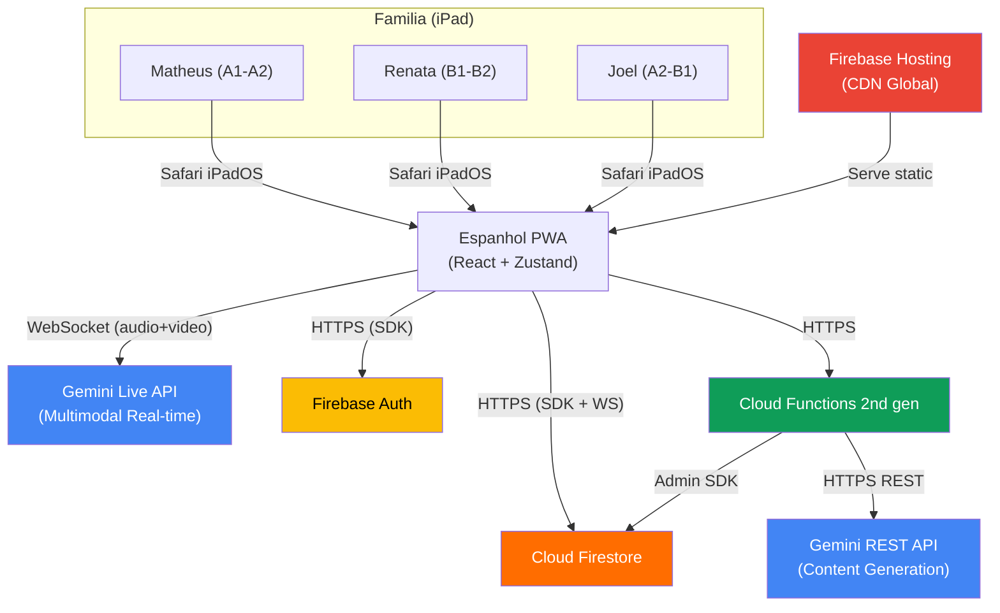
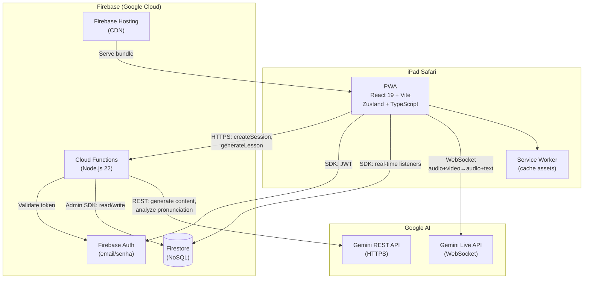
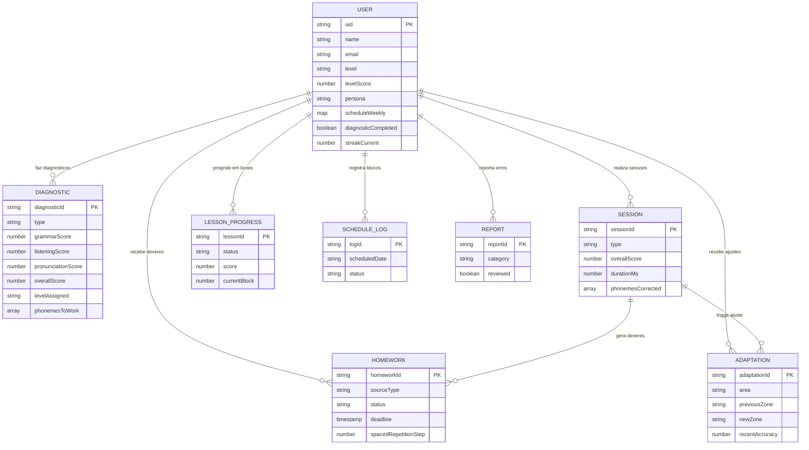
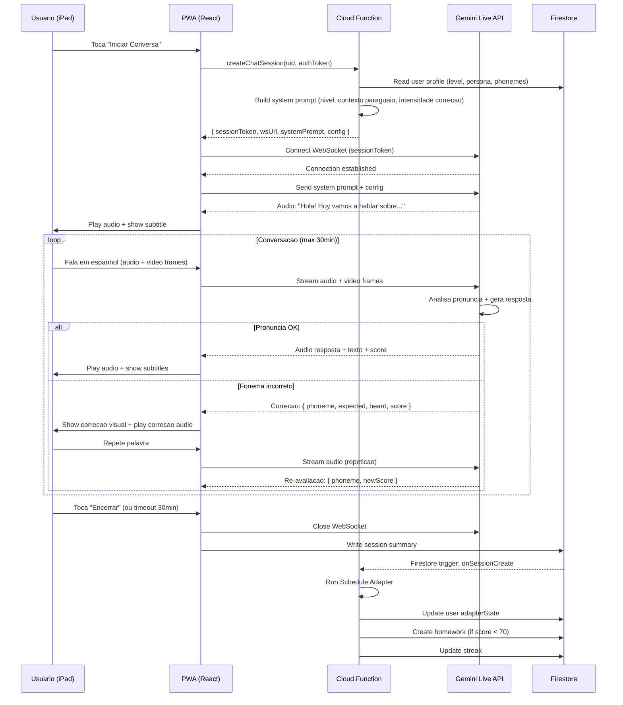
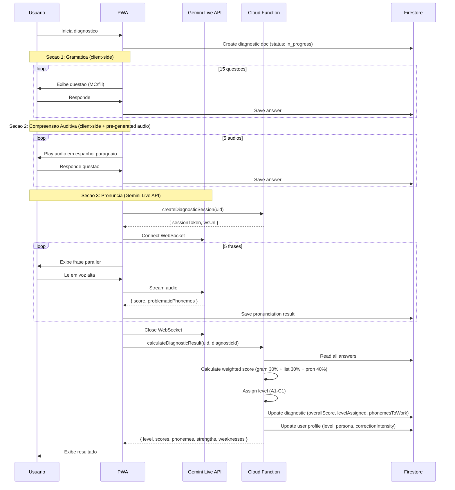
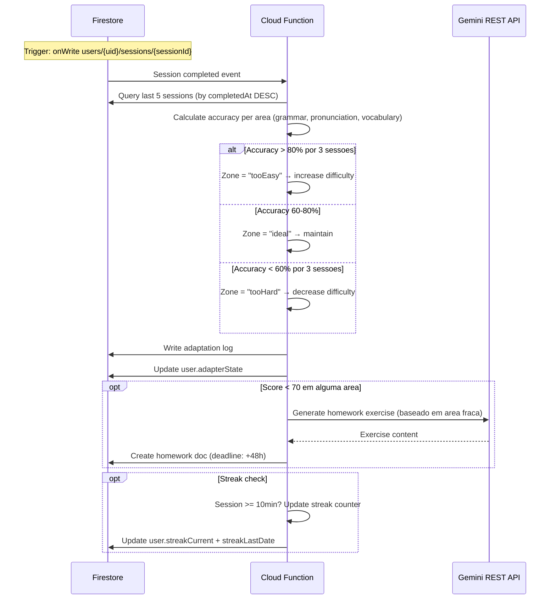
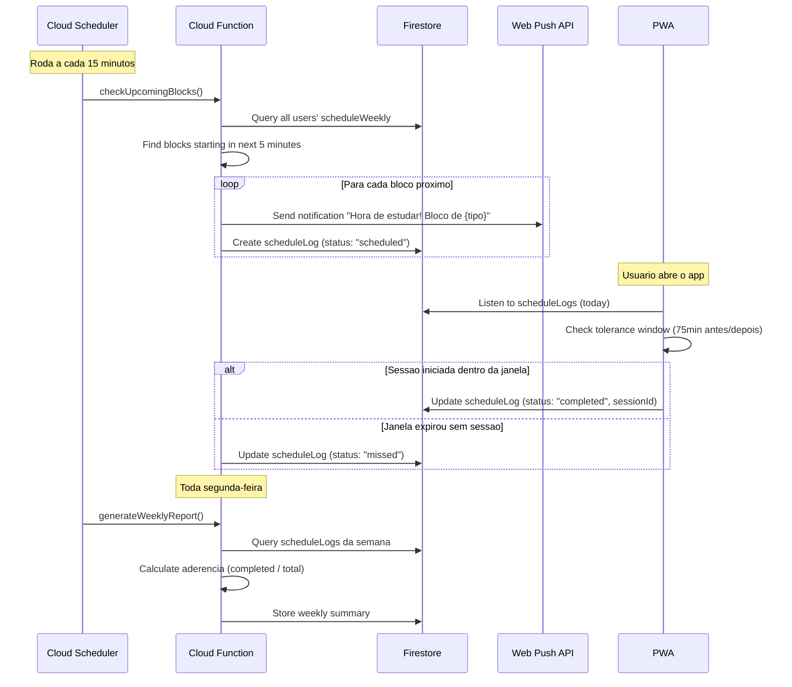
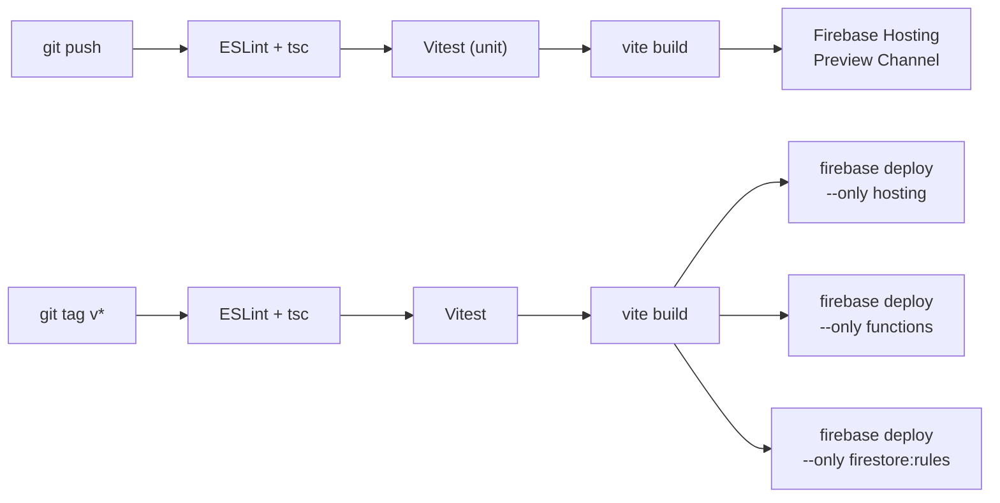

# Architecture: Espanhol — Tutor AI de Espanhol para iPad

## Metadados
- **Baseado em:** 01-product-brief.md, 02-prd.md, 03-ux-concept.md
- **Data:** 2026-02-23
- **Autor:** AI Project Planner
- **Versao:** 1.0
- **Status:** Draft

---

## 1. System Context (C4 Level 1)

### 1.1 Atores
| Ator | Tipo | Descricao | Interacao |
|------|------|-----------|-----------|
| Matheus | Pessoa (Iniciante) | Estudante universitario, 1o semestre Medicina | Licoes teoricas + quizzes + chat supervisionado (correcao intensiva) |
| Renata | Pessoa (Intermediaria) | Estudante avancada de Medicina | Chat supervisionado com foco fonetico medico (correcao moderada) |
| Joel | Pessoa (Profissional) | Profissional remoto, PO do projeto | Chat rapido vocabulario cotidiano (correcao minima) + admin |
| Gemini Live API | Sistema Externo | Motor AI multimodal do Google | WebSocket bidirecional: audio + video streaming em tempo real |
| Gemini REST API | Sistema Externo | API de geracao de conteudo | HTTP: geracao de licoes, exercicios, avaliacao de diagnostico |
| Firebase Auth | Sistema Externo | Servico de autenticacao Google | SDK client-side: email/senha, gerenciamento de sessao |
| Cloud Firestore | Sistema Externo | Banco NoSQL do Google | SDK client-side com real-time listeners + Security Rules por uid |
| Cloud Functions | Sistema Externo | Compute serverless do Google | HTTP triggers + Firestore triggers para logica server-side |
| Firebase Hosting | Sistema Externo | CDN/hosting estatico | Serve PWA (HTML/CSS/JS + service worker) |

### 1.2 Sistemas Externos
| Sistema | Protocolo | Dados Trocados | Direcao |
|---------|----------|----------------|---------|
| Gemini Live API | WebSocket (wss://) | Audio frames + video frames (client→) / Audio + texto + correcoes (→client) | Bidirecional real-time |
| Gemini REST API | HTTPS (POST) | Prompts + contexto (→) / Conteudo gerado, scores (←) | Request-Response |
| Firebase Auth | HTTPS (SDK) | Credenciais (→) / JWT token (←) | Request-Response |
| Cloud Firestore | HTTPS (SDK + WebSocket) | Documentos JSON bidirecionais | Bidirecional (real-time listeners) |
| Cloud Functions (2nd gen) | HTTPS / Event triggers | Payloads JSON | Request-Response + Event-driven |
| Web Push API (Safari) | HTTPS | Notificacoes de blocos e deveres | Server → Client |

### 1.3 Diagrama de Contexto



---

## 2. Container Diagram (C4 Level 2)

| Container | Tecnologia | Proposito | Comunica Com |
|-----------|------------|-----------|--------------|
| PWA (Client) | React 19 + Vite + Zustand + TypeScript | Interface do usuario, captura audio/video, renderizacao de licoes/exercicios | Gemini Live API (WebSocket), Firestore (SDK), Auth (SDK), Cloud Functions (HTTPS) |
| Cloud Functions | Node.js 22 + TypeScript (2nd gen) | Logica server-side: Schedule Adapter, geracao de licoes, scoring diagnostico, geracao de deveres, sessao Gemini | Gemini REST API (HTTPS), Firestore (Admin SDK) |
| Cloud Firestore | NoSQL document DB (Google) | Persistencia: perfis, sessoes, diagnosticos, progresso, agenda, deveres | PWA (real-time listeners), Cloud Functions (Admin SDK) |
| Firebase Auth | Identity service (Google) | Autenticacao email/senha, emissao de JWT | PWA (SDK), Cloud Functions (token validation) |
| Firebase Hosting | CDN + static hosting | Serve PWA bundle (HTML/CSS/JS/assets) + service worker | Browser (HTTPS) |



---

## 3. Padrao Arquitetural

### 3.1 Decisoes
| Aspecto | Decisao | Justificativa |
|---------|---------|---------------|
| Padrao | Client-heavy SPA + Serverless backend | 3 usuarios, sem escalabilidade complexa; Firebase elimina infra ops; logica pesada (IA) e delegada ao Gemini |
| Renderizacao | SPA (Client-Side Rendering) | Zero necessidade de SEO (app privado familiar); PWA precisa de hydration rapida; Firebase Hosting serve estatico |
| Framework Frontend | React 19 + Vite | Ecossistema maduro, PWA support nativo via vite-plugin-pwa, sem overhead de SSR/Next.js para app privado |
| State Management | Zustand | Leve (< 2KB), sem boilerplate, integra bem com Firestore real-time listeners; stores isolados por feature |
| Comunicacao real-time | WebSocket nativo (Gemini Live API) | Latencia minima (< 1.5s); sem proxy intermediario; audio+video bidirecional |
| Comunicacao server | Cloud Functions (HTTPS callable) | Seguranca (API keys server-side), logica de negocio (Schedule Adapter, scoring), geracao de conteudo |
| Persistencia | Firestore com subcollections por uid | Security Rules naturais (`request.auth.uid == userId`), queries eficientes por usuario, real-time listeners |
| Auth | Firebase Auth (email/senha) | Integrado com Firestore Security Rules; SDK client-side; zero backend custom |

### 3.2 ADRs

#### ADR-001: PWA Pura (sem Capacitor/Wrapper Nativo)
**Status:** Accepted
**Contexto:** O app precisa de acesso a camera, microfone, notificacoes push e Wake Lock no iPad. PWA no Safari/iPadOS tem limitacoes historicas, mas iPadOS 17+ expandiu significativamente o suporte a Web APIs.
**Decisao:** Implementar como PWA pura sem wrapper nativo. Validar APIs criticas no Sprint 0.
**Alternativas:**
| Alternativa | Pros | Contras | Motivo Rejeicao |
|------------|------|---------|-----------------|
| Capacitor (wrapper nativo) | Acesso completo a APIs nativas; notificacoes nativas | Complexidade de build (Xcode, provisioning); publicacao na App Store; overhead de manutencao | Over-engineering para 3 usuarios; App Store desnecessario para familia |
| React Native | Performance nativa; acesso completo | Rewrite completo; sem Firestore real-time listeners nativos tao simples; dev mais complexo | Escopo desproporcional; PWA atende os requisitos com menos complexidade |
| App nativo (Swift) | Maximo acesso a APIs iPad | Linguagem diferente; time de 1 dev; sem reaproveitamento web | Skill gap; complexidade desnecessaria |
**Consequencias:**
- Positivas: Deploy instantaneo via Firebase Hosting; zero App Store; update sem aprovacao Apple; stack unica (TypeScript)
- Negativas: Risco de limitacao Safari (notificacoes push, Wake Lock); necessidade de validacao no Sprint 0
- Mitigacao: Se PWA falhar em APIs criticas, pivotar para Capacitor (minimal wrapper) sem reescrever React code

#### ADR-002: Gemini Live API Direta do Client (sem Proxy)
**Status:** Accepted
**Contexto:** O chat supervisionado exige latencia E2E < 1.5s com audio+video bidirecional. Um proxy via Cloud Functions adicionaria 200-500ms de latencia e complexidade de WebSocket relay.
**Decisao:** Client conecta diretamente ao Gemini Live API via WebSocket. Cloud Function emite session token efemero para autenticacao.
**Alternativas:**
| Alternativa | Pros | Contras | Motivo Rejeicao |
|------------|------|---------|-----------------|
| Cloud Function como proxy WebSocket | API key 100% server-side; controle total de rate limiting | +200-500ms latencia; complexidade de relay; custo de Cloud Functions com WebSocket | Latencia inaceitavel para conversacao natural; custo de compute alto |
| Server dedicado (WebSocket relay) | Controle total; baixa latencia | Infra adicional; custo fixo; ops overhead | Over-engineering para 3 usuarios |
**Consequencias:**
- Positivas: Latencia minima; arquitetura mais simples; sem custo de relay
- Negativas: API key do Gemini precisa chegar ao client (via token efemero); menos controle sobre o stream
- Mitigacao: Cloud Function `createChatSession()` gera token efemero (TTL 35min = sessao max 30min + margem); API key nunca exposta diretamente; Firebase App Check valida origem

#### ADR-003: Subcollections Firestore por UID
**Status:** Accepted
**Contexto:** Dados sao estritamente por usuario (privacidade familiar). Security Rules precisam garantir isolamento total. Queries sao sempre filtradas por uid.
**Decisao:** Usar subcollections aninhadas sob `users/{uid}/` para todos os dados do usuario.
**Alternativas:**
| Alternativa | Pros | Contras | Motivo Rejeicao |
|------------|------|---------|-----------------|
| Collections raiz com campo uid | Queries cross-user faceis; indices globais | Security Rules mais complexas (where uid ==); risco de leak; indices compostos obrigatorios | Isolamento menos natural; Security Rules mais frageis |
| Collections raiz + Firestore Rules por uid | Flexivel; permite analytics cross-user | Mesmos riscos; queries cross-user nao sao necessarias (3 usuarios, sem social) | Over-engineering; riscos desnecessarios |
**Consequencias:**
- Positivas: Security Rules triviais (`request.auth.uid == userId`); isolamento nativo; sem risco de vazamento entre usuarios
- Negativas: Queries cross-user impossiveis (aceito — desnecessario para 3 usuarios); subcollection groups necessarios para analytics futuro
- Mitigacao: Se analytics cross-user necessario no futuro, usar Collection Group Queries ou exportar para BigQuery

#### ADR-004: Zustand para State Management
**Status:** Accepted
**Contexto:** App com real-time listeners do Firestore precisa de state management que integre naturalmente com updates assincronos. Stores precisam ser feature-based (auth, chat, lessons, schedule).
**Decisao:** Zustand com stores isolados por feature. Firestore listeners alimentam stores; componentes subscrevem via selectors.
**Alternativas:**
| Alternativa | Pros | Contras | Motivo Rejeicao |
|------------|------|---------|-----------------|
| React Context + useReducer | Zero dependencia; built-in | Re-renders em cascata; sem middleware; boilerplate para stores complexos | Performance degradada com muitos listeners simultaneos |
| TanStack Query + Firestore | Cache layer; optimistic updates nativos; retry | Projetado para REST, nao real-time listeners; overhead de abstraction sobre Firestore SDK | Impedance mismatch com Firestore real-time; complexidade sem beneficio |
| Redux Toolkit | Maduro; DevTools; middleware | Boilerplate excessivo para app pequeno; overkill | Peso e complexidade desproporcional para 3 usuarios e ~10 stores |
**Consequencias:**
- Positivas: Bundle < 2KB; zero boilerplate; middleware para persist/devtools; selectors previnem re-renders
- Negativas: Sem optimistic updates nativos (implementar manualmente onde necessario)
- Mitigacao: Wrapper `optimisticUpdate()` em utils compartilhado para acoes criticas (marcar dever, salvar progresso)

#### ADR-005: React + Vite (sem Next.js)
**Status:** Accepted
**Contexto:** App e PWA privada para 3 usuarios. Sem necessidade de SEO, SSR, ISR ou API routes server-side (Cloud Functions cobrem isso). Firebase Hosting serve arquivos estaticos.
**Decisao:** React 19 + Vite 6 como build tool. PWA via `vite-plugin-pwa`.
**Alternativas:**
| Alternativa | Pros | Contras | Motivo Rejeicao |
|------------|------|---------|-----------------|
| Next.js (App Router) | SSR/SSG; API routes; Image optimization | Server necessario (ou static export limitado); overhead; config complexa com Firebase Hosting | Zero beneficio de SSR para app privado; complexidade de deploy desnecessaria |
| Remix | Loader/Action pattern; SSR | Server necessario; menor ecossistema PWA | Mesmo motivo: SSR inutil aqui |
| Astro | Otimo para conteudo estatico | Nao projetado para SPA interativo com real-time | Paradigma errado para app real-time |
**Consequencias:**
- Positivas: Build rapido; zero config server; PWA nativa; HMR instantaneo; deploy trivial no Firebase Hosting
- Negativas: Sem SSR (irrelevante); sem otimizacao de imagem built-in (usar Vite plugins)
- Mitigacao: Se futuramente precisar de landing page publica com SEO, criar projeto Next.js separado

#### ADR-006: Gemini Session Token via Cloud Function
**Status:** Accepted
**Contexto:** ADR-002 decide que client conecta diretamente ao Gemini Live API. Mas API key nao pode ser exposta no client (RNF03 do PRD: "Gemini API key armazenada em Cloud Functions, nunca exposta no cliente").
**Decisao:** Cloud Function `createChatSession` valida Firebase Auth token, gera config de sessao com system prompt personalizado (nivel, persona, contexto), e retorna credenciais efemeras para conexao WebSocket.
**Consequencias:**
- API key permanece server-side (Cloud Function)
- Client recebe apenas token efemero com TTL de 35 minutos
- System prompt e calibrado server-side (impossivel manipular no client)
- Firebase App Check adiciona validacao de origem

---

## 4. Database Design (Firestore)

### 4.1 Modelo de Colecoes

```
firestore-root/
└── users/{uid}                          # Perfil do usuario
    ├── diagnostics/{diagnosticId}       # Resultados de diagnostico
    ├── sessions/{sessionId}             # Sessoes de chat e licoes
    ├── lessonProgress/{lessonId}        # Progresso por modulo de licao
    ├── homework/{homeworkId}            # Deveres com prazo
    ├── adaptations/{adaptationId}       # Historico do Schedule Adapter
    ├── scheduleLogs/{logId}             # Log de blocos cumpridos/perdidos
    └── reports/{reportId}              # Reports de erro de conteudo IA
```

### 4.2 Schemas Detalhados

#### Documento: `users/{uid}`
| Campo | Tipo | Obrigatorio | Default | Descricao |
|-------|------|-------------|---------|-----------|
| name | string | Sim | - | Nome do usuario |
| email | string | Sim | - | Email (espelho do Auth) |
| level | string \| null | Nao | null | Nivel atual: A1, A2, B1, B2, C1 (null antes do diagnostico) |
| levelScore | number \| null | Nao | null | Score ponderado do ultimo diagnostico (0-100) |
| persona | string \| null | Nao | null | Tipo de persona: "iniciante", "intermediario", "profissional" |
| correctionIntensity | string \| null | Nao | null | "intensive", "moderate", "minimal" (baseado em persona) |
| streakCurrent | number | Nao | 0 | Dias consecutivos com pelo menos 1 sessao (>= 10min) |
| streakLastDate | timestamp \| null | Nao | null | Data da ultima sessao que contou para streak |
| scheduleWeekly | map | Nao | {} | Blocos semanais: `{ "mon": ["18:00"], "tue": ["08:00","20:00"], ... }` |
| scheduleMinBlocks | number | Nao | 3 | Minimo de blocos semanais (RN21) |
| diagnosticCompleted | boolean | Nao | false | Se completou o diagnostico inicial |
| lastDiagnosticDate | timestamp \| null | Nao | null | Data do ultimo diagnostico (re-teste a cada 30 dias) |
| adapterState | map | Nao | {} | Estado atual do adapter: `{ grammar: "ideal", pronunciation: "tooEasy", vocabulary: "tooHard" }` |
| dailyChatCount | number | Nao | 0 | Sessoes de chat hoje (max 3/dia, RN11) |
| dailyChatResetDate | string | Nao | "" | Data do ultimo reset do contador diario (YYYY-MM-DD) |
| createdAt | timestamp | Sim | serverTimestamp | Data de criacao |
| updatedAt | timestamp | Sim | serverTimestamp | Ultima atualizacao |

#### Documento: `users/{uid}/diagnostics/{diagnosticId}`
| Campo | Tipo | Obrigatorio | Default | Descricao |
|-------|------|-------------|---------|-----------|
| type | string | Sim | - | "initial" ou "retest" |
| status | string | Sim | "in_progress" | "in_progress", "completed" |
| grammarScore | number \| null | Nao | null | Score gramatica (0-100) |
| grammarAnswers | array | Nao | [] | `[{ questionId, answer, correct, timeMs }]` |
| listeningScore | number \| null | Nao | null | Score compreensao (0-100) |
| listeningAnswers | array | Nao | [] | `[{ audioId, answer, correct, errorType }]` |
| pronunciationScore | number \| null | Nao | null | Score pronuncia (0-100) |
| pronunciationResults | array | Nao | [] | `[{ phraseId, score, problematicPhonemes: [] }]` |
| overallScore | number \| null | Nao | null | Media ponderada: grammar(30%) + listening(30%) + pronunciation(40%) |
| levelAssigned | string \| null | Nao | null | Nivel resultante: A1-C1 |
| strengths | array | Nao | [] | Pontos fortes identificados |
| weaknesses | array | Nao | [] | Pontos fracos identificados |
| phonemesToWork | array | Nao | [] | Fonemas problematicos: `["rr", "ll", "z"]` |
| previousDiagnosticId | string \| null | Nao | null | Referencia ao diagnostico anterior (para comparacao) |
| startedAt | timestamp | Sim | serverTimestamp | Inicio do teste |
| completedAt | timestamp \| null | Nao | null | Fim do teste |
| resumeSection | string \| null | Nao | null | Secao para retomar se app fechou: "grammar", "listening", "pronunciation" |
| resumeIndex | number \| null | Nao | null | Indice da questao para retomar |

#### Documento: `users/{uid}/sessions/{sessionId}`
| Campo | Tipo | Obrigatorio | Default | Descricao |
|-------|------|-------------|---------|-----------|
| type | string | Sim | - | "chat" ou "lesson" |
| status | string | Sim | "active" | "active", "completed", "abandoned" |
| lessonId | string \| null | Nao | null | ID do modulo (se type == "lesson") |
| topic | string \| null | Nao | null | Tema da conversa (se type == "chat") |
| durationMs | number \| null | Nao | null | Duracao total em ms |
| overallScore | number \| null | Nao | null | Score geral da sessao (0-100) |
| grammarScore | number \| null | Nao | null | Score de gramatica na sessao |
| pronunciationScore | number \| null | Nao | null | Score de pronuncia na sessao |
| vocabularyScore | number \| null | Nao | null | Score de vocabulario na sessao |
| phonemesCorrected | array | Nao | [] | Fonemas corrigidos: `[{ phoneme, attempts, finalScore }]` |
| topicsCovered | array | Nao | [] | Topicos abordados na conversa |
| corrections | array | Nao | [] | `[{ timestamp, type, original, corrected, accepted }]` |
| adapterSnapshot | map | Nao | {} | Snapshot do estado do adapter no momento da sessao |
| startedAt | timestamp | Sim | serverTimestamp | Inicio |
| completedAt | timestamp \| null | Nao | null | Fim |

#### Documento: `users/{uid}/lessonProgress/{lessonId}`
| Campo | Tipo | Obrigatorio | Default | Descricao |
|-------|------|-------------|---------|-----------|
| moduleTitle | string | Sim | - | Nome do modulo |
| level | string | Sim | - | Nivel do modulo (A1-C1) |
| status | string | Sim | "locked" | "locked", "available", "in_progress", "completed" |
| currentBlock | number | Nao | 0 | Bloco atual (cada modulo tem 3-5 blocos) |
| totalBlocks | number | Sim | - | Total de blocos no modulo |
| score | number \| null | Nao | null | Score final (0-100) |
| exerciseResults | array | Nao | [] | `[{ exerciseId, type, score, attempts }]` |
| weakExercises | array | Nao | [] | IDs de exercicios com score < 70 (para Schedule Adapter) |
| prerequisiteId | string \| null | Nao | null | Modulo pre-requisito |
| completedAt | timestamp \| null | Nao | null | Data de conclusao |

#### Documento: `users/{uid}/homework/{homeworkId}`
| Campo | Tipo | Obrigatorio | Default | Descricao |
|-------|------|-------------|---------|-----------|
| sourceSessionId | string | Sim | - | Sessao que originou o dever |
| sourceType | string | Sim | - | "grammar", "pronunciation", "vocabulary" |
| contentRef | string | Sim | - | Referencia ao conteudo fraco (exercicio ou fonema) |
| status | string | Sim | "pending" | "pending", "completed", "overdue" |
| score | number \| null | Nao | null | Score ao completar |
| deadline | timestamp | Sim | - | Prazo (48h apos criacao) |
| spacedRepetitionStep | number | Sim | 0 | Step atual na curva: 0=1h, 1=1d, 2=3d, 3=7d, 4=30d |
| nextReviewDate | timestamp \| null | Nao | null | Proxima data de revisao (pos-conclusao) |
| attempts | number | Nao | 0 | Tentativas |
| createdAt | timestamp | Sim | serverTimestamp | Criacao |
| completedAt | timestamp \| null | Nao | null | Conclusao |

#### Documento: `users/{uid}/adaptations/{adaptationId}`
| Campo | Tipo | Obrigatorio | Default | Descricao |
|-------|------|-------------|---------|-----------|
| triggerSessionId | string | Sim | - | Sessao que triggerou o ajuste |
| area | string | Sim | - | "grammar", "pronunciation", "vocabulary" |
| previousZone | string | Sim | - | "tooEasy", "ideal", "tooHard" |
| newZone | string | Sim | - | "tooEasy", "ideal", "tooHard" |
| recentAccuracy | number | Sim | - | Taxa de acerto das ultimas 5 sessoes (%) |
| adjustment | string | Sim | - | "increased", "maintained", "decreased" |
| reason | string | Sim | - | Descricao legivel do motivo |
| createdAt | timestamp | Sim | serverTimestamp | Data do ajuste |

#### Documento: `users/{uid}/scheduleLogs/{logId}`
| Campo | Tipo | Obrigatorio | Default | Descricao |
|-------|------|-------------|---------|-----------|
| scheduledDate | string | Sim | - | Data agendada (YYYY-MM-DD) |
| scheduledTime | string | Sim | - | Horario agendado (HH:MM) |
| status | string | Sim | "scheduled" | "scheduled", "completed", "missed" |
| sessionId | string \| null | Nao | null | Sessao vinculada (se completed) |
| completedAt | timestamp \| null | Nao | null | Quando foi cumprido |
| toleranceWindowMinutes | number | Sim | 75 | Janela de tolerancia (RN26-RF06) |

#### Documento: `users/{uid}/reports/{reportId}`
| Campo | Tipo | Obrigatorio | Default | Descricao |
|-------|------|-------------|---------|-----------|
| category | string | Sim | - | "grammar_error", "wrong_translation", "bad_phonetic_correction", "other" |
| screen | string | Sim | - | Tela onde o erro foi reportado |
| contentSnapshot | string | Sim | - | Conteudo que continha o erro |
| sessionId | string \| null | Nao | null | Sessao associada |
| userComment | string \| null | Nao | null | Texto livre do usuario |
| reviewed | boolean | Nao | false | Se Joel (PO) revisou |
| createdAt | timestamp | Sim | serverTimestamp | Data do report |

### 4.3 Diagrama de Relacionamentos



### 4.4 Indices Firestore

| Colecao | Campos | Tipo | Proposito |
|---------|--------|------|-----------|
| `users/{uid}/homework` | status ASC, deadline ASC | Composite | Listar deveres pendentes ordenados por urgencia |
| `users/{uid}/sessions` | completedAt DESC | Single | Ultimas sessoes para Schedule Adapter |
| `users/{uid}/sessions` | type ASC, completedAt DESC | Composite | Filtrar sessoes por tipo |
| `users/{uid}/scheduleLogs` | scheduledDate DESC | Single | Logs recentes para metrica de aderencia |
| `users/{uid}/lessonProgress` | status ASC, level ASC | Composite | Licoes disponiveis por nivel |
| `users/{uid}/homework` | status ASC, spacedRepetitionStep ASC, nextReviewDate ASC | Composite | Deveres para revisao espacada |

### 4.5 Security Rules (Estrutura)

> **Fonte autoritativa:** As rules detalhadas e granulares estao em `05-security.md` secao 4.4. Abaixo a versao resumida alinhada.

```javascript
rules_version = '2';
service cloud.firestore {
  match /databases/{database}/documents {

    // DEFAULT: negar tudo
    match /{document=**} {
      allow read, write: if false;
    }

    // Helper: usuario autenticado e owner
    function isOwner(userId) {
      return request.auth != null && request.auth.uid == userId;
    }

    // Helper: campo nao foi modificado
    function fieldUnchanged(field) {
      return request.resource.data[field] == resource.data[field];
    }

    // USERS
    match /users/{userId} {
      allow create: if isOwner(userId)
        && request.resource.data.keys().hasAll(['name', 'email', 'createdAt'])
        && request.resource.data.name is string
        && request.resource.data.name.size() >= 2
        && request.resource.data.email is string;
      allow read: if isOwner(userId);
      allow update: if isOwner(userId)
        && fieldUnchanged('email')
        && fieldUnchanged('createdAt');
      allow delete: if false;

      // SUBCOLLECTIONS (granulares)
      match /diagnostics/{docId} {
        allow read, write: if isOwner(userId);
      }
      match /sessions/{docId} {
        allow read, create, update: if isOwner(userId);
        allow delete: if false;
      }
      match /lessonProgress/{docId} {
        allow read, write: if isOwner(userId);
      }
      match /homework/{docId} {
        allow read, update: if isOwner(userId);
        allow create: if false; // criado apenas por Cloud Functions
        allow delete: if false;
      }
      match /adaptations/{docId} {
        allow read: if isOwner(userId);
        allow write: if false; // apenas Cloud Functions
      }
      match /scheduleLogs/{docId} {
        allow read, write: if isOwner(userId);
      }
      match /reports/{docId} {
        allow read, create: if isOwner(userId);
        allow update, delete: if false; // reports sao imutaveis
      }
    }
  }
}
```

---

## 5. Integracoes e Data Flow

### 5.1 Inventario de Integracoes
| Integracao | Proposito | Protocolo | Auth | Rate Limit | Fallback | Prioridade |
|-----------|---------|----------|------|-----------|----------|----------|
| Gemini Live API | Chat supervisionado real-time (audio+video bidirecional) | WebSocket (wss://) | Token efemero via Cloud Function | Tier-dependent; monitorar | Modo texto (degradacao graceful) | P0 — Core |
| Gemini REST API | Geracao de licoes, exercicios, avaliacao diagnostico, system prompts | HTTPS POST | API Key (server-side em Cloud Functions) | 60 RPM (free tier) | Cache de conteudo pre-gerado no Firestore | P0 — Core |
| Firebase Auth | Autenticacao email/senha | SDK (HTTPS) | Firebase project config | 100 signups/IP/hora | Retry com backoff | P0 |
| Cloud Firestore | Persistencia de todos os dados | SDK (HTTPS + WebSocket) | Firebase Auth JWT | 1 write/s/doc | Retry com backoff; sem offline mode no MVP | P0 |
| Cloud Functions 2nd gen | Logica server-side | HTTPS callable + Firestore triggers | Firebase Auth token | 1000 inv/100s | Retry para funcoes idempotentes | P0 |
| Firebase Hosting | Serve PWA estatica | CDN (HTTPS) | N/A | 10GB/mes Blaze | CDN global (alta disponibilidade) | P0 |
| Web Push API | Notificacoes de blocos e deveres | HTTPS | VAPID keys | N/A | Sem notificacao; usuario ve ao abrir app | P1 |

### 5.2 Data Flow: Chat Supervisionado (Fluxo Critico)



### 5.3 Data Flow: Diagnostico



### 5.4 Data Flow: Schedule Adapter (Event-driven)



### 5.5 Data Flow: Agenda e Notificacoes



---

## 6. Seguranca

### 6.1 Autenticacao e Autorizacao
| Aspecto | Decisao | Justificativa |
|---------|---------|---------------|
| Metodo de Auth | Firebase Auth (email/senha) | Integrado com Firestore Security Rules; sem OAuth complexo para app familiar |
| Modelo de Autorizacao | UID-based (Firestore Security Rules) | Cada usuario so acessa `users/{uid}/**`; sem roles no MVP (RN03) |
| Sessao | Firebase Auth SDK (auto-refresh JWT) | Token refresh automatico; expira apos 7 dias de inatividade (PRD) |
| Rate Limiting (login) | 5 tentativas / 15 min → bloqueio 30 min | Client-side enforcement + Firestore Rules (RN do RF01) |
| Rate Limiting (chat) | Max 3 sessoes/dia/usuario | Cloud Function valida antes de criar sessao (RN11) |
| Rate Limiting (API Gemini) | Max 90 min audio/dia (30min x 3 usuarios) | Cloud Function monitora + bloqueia |

### 6.2 Modelo de Ameacas (Simplificado)
| Ameaca | Vetor | Mitigacao | Prioridade |
|--------|-------|-----------|------------|
| API Key do Gemini exposta | Client-side code | Token efemero via Cloud Function (ADR-002, ADR-006); API key nunca no client | P0 |
| Acesso a dados de outro usuario | Manipulacao de UID | Firestore Security Rules: `request.auth.uid == userId` | P0 |
| Brute force login | Tentativas em massa | Rate limit 5/15min + bloqueio 30min (Firebase Auth config) | P0 |
| XSS em conteudo gerado pela IA | Gemini retorna HTML/JS malicioso | Sanitizar todo output da IA antes de render; usar `textContent` nao `innerHTML` | P0 |
| Abuso de Cloud Functions | Chamadas nao autenticadas | Validar Firebase Auth token em toda Cloud Function; Firebase App Check | P0 |
| CSRF | Formularios | Firebase Auth SDK usa tokens no header (nao cookies); CSRF nao aplicavel | N/A |

### 6.3 Checklist de Seguranca
- [ ] Firebase Auth configurado com email/senha
- [ ] Firestore Security Rules restritivas por uid (testadas com emulador)
- [ ] Gemini API key em Cloud Functions (nunca no client)
- [ ] Token efemero para Gemini Live API (TTL 35min)
- [ ] Firebase App Check habilitado (reCAPTCHA Enterprise)
- [ ] Rate limiting em Cloud Functions (login, chat, API calls)
- [ ] Sanitizacao de output do Gemini antes de render
- [ ] HTTPS obrigatorio (Firebase Hosting default)
- [ ] Input validation em todos os Cloud Functions (zod schemas)
- [ ] Logs de seguranca habilitados (Cloud Logging)

---

## 7. Infraestrutura

### 7.1 Ambientes
| Ambiente | URL | Firestore | Deploy Trigger | Gemini |
|----------|-----|-----------|---------------|--------|
| Dev (local) | localhost:5173 | Emulador local | Manual (vite dev) | Emulador ou API key dev |
| Preview | preview--espanhol-tutor.web.app | Firestore dev (projeto separado ou emulador) | PR merge → GitHub Action | API key dev |
| Production | espanhol-tutor.web.app | Firestore prod | Tag release → GitHub Action | API key prod |

### 7.2 Estrutura de Projeto Firebase
```
firebase.json
├── hosting: { public: "dist", rewrites: [{ source: "**", destination: "/index.html" }] }
├── firestore: { rules: "firestore.rules", indexes: "firestore.indexes.json" }
├── functions: { source: "functions", runtime: "nodejs22" }
└── emulators: { auth, firestore, functions, hosting }
```

### 7.3 Scaling (Projecao)
| Nivel | Usuarios | Sessoes/dia | Gemini calls/dia | Firestore writes/dia | Custo estimado/mes |
|-------|---------|------------|-----------------|---------------------|-------------------|
| MVP (atual) | 3 | 6-9 | ~50-100 | ~500-1000 | ~$5-15 (Blaze pay-as-you-go) |
| Familia expandida | 5-10 | 15-30 | ~200-400 | ~2000-5000 | ~$20-50 |
| Publico (v3.0) | 100+ | 300+ | Tier pago Gemini | Indices otimizados necessarios | Requer re-arquitetura |

> **Nota:** Para MVP com 3 usuarios, Firebase Blaze (pay-as-you-go) e suficiente. Custo dominado pelas chamadas ao Gemini API.

### 7.4 Observabilidade
| Camada | O que monitorar | Ferramenta | Prioridade |
|--------|----------------|------------|----------|
| App (client) | Erros JS, crashes, latencia percebida | Firebase Crashlytics (web) + Performance Monitoring | P0 |
| Cloud Functions | Invocacoes, erros, latencia, cold starts | Cloud Logging + Cloud Monitoring (Firebase console) | P0 |
| Gemini API | Latencia WebSocket, tokens consumidos, erros | Cloud Logging (via Cloud Functions) + metricas custom | P0 |
| Firestore | Reads/writes/deletes, bandwidth, rules denials | Firebase console (Usage tab) | P1 |
| Business | Sessoes/dia, aderencia, diagnosticos, streaks | Firestore queries + Cloud Function scheduled reports | P1 |
| Custo | Billing alerts | Google Cloud Billing alerts ($20, $50, $100) | P0 |

### 7.5 CI/CD Pipeline



---

## 8. GAP Analysis: Infraestrutura

> Skill: `gap-analysis` — Dimensao: Infrastructure

### 8.1 Architecture Assessment
| Componente | Atual | Necessario | GAP | Esforco |
|-----------|-------|-----------|-----|---------|
| PWA (React + Vite) | Inexistente | SPA com PWA manifest, service worker, camera/mic access | Implementacao completa | L |
| Firebase Auth | Inexistente | Email/senha com rate limiting e sessao de 7 dias | Setup padrao Firebase + regras customizadas | S |
| Firestore schema | Inexistente | 8 subcollections por uid com Security Rules e indices | Definicao de schema + rules + indices compostos | M |
| Cloud Functions | Inexistente | ~8-10 functions (session, adapter, homework, diagnostic, cron) | Implementacao de logica de negocio server-side | L |
| Gemini Live API integration | Inexistente | WebSocket bidirecional com token efemero e system prompt dinamico | Integracao + calibracao de prompts | L |
| Gemini REST API integration | Inexistente | Geracao de licoes, exercicios, avaliacao | Integracao + prompt engineering | M |
| CI/CD | Inexistente | GitHub Actions: lint → test → build → deploy Firebase | Pipeline padrao | S |
| Observabilidade | Inexistente | Crashlytics + Performance + Cloud Logging + billing alerts | Setup e configuracao | S |

### 8.2 Scalability Assessment
| Dimensao | Atual | 6 meses | 12 meses | GAP |
|----------|-------|---------|----------|-----|
| Usuarios | 0 | 3 (familia) | 3 (familia) | Nenhum — Firebase suporta nativamente |
| Sessoes simultaneas | 0 | 1 (iPad compartilhado) | 1 | Nenhum |
| Dados Firestore | 0 | ~100MB | ~500MB | Nenhum (limite free: 1GB) |
| Gemini API calls/dia | 0 | ~100 | ~150 | Monitorar tier; considerar cache agressivo |
| Cloud Functions invocacoes/dia | 0 | ~200 | ~300 | Dentro do free tier |
| Hosting bandwidth/mes | 0 | ~2GB | ~3GB | Dentro do free tier (10GB) |

### 8.3 Technical Debt (Antecipado)
| Debito | Impacto | Risco Futuro | Esforco | Prioridade |
|--------|---------|-------------|---------|------------|
| Sem modo offline | Perda de sessao se internet cair durante estudo | Frustacao; perda de dados de exercicio em andamento | L | P2 (v2.0) |
| PWA sem Capacitor | Limitacoes Safari podem surgir (Wake Lock, Push) | Feature bloqueada se Apple nao implementar Web API | M (pivotar para Capacitor) | P2 (contingencia) |
| Sem cache de licoes | Cada acesso gera call ao Gemini REST | Custo cresce; latencia desnecessaria para conteudo repetido | S | P1 |
| Monolithic Cloud Functions | Todas as functions em 1 deploy | Cold start aumenta; deploys lentos; blast radius alto | M (split em servicos) | P2 |
| Sem testes E2E | Regressoes nao detectadas | Bugs em producao entre deploys | L (Playwright setup) | P1 |

### 8.4 GAP Inventory
| ID | Area | AS-IS | TO-BE | GAP | Severidade | Prioridade |
|----|------|-------|-------|-----|------------|------------|
| G-ARCH-01 | WebSocket + Gemini Live | Inexistente | Client conecta via token efemero a Gemini Live API para chat real-time com audio+video | Implementacao completa do fluxo: CF gera token → client conecta → streaming bidirecional → session summary | Critical | P0 |
| G-ARCH-02 | Firestore schema + Rules | Inexistente | 8 subcollections com Security Rules por uid, indices compostos, validation rules | Definir schema completo, escrever rules, criar indices, testar com emulador | Critical | P0 |
| G-ARCH-03 | Schedule Adapter | Inexistente | Cloud Function triggerada por sessao que recalcula dificuldade e gera deveres | Logica de negocio: media movel de acertos, zonas de dificuldade, geracao de homework | High | P0 |
| G-ARCH-04 | PWA no Safari/iPadOS | Desconhecido | PWA com camera, microfone, Wake Lock, Push Notifications funcionando no Safari iPadOS 17+ | Sprint 0: validar todas as Web APIs criticas no iPad real | Critical | P0 |
| G-ARCH-05 | Prompt Engineering | Inexistente | System prompts calibrados para: espanhol paraguaio, 3 niveis de correcao, vocabulario por persona | Criar, testar e iterar prompts com gravacoes reais dos 3 usuarios | High | P0 |
| G-ARCH-06 | CI/CD Pipeline | Inexistente | GitHub Actions: lint + typecheck + test + build + deploy (preview + prod) | Setup de pipeline; configurar Firebase deploy tokens | Medium | P1 |
| G-ARCH-07 | Observabilidade | Inexistente | Crashlytics + Performance + Cloud Logging + billing alerts configurados | Setup e integracao com Firebase console | Medium | P1 |
| G-ARCH-08 | Cache de licoes | Inexistente | Licoes geradas pelo Gemini cacheadas no Firestore para re-uso | Cloud Function que verifica cache antes de chamar Gemini REST | Medium | P1 |
| G-ARCH-09 | Spaced Repetition Engine | Inexistente | Algoritmo SM-2 simplificado implementado em Cloud Function para curva de esquecimento | Logica de intervalos (1h→1d→3d→7d→30d) + triggers Firestore | High | P0 |
| G-ARCH-10 | Tolerancia de agenda (75min) | Inexistente | Logica que vincula sessoes a slots agendados dentro de janela de 75min | Cloud Function ou client-side logic que verifica proximidade temporal | Medium | P0 |

---

## 9. Estrutura de Codigo (Proposta)

### 9.1 Frontend (PWA)

```
src/
├── app/
│   ├── App.tsx                  # Root: providers, router
│   ├── router.tsx               # React Router v7 config
│   └── providers.tsx            # Auth, Firestore, Zustand providers
├── features/
│   ├── auth/
│   │   ├── components/          # LoginForm, RegisterForm
│   │   ├── hooks/               # useAuth, useAuthGuard
│   │   └── store.ts             # authStore (Zustand)
│   ├── onboarding/
│   │   ├── components/          # WelcomeSlides, OnboardingFlow
│   │   └── hooks/
│   ├── diagnostic/
│   │   ├── components/          # GrammarQuestion, ListeningQuestion, PronunciationRecorder, DiagnosticResult
│   │   ├── hooks/               # useDiagnostic, usePronunciationAnalysis
│   │   └── store.ts             # diagnosticStore
│   ├── chat/
│   │   ├── components/          # ChatSession, TutorAvatar, Subtitles, PhonemeCorrection, ChatSummary
│   │   ├── hooks/               # useGeminiLive, useAudioCapture, useVideoCapture
│   │   ├── lib/                 # websocket-manager.ts, audio-processor.ts
│   │   └── store.ts             # chatStore
│   ├── lessons/
│   │   ├── components/          # LessonLibrary, LessonContent, Flashcard, Quiz
│   │   ├── hooks/               # useLessons, useFlashcard
│   │   └── store.ts             # lessonsStore
│   ├── homework/
│   │   ├── components/          # HomeworkList, HomeworkExercise, DeadlineCountdown
│   │   ├── hooks/               # useHomework
│   │   └── store.ts             # homeworkStore
│   ├── schedule/
│   │   ├── components/          # WeeklyCalendar, ScheduleSetup, BlockEditor
│   │   ├── hooks/               # useSchedule, useNotifications
│   │   └── store.ts             # scheduleStore
│   ├── progress/
│   │   ├── components/          # ProgressDashboard, EvolutionChart, DiagnosticComparison
│   │   ├── hooks/               # useProgress
│   │   └── store.ts             # progressStore
│   ├── dashboard/
│   │   ├── components/          # MainDashboard, StreakBadge, NextBlockCard, HomeworkPreview
│   │   └── hooks/               # useDashboard
│   └── settings/
│       ├── components/          # AccountSettings, NotificationSettings
│       └── hooks/
├── shared/
│   ├── components/
│   │   ├── ui/                  # Button, Card, Input, Modal, Sidebar, ProgressBar
│   │   ├── layout/              # AppLayout, SidebarLayout, FullScreenLayout
│   │   └── feedback/            # ErrorBoundary, Loading, EmptyState, Toast
│   ├── hooks/
│   │   ├── useFirestore.ts      # Generic Firestore listener hook
│   │   ├── useWakeLock.ts       # Wake Lock API
│   │   └── useMediaPermissions.ts
│   ├── lib/
│   │   ├── firebase.ts          # Firebase app init + exports
│   │   ├── firestore.ts         # Typed collection refs + helpers
│   │   └── utils.ts             # Formatters, validators
│   └── types/
│       ├── user.ts              # User, Diagnostic, Session types
│       ├── lesson.ts
│       ├── homework.ts
│       └── schedule.ts
├── assets/                      # SVGs, images, audio samples
├── styles/
│   └── globals.css              # Tailwind base + custom tokens
├── main.tsx                     # Entry point
├── vite-env.d.ts
└── sw.ts                        # Service worker (via vite-plugin-pwa)
```

### 9.2 Cloud Functions

```
functions/
├── src/
│   ├── index.ts                 # Export all functions
│   ├── chat/
│   │   ├── createChatSession.ts    # HTTP: gera token efemero + system prompt
│   │   └── onSessionComplete.ts    # Firestore trigger: pos-sessao
│   ├── diagnostic/
│   │   ├── createDiagSession.ts    # HTTP: gera token para secao pronuncia
│   │   ├── calculateResult.ts      # HTTP: calcula score ponderado + nivel
│   │   └── generateQuestions.ts    # HTTP: gera questoes via Gemini REST
│   ├── adapter/
│   │   ├── runAdapter.ts           # Firestore trigger: recalcula dificuldade
│   │   └── calculateAccuracy.ts    # Utility: media movel de acertos
│   ├── homework/
│   │   ├── generateHomework.ts     # Chamado pelo adapter: cria dever
│   │   └── checkDeadlines.ts       # Scheduled: marca deveres vencidos
│   ├── lessons/
│   │   ├── generateLesson.ts       # HTTP: gera conteudo de licao via Gemini
│   │   └── cacheManager.ts         # Utility: verifica/salva cache no Firestore
│   ├── schedule/
│   │   ├── checkBlocks.ts          # Scheduled (cada 15min): notificacoes
│   │   └── weeklyReport.ts         # Scheduled (segunda): relatorio semanal
│   ├── streak/
│   │   └── updateStreak.ts         # Utility: atualiza streak counter
│   └── shared/
│       ├── gemini.ts               # Gemini REST client wrapper
│       ├── auth.ts                 # Validacao de token middleware
│       ├── schemas.ts              # Zod schemas para input validation
│       └── prompts/
│           ├── chat-system.ts      # System prompt para chat (por nivel)
│           ├── diagnostic.ts       # Prompts para avaliacao de pronuncia
│           └── lesson-gen.ts       # Prompts para geracao de licoes
├── package.json
└── tsconfig.json
```

---

## Aprovacoes

| Papel | Nome | Status | Data |
|-------|------|--------|------|
| Product Owner | Joel | Pendente | - |
