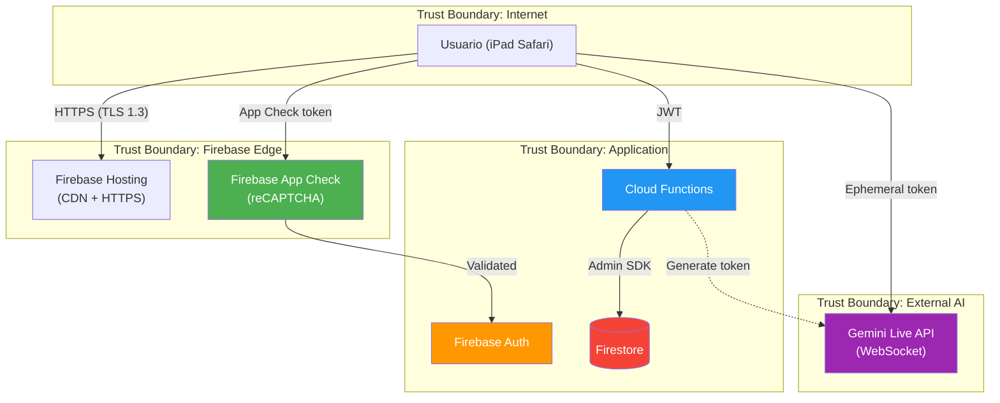

# Security: Espanhol — Tutor AI de Espanhol para iPad

## Metadados
- **Baseado em:** 01-product-brief.md, 02-prd.md, 03-ux-concept.md, 04-architecture.md
- **Data:** 2026-02-23
- **Autor:** AI Security Auditor
- **Versao:** 1.0
- **Status:** Draft

---

## 1. Security Overview

### 1.1 Classificacao do Sistema
| Aspecto | Valor |
|---------|-------|
| **Dados sensiveis** | Sim — PII basico (nome, email), dados de voz/video (biometrico potencial), dados educacionais |
| **Compliance obrigatorio** | Nenhum obrigatorio — uso familiar privado sem coleta de terceiros. LGPD nao aplicavel (uso pessoal, nao comercial). Boas praticas de privacidade adotadas voluntariamente |
| **Nivel de risco** | Baixo — 3 usuarios conhecidos, sem monetizacao, sem dados financeiros, sem acesso publico |
| **Exposicao** | Internet-facing (PWA servida via Firebase Hosting) porem audiencia fechada (3 usuarios familiares) |
| **Tipo de dados biometricos** | Audio de voz e video facial capturados durante sessoes de chat — transmitidos via WebSocket ao Gemini, NAO armazenados no Firestore |

### 1.2 Principios de Seguranca Aplicados
1. **Defense in Depth** — Firebase Auth + Firestore Security Rules + Cloud Functions validation + App Check
2. **Least Privilege** — Cada usuario acessa apenas `users/{uid}/**`; Cloud Functions usam service accounts com escopos minimos
3. **Secure by Default** — Firestore default deny; API key nunca no client; HTTPS obrigatorio
4. **Data Minimization** — Audio/video NAO persistidos; apenas scores e metadados salvos
5. **No Trust in Client** — Toda logica sensivel (scoring, nivel, adapter) roda em Cloud Functions; client e "dumb display"

---

## 2. Threat Model

### 2.1 Atores de Ameaca
| Ator | Motivacao | Capacidade | Probabilidade | Relevancia para este app |
|------|-----------|-----------|---------------|-------------------------|
| Script Kiddie | Vandalismo, explorar endpoints expostos | Baixa (ferramentas automaticas) | Baixa | App sem valor financeiro ou dados valiosos para revenda |
| Vizinho/Conhecido | Curiosidade, acesso ao iPad | Baixa (acesso fisico) | Media | iPad compartilhado em casa; alguem pode abrir o app |
| Atacante Externo | Abuso de API Gemini (custo) | Media (interceptar token) | Baixa | Token efemero + App Check mitigam |
| Insider (familia) | Acessar dados de outro membro | Baixa (acesso fisico ao iPad) | Media | Perfis separados com uid isolation |
| Supply Chain | Dependencia maliciosa (npm) | Media | Baixa | Monitorar com npm audit |

### 2.2 Superficie de Ataque
| Superficie | Componentes Expostos | Risco | Mitigacao |
|-----------|---------------------|-------|-----------|
| **PWA Frontend** | Formularios (login/register), camera/microfone capture, localStorage | Medio | Input validation (Zod); sanitizacao de output Gemini; nenhum dado sensivel em localStorage |
| **Gemini WebSocket** | Token efemero no client; audio/video stream | Medio | Token TTL 35min; App Check valida origem; audio/video nao persistido |
| **Cloud Functions** | Endpoints HTTPS (createSession, calculateResult, generateLesson) | Medio | Firebase Auth token obrigatorio; input validation (Zod); rate limiting |
| **Firestore** | Dados de perfil, progresso, sessoes | Baixo | Security Rules restritivas (uid-based); nenhuma collection publica |
| **Firebase Auth** | Endpoint de login/register | Medio | Rate limiting nativo (5/15min); email enumeration protection |
| **Firebase Hosting** | PWA bundle (HTML/JS/CSS) | Baixo | CDN com HTTPS; sem dados sensiveis no bundle; CSP headers |
| **Acesso fisico ao iPad** | App aberto, sessao ativa | Medio | Firebase Auth sessao de 7 dias; lock screen do iPad e primeira defesa |

### 2.3 Diagrama de Ameacas (STRIDE)



**Analise STRIDE:**
| Categoria | Ameaca | Componente | Risco | Mitigacao |
|-----------|--------|-----------|-------|-----------|
| **S**poofing | Alguem finge ser outro usuario | Firebase Auth | Medio | Email/senha + rate limiting; sem social login simplificado |
| **T**ampering | Manipular scores ou nivel no client | Firestore (via client) | Medio | Security Rules read-only para campos criticos (level, scores); calculos em Cloud Functions |
| **R**epudiation | Usuario nega ter feito sessao | Logs de sessao | Baixo | Timestamps imutaveis via `serverTimestamp()`; session logs no Firestore |
| **I**nformation Disclosure | Vazamento de dados de outro usuario | Firestore | Baixo | Security Rules: `request.auth.uid == userId` em todas as subcollections |
| **D**enial of Service | Abuso de Cloud Functions/Gemini API | Cloud Functions | Medio | Rate limiting; billing alerts; max 3 sessoes/dia/usuario |
| **E**levation of Privilege | Usuario acessa admin ou dados de outro | Firestore + Functions | Baixo | Sem roles admin no MVP; uid-based isolation total |

---

## 3. OWASP Top 10 Assessment

| # | Vulnerabilidade | Aplicavel? | Risco | Mitigacao Planejada | Status |
|---|----------------|-----------|-------|---------------------|--------|
| A01 | Broken Access Control | Sim | Medio | Firestore Security Rules por uid; Cloud Functions validam `auth.uid` em toda request; nenhum endpoint publico sem auth | Planejado |
| A02 | Cryptographic Failures | Parcial | Baixo | Firebase Auth gerencia hashing de senhas (scrypt); TLS 1.3 em transito (Firebase default); Firestore encryption at rest (Google default); API keys nunca no client | Planejado |
| A03 | Injection (XSS) | Sim | Medio | Output do Gemini sanitizado antes de render (DOMPurify para HTML, `textContent` para texto puro); React escapa JSX por default; CSP header restritivo | Planejado |
| A04 | Insecure Design | Parcial | Baixo | Threat model documentado; audio/video nao persistido; scoring server-side; token efemero para Gemini | Planejado |
| A05 | Security Misconfiguration | Sim | Medio | Firestore default deny; Firebase Hosting com security headers (CSP, HSTS, X-Frame-Options); emuladores para teste local | Planejado |
| A06 | Vulnerable Components | Sim | Medio | `npm audit` no CI/CD; dependabot no GitHub; lock file committado; auditoria trimestral | Planejado |
| A07 | Auth & Identity Failures | Sim | Medio | Firebase Auth com rate limiting; sessao 7 dias; sem remember-me inseguro; bloqueio apos 5 tentativas | Planejado |
| A08 | Software & Data Integrity | Parcial | Baixo | CI/CD com steps imutaveis; `package-lock.json` committado; Firebase deploy via service account no CI | Planejado |
| A09 | Security Logging & Monitoring | Sim | Medio | Cloud Logging habilitado; Firestore Security Rules denials logados; billing alerts configurados; Crashlytics para erros client | Planejado |
| A10 | Server-Side Request Forgery | Nao | N/A | Cloud Functions nao fazem requests baseados em input do usuario (apenas chamam Gemini API com prompts pre-definidos) | N/A |

---

## 4. Autenticacao e Autorizacao

### 4.1 Estrategia de Auth
| Aspecto | Decisao | Justificativa |
|---------|---------|---------------|
| Metodo | Firebase Auth (email/senha) com JWT automatico | Integrado nativamente com Firestore Security Rules; zero backend auth custom |
| Provider | Firebase Auth SDK (client-side) | Gerencia sessao, refresh de token, persistencia entre tabs automaticamente |
| MFA | Nao (MVP) | 3 usuarios familiares em iPad compartilhado; MFA adicionaria friccao sem beneficio proporcional |
| Session Duration | 7 dias de inatividade | Equilibrio entre conveniencia (nao relogar todo dia) e seguranca (expira se iPad ficar parado) |
| Refresh Strategy | Firebase Auth auto-refresh (1h token, refresh silencioso) | Gerenciado pelo SDK; token refresh a cada ~55 minutos sem intervencao |
| Account Recovery | Reset de senha por email | Firebase Auth built-in; unico metodo no MVP |

### 4.2 Modelo de Autorizacao
| Aspecto | Decisao |
|---------|---------|
| Modelo | UID-based isolation (sem RBAC) |
| Roles | Nenhum no MVP (RN03: todos os usuarios tem mesmas permissoes) |
| Granularidade | Por subcollection: cada usuario acessa apenas `users/{uid}/**` |
| Enforcement | Firestore Security Rules (server-side, inviolavel pelo client) |

### 4.3 Matriz de Permissoes (Firestore)
| Recurso | Proprio Usuario (uid match) | Outro Usuario | Nao Autenticado | Cloud Function (Admin) |
|---------|---------------------------|---------------|-----------------|----------------------|
| `users/{uid}` | Read, Update | Deny | Deny | Read, Write |
| `users/{uid}/diagnostics/**` | Read, Write | Deny | Deny | Read, Write |
| `users/{uid}/sessions/**` | Read, Write | Deny | Deny | Read, Write |
| `users/{uid}/lessonProgress/**` | Read, Write | Deny | Deny | Read, Write |
| `users/{uid}/homework/**` | Read, Write | Deny | Deny | Read, Write |
| `users/{uid}/adaptations/**` | Read | Deny | Deny | Read, Write |
| `users/{uid}/scheduleLogs/**` | Read, Write | Deny | Deny | Read, Write |
| `users/{uid}/reports/**` | Create, Read | Deny | Deny | Read, Write |

> **Nota:** `adaptations` e read-only para o client porque o Schedule Adapter roda exclusivamente em Cloud Functions. O client apenas exibe o historico.

### 4.4 Firestore Security Rules Detalhadas

```javascript
rules_version = '2';
service cloud.firestore {
  match /databases/{database}/documents {

    // DEFAULT: negar tudo
    match /{document=**} {
      allow read, write: if false;
    }

    // Helper: usuario autenticado e owner
    function isOwner(userId) {
      return request.auth != null && request.auth.uid == userId;
    }

    // Helper: campo nao foi modificado
    function fieldUnchanged(field) {
      return request.resource.data[field] == resource.data[field];
    }

    // USERS
    match /users/{userId} {
      // Criar: apenas o proprio usuario, durante registro
      allow create: if isOwner(userId)
        && request.resource.data.keys().hasAll(['name', 'email', 'createdAt'])
        && request.resource.data.name is string
        && request.resource.data.name.size() >= 2
        && request.resource.data.email is string;

      // Ler: apenas o proprio usuario
      allow read: if isOwner(userId);

      // Atualizar: apenas o proprio usuario; campos criticos protegidos
      allow update: if isOwner(userId)
        && fieldUnchanged('email')       // email nao muda via client
        && fieldUnchanged('createdAt');   // timestamp imutavel

      // Deletar: nunca via client
      allow delete: if false;

      // SUBCOLLECTIONS: padrao generico
      match /diagnostics/{docId} {
        allow read, write: if isOwner(userId);
      }
      match /sessions/{docId} {
        allow read, create: if isOwner(userId);
        allow update: if isOwner(userId);
        allow delete: if false;
      }
      match /lessonProgress/{docId} {
        allow read, write: if isOwner(userId);
      }
      match /homework/{docId} {
        allow read, update: if isOwner(userId);
        allow create: if false; // criado apenas por Cloud Functions
        allow delete: if false;
      }
      match /adaptations/{docId} {
        allow read: if isOwner(userId);
        allow write: if false; // apenas Cloud Functions
      }
      match /scheduleLogs/{docId} {
        allow read, write: if isOwner(userId);
      }
      match /reports/{docId} {
        allow read, create: if isOwner(userId);
        allow update, delete: if false; // reports sao imutaveis
      }
    }
  }
}
```

### 4.5 Rate Limiting
| Recurso | Limite | Enforcement | Acao ao exceder |
|---------|--------|-------------|-----------------|
| Login (tentativas falhadas) | 5 por 15 minutos | Client-side + Firebase Auth | Bloqueio de 30 minutos; mensagem "Muitas tentativas. Tente em 30 minutos." |
| Registro de contas | 5 contas por instalacao (familia) | Firestore Rules (count query) | Mensagem "Limite de contas atingido" |
| Sessoes de chat por dia | 3 por usuario | Cloud Function `createChatSession` valida | Mensagem "Voce atingiu o limite diario de conversas" |
| Minutos de audio por dia | 90 min total (30 x 3 usuarios) | Cloud Function monitora | Bloqueia novas sessoes de chat |
| Cloud Functions calls | 1000 invocacoes / 100s | Firebase default | Retry com backoff; alert de billing |
| Firestore writes | 1 write/s/documento | Firestore default | Retry com backoff no client |

---

## 5. Protecao de Dados

### 5.1 Classificacao de Dados
| Dado | Classificacao | Armazenamento | Encriptacao | Retencao | Coleta |
|------|-------------|---------------|-------------|----------|--------|
| Senha | Critico | Hash (Firebase Auth — scrypt) | At rest (Google infra) | Ate exclusao da conta | Registro |
| Email | PII | Firestore `users/{uid}.email` | At rest + transit (TLS 1.3) | Ate exclusao da conta | Registro |
| Nome | PII | Firestore `users/{uid}.name` | At rest + transit | Ate exclusao da conta | Registro |
| Audio de voz (sessoes) | Biometrico potencial | NAO ARMAZENADO — streaming direto Gemini | Transit only (WSS + TLS) | Zero (nao persistido) | Cada sessao de chat/diagnostico |
| Video facial (sessoes) | Biometrico potencial | NAO ARMAZENADO — streaming direto Gemini | Transit only (WSS + TLS) | Zero (nao persistido) | Cada sessao de chat |
| Scores de pronuncia | Educacional | Firestore subcollections | At rest + transit | Indefinido | Pos-analise Gemini |
| Progresso academico | Educacional | Firestore subcollections | At rest + transit | Indefinido | Cada sessao |
| Token efemero Gemini | Credencial temporaria | Memory (client) | Transit | 35 minutos (TTL) | Cada sessao de chat |
| Firebase Auth JWT | Credencial de sessao | Memory + IndexedDB (SDK) | Transit | 1h (auto-refresh) | Login |

### 5.2 Compliance
| Regulamento | Aplicavel? | Justificativa | Status |
|-------------|-----------|---------------|--------|
| LGPD | Nao obrigatorio | Uso pessoal/familiar, sem coleta de dados de terceiros, sem tratamento comercial (Art. 4o, III da LGPD) | N/A — boas praticas adotadas voluntariamente |
| GDPR | Nao | Usuarios no Paraguai; app nao atende EU | N/A |
| SOC 2 | Nao | Nao e SaaS comercial | N/A |
| COPPA | Nao | Todos os usuarios sao adultos (> 18) | N/A |

### 5.3 Privacy by Design (Boas Praticas Voluntarias)
- [x] **Coleta minima** — Apenas nome, email, senha. Audio/video NAO persistido
- [x] **Data minimization** — Scores salvos como numeros; audio descartado apos analise Gemini
- [ ] **Direito de exclusao** — Cloud Function `deleteUserData(uid)` para apagar todos os dados (implementar)
- [ ] **Exportacao de dados** — Cloud Function `exportUserData(uid)` retorna JSON com todos os dados (P2 — futuro)
- [x] **Isolamento** — Dados estritamente por uid; sem views cross-user
- [x] **Transparencia** — Tela de configuracoes mostra quais dados sao coletados

---

## 6. Seguranca de API

### 6.1 Protecoes
| Protecao | Implementacao | Configuracao |
|----------|---------------|-------------|
| Rate Limiting | Firebase Auth built-in + custom em Cloud Functions | Login: 5/15min; Chat: 3/dia; Functions: 1000/100s |
| Input Validation | Zod schemas em todas as Cloud Functions | Cada endpoint tem schema de request body |
| CORS | Firebase Hosting rewrite rules + Cloud Functions CORS | Apenas `espanhol-tutor.web.app` e `localhost:5173` |
| CSRF Protection | N/A — Firebase Auth usa JWT no header (nao cookies) | Nao aplicavel |
| Content Security Policy | Firebase Hosting headers | `default-src 'self'; script-src 'self'; connect-src 'self' *.googleapis.com *.firebaseio.com; media-src 'self' blob:; img-src 'self' data: blob:` |
| HTTP Security Headers | Firebase Hosting `firebase.json` headers | HSTS, X-Content-Type-Options, X-Frame-Options, Referrer-Policy |
| Firebase App Check | reCAPTCHA Enterprise (web) | Validacao de origem em Cloud Functions; bloqueia requests de fontes nao-autorizadas |

### 6.2 Cloud Functions — Endpoints e Protecoes
| Function | Trigger | Auth Obrigatoria | Input Validation | Rate Limit Custom | Dados Sensiveis |
|----------|---------|-----------------|------------------|-------------------|-----------------|
| `createChatSession` | HTTPS callable | Sim (Firebase Auth) | Zod: `{ uid: string }` | Max 3/dia por uid | Retorna token efemero (35min TTL) |
| `createDiagnosticSession` | HTTPS callable | Sim | Zod: `{ uid: string, diagnosticId: string }` | Max 2/dia (teste + retry) | Token efemero para pronuncia |
| `calculateDiagnosticResult` | HTTPS callable | Sim | Zod: `{ uid: string, diagnosticId: string }` | 1/diagnostico | Calcula nivel (nao manipulavel pelo client) |
| `generateLesson` | HTTPS callable | Sim | Zod: `{ uid: string, level: string, topic: string }` | 20/dia | Conteudo educacional via Gemini REST |
| `runAdapter` | Firestore trigger (onWrite session) | N/A (trigger interno) | Validacao de documento | N/A | Recalcula dificuldade |
| `generateHomework` | Chamado pelo adapter | N/A (interno) | Validacao de dados | N/A | Cria dever baseado em areas fracas |
| `checkBlocks` | Cloud Scheduler (cada 15min) | N/A (cron) | N/A | N/A | Envia push notifications |
| `weeklyReport` | Cloud Scheduler (segunda) | N/A (cron) | N/A | N/A | Gera relatorio semanal |

### 6.3 Sanitizacao de Output Gemini
| Contexto | Metodo | Biblioteca | Justificativa |
|----------|--------|-----------|---------------|
| Texto em subtitles/correcoes (chat) | `textContent` (nao `innerHTML`) | Nativo DOM | Gemini pode retornar markdown/HTML; evitar XSS |
| Conteudo de licoes (teoria) | DOMPurify com allowlist restritivo | `dompurify` | Licoes podem ter formatacao (bold, lista); sanitizar preservando formato seguro |
| Exercicios (flashcards, quizzes) | Zod schema validation + `textContent` | `zod` + nativo | Validar estrutura JSON antes de render; texto puro |
| System prompts (Cloud Functions) | Template literals com escape | Nativo | Dados do usuario (nome, nivel) interpolados em prompts; escapar caracteres especiais |

### 6.4 Firebase Hosting Security Headers

```json
{
  "hosting": {
    "headers": [
      {
        "source": "**",
        "headers": [
          { "key": "X-Content-Type-Options", "value": "nosniff" },
          { "key": "X-Frame-Options", "value": "DENY" },
          { "key": "X-XSS-Protection", "value": "0" },
          { "key": "Referrer-Policy", "value": "strict-origin-when-cross-origin" },
          { "key": "Permissions-Policy", "value": "camera=(self), microphone=(self), geolocation=()" },
          {
            "key": "Content-Security-Policy",
            "value": "default-src 'self'; script-src 'self' 'unsafe-inline' https://apis.google.com; style-src 'self' 'unsafe-inline' https://fonts.googleapis.com; font-src 'self' https://fonts.gstatic.com; connect-src 'self' https://*.googleapis.com https://*.firebaseio.com wss://*.googleapis.com https://*.cloudfunctions.net; media-src 'self' blob:; img-src 'self' data: blob: https://*.googleusercontent.com; frame-src 'self' https://*.firebaseapp.com"
          },
          {
            "key": "Strict-Transport-Security",
            "value": "max-age=63072000; includeSubDomains; preload"
          }
        ]
      }
    ]
  }
}
```

---

## 7. Seguranca de Infraestrutura

### 7.1 Network Security
| Camada | Protecao | Ferramenta | Status |
|--------|----------|-----------|--------|
| Edge | CDN global + DDoS protection | Firebase Hosting (Google Cloud CDN) | Automatico |
| Transport | TLS 1.3 em todas as conexoes | Firebase default (HTTPS obrigatorio) | Automatico |
| WebSocket | WSS (TLS) para Gemini Live API | Google AI infrastructure | Automatico |
| Application | CSP + CORS + security headers | `firebase.json` headers config | Planejado |
| Data at rest | Encryption (AES-256) | Google Cloud default (Firestore, Auth) | Automatico |

### 7.2 Secret Management
| Secret | Armazenamento | Rotacao | Acesso |
|--------|---------------|---------|--------|
| Gemini API Key | Cloud Functions environment variable (`defineSecret`) | Manual; a cada 90 dias recomendado | Apenas Cloud Functions runtime |
| Firebase Admin SDK key | Auto-provisioned (Application Default Credentials) | Automatico (Google gerencia) | Cloud Functions runtime |
| Firebase Web Config | `firebase.ts` no client (nao e secret — e publico por design) | N/A | Client-side (nao sensivel) |
| VAPID Key (Push) | Cloud Functions environment variable | Manual | Cloud Functions runtime |
| GitHub Deploy Token | GitHub Secrets (Actions) | Manual; a cada 90 dias | CI/CD pipeline apenas |

> **Nota:** Firebase Web Config (apiKey, projectId, etc.) e publico por design — a seguranca vem das Security Rules e Auth, nao do sigilo da config. A API Key do Firebase no client NAO e a mesma do Gemini.

### 7.3 Firebase App Check
| Aspecto | Configuracao |
|---------|-------------|
| Provider | reCAPTCHA Enterprise (web) |
| Enforcement | Cloud Functions: `app.options.credential` + `appCheck().verifyToken()` |
| Fallback | Se App Check falha, bloquear request (nao degradar gracefully) |
| Debug mode | Habilitado apenas em localhost via debug token |

---

## 8. Incident Response Plan

### 8.1 Classificacao de Incidentes
| Severidade | Definicao | Tempo de Resposta | Exemplo Neste App |
|-----------|-----------|-------------------|-------------------|
| P0 - Critico | Dados de usuario vazados ou acesso nao autorizado | Imediato | Firestore Security Rules com bypass; API key do Gemini exposta |
| P1 - Alto | Vulnerabilidade exploravel descoberta | < 4h | XSS via output do Gemini; Cloud Function sem auth |
| P2 - Medio | Vulnerabilidade potencial ou anomalia de custo | < 24h | Dependencia com CVE; billing spike inesperado |
| P3 - Baixo | Best practice nao seguida | < 1 semana | Security header faltando; log incompleto |

### 8.2 Procedimento (Adaptado para App Familiar)
1. **Detectar** — Billing alerts (>$20, >$50, >$100); Cloud Logging alerts; Crashlytics; Security Rules denials spike
2. **Conter** — Desabilitar Cloud Functions afetadas; revogar API key Gemini; ajustar Firestore Rules
3. **Investigar** — Cloud Logging; Firestore audit; revisao de Security Rules
4. **Remediar** — Hotfix + deploy via Firebase CLI; atualizar dependencias se CVE
5. **Comunicar** — Joel (PO) avalia se dados foram afetados; comunicar Matheus e Renata se necessario
6. **Prevenir** — Documentar no ADR; adicionar teste de seguranca; atualizar Security Rules

### 8.3 Contatos
| Papel | Pessoa | Canal |
|-------|--------|-------|
| PO / Security Lead | Joel | Presencial (familia) |
| Usuarios afetados | Matheus, Renata | Presencial / WhatsApp |
| Firebase Support | Google | Console > Support |

---

## 9. Security Testing Plan

| Tipo | Ferramenta | Frequencia | Responsavel | Prioridade |
|------|-----------|-----------|-------------|------------|
| Firestore Rules Unit Tests | `@firebase/rules-unit-testing` | Cada PR que modifica rules | CI/CD (GitHub Actions) | P0 |
| SAST (Static Analysis) | ESLint + `eslint-plugin-security` | Cada PR | CI/CD | P0 |
| Dependency Audit | `npm audit` + Dependabot | Cada PR + semanal | CI/CD + GitHub | P0 |
| Input Validation Tests | Vitest (Zod schemas das Cloud Functions) | Cada PR | CI/CD | P0 |
| Secret Scanning | GitHub Secret Scanning (nativo) | Cada push | GitHub | P0 |
| CSP Validation | Lighthouse security audit | Mensal | Manual | P1 |
| Penetration Testing (leve) | Manual (Joel + Claude Code) | Trimestral | Joel | P2 |
| App Check Verification | Teste manual com token invalido | Apos cada deploy | Manual | P1 |

### 9.1 Testes de Firestore Security Rules (Exemplos)

```typescript
// Testes criticos a implementar:

// 1. Usuario so le seus proprios dados
test('user can only read own profile', async () => {
  // user A tenta ler dados de user B → DENY
});

// 2. Usuario nao pode modificar email
test('user cannot change email', async () => {
  // update com email diferente → DENY
});

// 3. Homework nao pode ser criado pelo client
test('client cannot create homework', async () => {
  // create homework via client SDK → DENY
});

// 4. Adaptations sao read-only para client
test('client cannot write adaptations', async () => {
  // write adaptation via client SDK → DENY
});

// 5. Reports sao imutaveis apos criacao
test('client cannot update reports', async () => {
  // update report via client SDK → DENY
});

// 6. Usuario nao autenticado nao acessa nada
test('unauthenticated user denied everywhere', async () => {
  // read/write qualquer path sem auth → DENY
});
```

---

## 10. GAP Analysis: Seguranca

> Skill: `gap-analysis` — Dimensao: Security

### 10.1 OWASP Coverage
| Vulnerabilidade OWASP | Mitigacao Necessaria | Estado Atual | GAP | Prioridade |
|----------------------|---------------------|-------------|-----|------------|
| A01: Broken Access Control | Firestore Security Rules por uid + Cloud Functions auth validation | Inexistente (greenfield) | Rules a implementar e testar | P0 |
| A02: Cryptographic Failures | Firebase Auth scrypt hashing + TLS 1.3 + token efemero para Gemini | Inexistente | Firebase defaults cobrem; token efemero a implementar | P0 |
| A03: Injection (XSS) | Sanitizacao de output Gemini (DOMPurify + textContent) + CSP | Inexistente | DOMPurify a integrar; CSP a configurar | P0 |
| A05: Security Misconfiguration | Default deny Firestore; security headers no Hosting; App Check | Inexistente | Config completa a implementar no Sprint 0 | P0 |
| A06: Vulnerable Components | npm audit + Dependabot + lock file | Inexistente | Pipeline CI/CD a configurar | P1 |
| A07: Auth Failures | Firebase Auth rate limiting + sessao 7d + bloqueio 5 tentativas | Inexistente | Firebase Auth config a aplicar | P0 |
| A09: Logging & Monitoring | Cloud Logging + billing alerts + Crashlytics | Inexistente | Setup de observabilidade a fazer | P1 |

### 10.2 Security Controls GAP
| Controle | Necessario | Existe | Status | GAP | Prioridade |
|----------|----------|--------|--------|-----|------------|
| Firestore Security Rules | Sim | Nao | Planejado | Implementar + unit tests | P0 |
| Firebase App Check | Sim | Nao | Planejado | Configurar reCAPTCHA Enterprise | P0 |
| CSP Headers | Sim | Nao | Planejado | Configurar no firebase.json | P0 |
| Input Validation (Zod) | Sim | Nao | Planejado | Schemas para todas as Cloud Functions | P0 |
| DOMPurify (output sanitization) | Sim | Nao | Planejado | Integrar onde Gemini output e renderizado | P0 |
| npm audit no CI | Sim | Nao | Planejado | GitHub Actions step | P1 |
| Billing Alerts | Sim | Nao | Planejado | Google Cloud Console: $20, $50, $100 | P0 |
| Secret Scanning | Sim | Nao (GitHub nativo) | Parcial | Garantir habilitado no repo | P1 |
| Firestore Rules Unit Tests | Sim | Nao | Planejado | `@firebase/rules-unit-testing` no CI | P0 |
| Data Deletion Function | Recomendado | Nao | Planejado | Cloud Function `deleteUserData` | P2 |

### 10.3 GAP Inventory
| ID | Area | AS-IS | TO-BE | GAP | Severidade | Prioridade |
|----|------|-------|-------|-----|------------|------------|
| G-SEC-01 | Firestore Security Rules | Inexistente | Rules completas por uid com unit tests para todas as subcollections | Escrever rules + 6+ testes unitarios | Critical | P0 |
| G-SEC-02 | Firebase App Check | Inexistente | reCAPTCHA Enterprise configurado + enforcement em Cloud Functions | Setup App Check + integracao nas functions | High | P0 |
| G-SEC-03 | XSS via Gemini output | Sem protecao | DOMPurify em conteudo de licoes + textContent para chat subtitles + CSP restritivo | Integrar DOMPurify + configurar CSP | High | P0 |
| G-SEC-04 | Token efemero para Gemini | Inexistente | Cloud Function gera token com TTL 35min; API key nunca no client | Implementar `createChatSession` + `createDiagnosticSession` | Critical | P0 |
| G-SEC-05 | Input validation em Cloud Functions | Inexistente | Zod schemas validando todas as requests em todas as functions | Criar schemas + middleware de validacao | High | P0 |
| G-SEC-06 | Security Headers | Inexistente | CSP + HSTS + X-Frame-Options + Permissions-Policy no firebase.json | Configurar headers + validar com Lighthouse | Medium | P0 |
| G-SEC-07 | Billing alerts | Inexistente | Alerts em $20, $50, $100 no Google Cloud Billing | Configurar no console | Medium | P0 |
| G-SEC-08 | Dependency audit no CI | Inexistente | npm audit + Dependabot habilitados no GitHub Actions | Adicionar step no pipeline | Medium | P1 |
| G-SEC-09 | Cloud Logging + alerts | Inexistente | Logging estruturado em Cloud Functions + alerts para Security Rules denials | Configurar logging + alert policies | Medium | P1 |
| G-SEC-10 | Data deletion capability | Inexistente | Cloud Function que apaga todos os dados de um uid | Implementar `deleteUserData(uid)` | Low | P2 |
| G-SEC-11 | Campos criticos write-protected | Inexistente | `level`, `levelScore`, `overallScore` nao modificaveis pelo client (apenas Cloud Functions) | Security Rules granulares para campos sensiveis | High | P0 |

---

## Aprovacoes

| Papel | Nome | Status | Data |
|-------|------|--------|------|
| Product Owner / Security Lead | Joel | Pendente | - |
